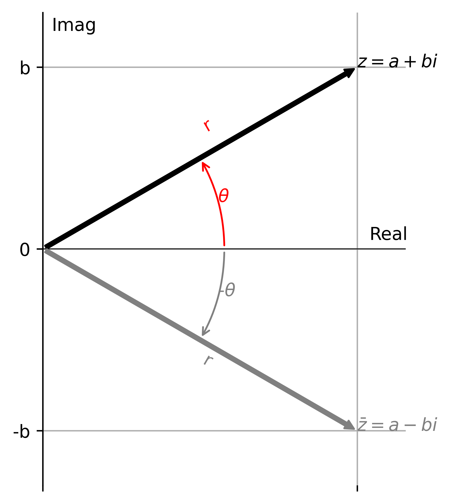
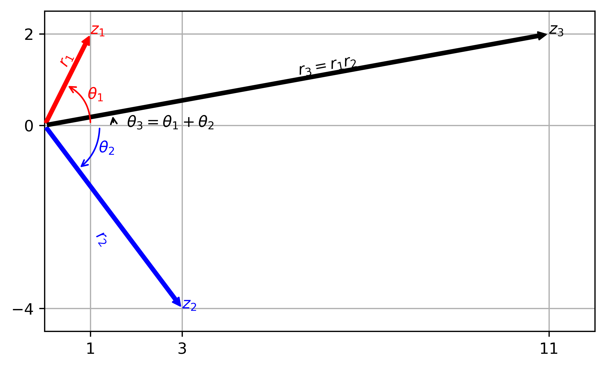
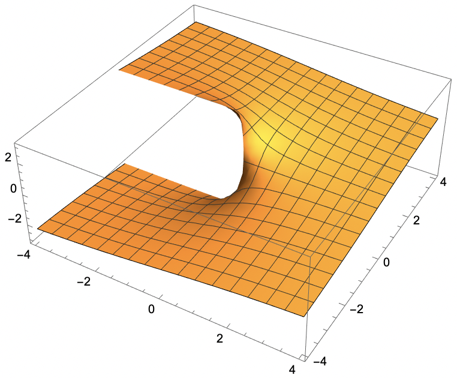
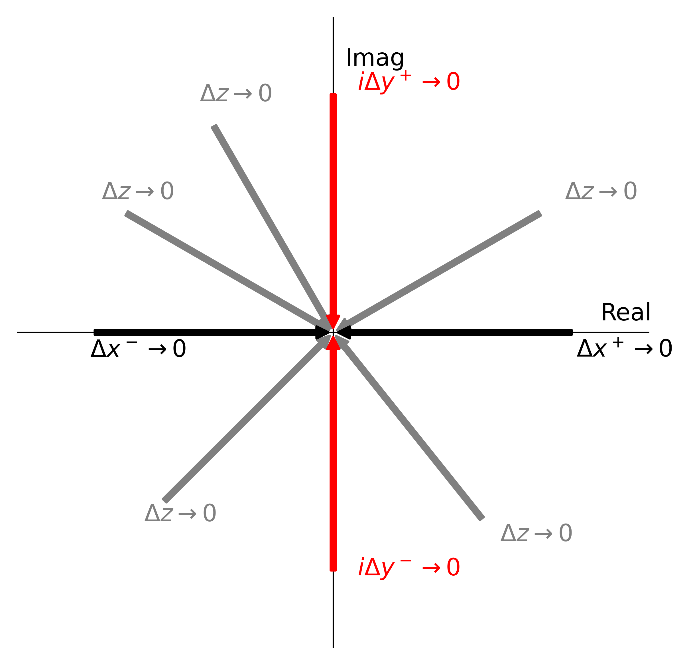
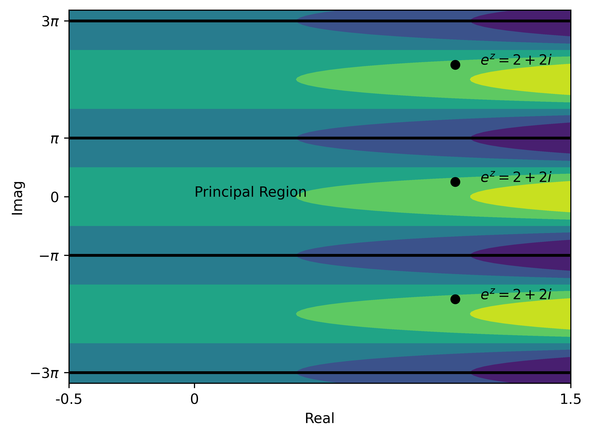

# Complex Analysis

## Learning Objectives

After learning this chapter, you will be able to:

+ Know what complex numbers are and ways to represent them.
+ Perform basic mathematical operations of complex numbers.
+ Compute the derivative of a complex function.
+ Evaluate special complex functions.

## Introduction
So far we have seen a few occurrences of complex numbers.  One is in Laplace Transform, which builds upon an integral transformation involving a complex function $e^{st}$, though we did treated the integral as if the one for real functions.  Another example is in matrices, when we see the Givens rotation matrix,
```{math}
\begin{bmatrix}
\cos\theta & -\sin\theta \\
\sin\theta & \cos\theta
\end{bmatrix}
```
Its eigenvalues are $\cos\theta \pm i\sin\theta$; this hints a connection between complex numbers and rotations.  A third example is that, very soon, we will learn about Fourier methods for frequency analysis of signals, which heavily relies on the properties of a complex function $e^{i\omega t}$.

Complex numbers and functions appear in many other places in engineer applications.  One important application is the solution of the following partial differential equation (PDE),
```{math}
\frac{\partial^2 u}{\partial x^2} + \frac{\partial^2 u}{\partial y^2} = 0
```
that is the governing equation for many heat transfer and fluid mechanics problems.  Some "good" complex functions turn out to be solutions to the PDE, so that one can solve the problems quickly.

In particular, in aerodynamics, given some conditions, there is a one-to-one correspondence between the mathematical and aerodynamic concepts,
```{math}
\begin{bmatrix}
\text{Mathematics} &\quad &\text{Aerospace} \\
\text{Analytic Functions} &\equiv &\text{Aerodynamics} \\
\downarrow &\quad &\downarrow \\
\text{Cauchy-Riemann Relation} &\equiv &\text{Streamlines} \\
\downarrow &\quad &\downarrow \\
\text{Harmonic Equation} &\equiv &\text{Potential Flow Eqn.} \\
\downarrow &\quad &\downarrow \\
\text{Harmonic Functions} &\equiv &\text{Flow Field Solution} \\
\downarrow &\quad &\downarrow \\
\text{Complex Integral} &\equiv &\text{Lift Calculation}
\end{bmatrix}
```
While there are several jargons in the diagram now, we will revisit it at a later stage with a better idea.

To sum up, the mathematics involving complex numbers and functions, or **complex analysis**, is widely used in engineering and needs to be elucidated in more details.  Specifically, we will review the arithmetic operations of complex numbers, define the continuity and differentiation of complex functions, and learn about several common complex functions.

## Complex Arithmetics

Conventionally, we denote a complex number
```{math}
z=x+iy
```
where $i$ is the unit imaginary number such that
```{math}
i^2=-1,\quad i^3=-i,\quad i^4=1
```
and $x$ and $y$ are the real and imaginary parts of the complex number, denoted,
```{math}
x=\Re(z),\quad y=\Im(z)
```

### Cartesian and Polar Forms
One can view a complex number $z=x+iy$ as a vector $(x,y)$ on a special 2D Cartesian plane, the **complex plane**, having the real and imaginary axes.  Using the view of vectors, the addition and subtraction of complex numbers have a clear geometrical meaning,
```{math}
z_1 \pm z_2 = (x_1\pm x_2) + i (y_1\pm y_2)
```

As we know, 2D Cartesian coordinates $(x,y)$ can be converted to and from polar coordinates $(r,\theta)$,
```{math}
\left\{
\begin{array}{l}
x=r\cos\theta \\
y=r\sin\theta
\end{array}
\right. \text{ or }
\left\{
\begin{array}{l}
r = \sqrt{x^2+y^2} \\
\theta = \tan^{-1}\frac{y}{x}
\end{array}
\right.
```

So is a complex number, $z=x+iy$; we can represent it using a radius and an angle, $(r,\theta)$.  Specifically, if we use the famous Euler formula,
```{math}
e^{i\theta} = \cos\theta + i\sin\theta
```
then the polar form of a complex number is
```{math}
z=x+iy = r\cos\theta + ir\sin\theta = r(\cos\theta + i\sin\theta) = \boxed{re^{i\theta}}
```
The radius $r$ is clearly the length of the 2D vector representing the complex number, and is an extension of the **absolute value** of a real number; we denote it
```{math}
r=\Abs(z)=|z|
```
As for $\theta$, it is the angle between the 2D vector and the real axis, or **argument**, and we denote it
```{math}
\theta = \arg(z)
```

&clubs; Be careful with the notation, $\arg$.  Later we will see a relevant but different symbol $\Arg$.



Next, we introduce the **complex conjugate**, or just **conjugate**.  For $z=x+iy$, its conjugate is
```{math}
\bar{z} = x-iy
```
and the two complex numbers are called a **conjugate pair**.
Geometrically, it means reflecting the 2D vector by the real axis.  In the polar form, the conjugate is
```{math}
\bar{z} = r\cos\theta - ir\sin\theta = r(\cos\theta - i\sin\theta) = \boxed{re^{-i\theta}}
```

One reason to introduce conjugates is simply that complex numbers frequently appear in conjugate pairs.  Two examples include the solutions to a mass-spring damper ($e^{i\omega t}$ and $e^{-i\omega t}$) and the eigenvalues of the Givens rotation matrix ($\cos\theta\pm\sin\theta$); in both cases the conjugacy is actually due to the roots of a quadratic polynomial of real coefficients.

Some convenient properties of complex conjugate are,

+ The relation to the real and imaginary parts: $x=\frac{z+\bar{z}}{2}$, $y=\frac{z-\bar{z}}{2}$
+ The relation to the radius: $z\bar{z}=(re^{i\theta})(re^{-i\theta})=r^2$

### Arithmetics

In the following we explore more arithmetic operations of complex numbers, including multiplication, division, and the so-called principal value.

#### Multiplication

In Cartesian form, the multiplication is defined as,
```{math}
\begin{aligned}
z_1z_2 &= (x_1+iy_1)(x_2+iy_2) \\
&= x_1x_2 + iy_1x_2 + ix_1y_2 + i^2 x_2y_1 \\
&= (x_1x_2-y_1y_2) + i(x_1y_2+x_2y_1)
\end{aligned}
```

If the polar form is available, then the multiplication can be significantly simplified,
```{math}
z_1z_2 = r_1r_2e^{i(\theta_1+\theta_2)}
```
Furthermore, the polar form also reveals the geometrical interpretation of multiplication.  When $z_1$ is multiplied by $z_2$, its length is elongated by $r_2$ and its angle is rotated by $\theta_2$



**Example**

Suppose we have $z_1=1+2i$ and $z_2=3-4i$.  In Cartesian form,
```{math}
z_1z_2 = (1+2i)(3-4i) = (3+8)+i(-4+6) = 11+2i
```

Alternatively, we can convert to polar form first, $z_1 = x_1+iy_1 = r_1e^{i\theta_1}$, with
```{math}
r_1=\sqrt{x_1^2+y_1^2}=\sqrt{5}\approx 2.24,\quad \theta_1=\tan^{-1}\frac{y_1}{x_1}=\tan^{-1}2\approx 1.11 \mathrm{rad}
```
and for $z_2 = x_2+iy_2 = r_2e^{i\theta_2}$
```{math}
r_2=\sqrt{x_2^2+y_2^2}=5,\quad \theta_2=\tan^{-1}\frac{y_2}{x_2}=\tan^{-1}(-4/3)\approx -0.927 \mathrm{rad}
```
Then the multiplication is
```{math}
z_1z_2 = r_1r_2e^{i(\theta_1+\theta_2)} \approx 2.24\times 5 e^{i(1.11-0.927)} = 11.2 e^{i0.183}
```

We can double check with the Cartesian form results
```{math}
z_1z_2 \approx 11.2 e^{i0.183} = 11.2\cos(0.183) + 11.2i\sin(0.183) \approx 11+2i
```
which matches up!

The multiplication has also a geometrical interpretation, which is more clear in the polar form.

**Side note**

If we denote the multiplication as $z_2 = pz_1$, with $p=a+bi$, then we could write the operation in matrix form
```{math}
\begin{bmatrix} x_2 \\ y_2 \end{bmatrix} =
\begin{bmatrix} a & -b \\ b & a \end{bmatrix}
\begin{bmatrix} x_1 \\ y_1 \end{bmatrix}
```
You may verify the equation by comparing with the multiplication in Cartesian form.  You might notice the Givens rotation matrix is just a special case of this operation.  In other words, Givens rotation can be represented compactly using a complex number $e^{i\theta}$ in complex domain.

#### Division

The division is a little more tedious in Cartesian form,
```{math}
\frac{z_1}{z_2} = \frac{z_1\bar{z}_2}{z_2\bar{z}_2} = \frac{(x_1+iy_1)(x_2-iy_2)}{x_2^2+y_2^2} = \frac{x_1x_2+y_1y_2}{x_2^2+y_2^2} + i\frac{x_2y_1-x_1y_2}{x_2^2+y_2^2}
```
where the property of conjugate is leveraged to eliminate the imaginary number in the denominator.

The polar form, on the other hand, is almost as simple as multiplication,
```{math}
\frac{z_1}{z_2} = \frac{r_1e^{i\theta_1}}{r_2e^{i\theta_2}} = \frac{r_1}{r_2}e^{i(\theta_1-\theta_2)}
```
and again, it reveals the geometrical interpretation.  As one can expect, it is the reverse of multiplication: shrinking length by $r_2$ and rotation "back" by $\theta_2$.

**Example:** As a practice, following the previous example, try to verify that the division of $11+2i$ by $z_2=3-4i$ gives $z_1=1+2i$.  Verify the results in both Cartesian and polar forms.

**Side note**

Following the notation in multiplication, if we denote the division as $z_1 = z_2/p$, with $p=a+bi$, then we could write the operation in matrix form
```{math}
\begin{bmatrix} x_1 \\ y_1 \end{bmatrix} =
\begin{bmatrix} a & -b \\ b & a \end{bmatrix}^{-1}
\begin{bmatrix} x_2 \\ y_2 \end{bmatrix}
```
Note that
```{math}
\begin{bmatrix} a & -b \\ b & a \end{bmatrix}^{-1} = \frac{1}{a^2+b^2}\begin{bmatrix} a & b \\ -b & a \end{bmatrix}
```
This may provide another way to look at the division in Cartesian form.

### Principal Values

Lastly, we look at an arithmetic operation that people do not use in real numbers.  First, let us think about this: what is the polar form of $i$?

Either by definition, or by geometrical representation (unit vector pointing upward), one can see that $r=1$ and $\theta=\pi/2$.  Hence, $i=e^{i\frac{\pi}{2}}$.

But how about $\theta=5\pi/2$?
```{math}
e^{i\frac{5\pi}{2}} = \cos\frac{5\pi}{2}+i\sin\frac{5\pi}{2} = \cos\frac{\pi}{2}+i\sin\frac{\pi}{2} = i
```
In fact, there are infinitely many answers, due to the periodicity of the sinusoidal functions.  Specifically, all the $\theta$'s below would produce $i$,
```{math}
\theta=\arg(i)=\frac{\pi}{2} + 2n\pi,\quad n\in \text{Integers}
```
Therefore, we see that the argument, $\arg$, is a *multi-valued* function, which might cause trouble sometimes, esp. when one only wants one unique solution.

This is why the **principal value** (PV) is introduced.  It picks one particular argument, denoted $\Arg(z)$,
```{math}
-\pi < \Arg(z) \leq \pi
```
and then the polar form of a complex number is uniquely determined as
```{math}
\PV(z)=|z|e^{i\Arg(z)}
```

Back to the motivating example, we have $\Arg(z) = \frac{\pi}{2}$, and hence $i=e^{i\frac{\pi}{2}}$, which matches with the intuitive choice of angle.

**Example**

Let's find the PV of $e^{i\frac{5\pi}{4}}$.  First, find the argument
```{math}
\arg(z)=\frac{5\pi}{4} + 2n\pi,\quad n\in \text{Integers}
```
Then we find teh Argument by picking the $n$ so that $\arg(z)$ lies in $(-\pi,\pi]$; in this case $n=-1$, and
```{math}
\Arg(z) = -\frac{3\pi}{4}
```
So the principal value is found as
```{math}
\PV(z) = e^{-i\frac{3\pi}{4}}
```

## Continuity, Derivatives, and Analyticity

Next, we turn to functions of complex numbers, typically denoted $f(z)$ or $w(z)$.  The complex functions do have some properties that might be counter-intuitive, and thus to use these complex functions comfortably, we need to understand them well.  This requires us to explore a little bit of the complex calculus, including the concepts of continuity and derivatives.

### Continuity

#### Definition
First we extend the concept of limit to complex functions.  From the $\epsilon-\delta$ language, formally, we can state the limit as follows.

If for all $z$, when $|z-z_o|\leq \delta$,
```{math}
|f(z)-l|\leq \epsilon
```
then
```{math}
\lim_{z\rightarrow z_o} f(z) = l
```

The above statement justs says that, if as $z$ approaches $z_o$, $f(z)$ approaches $f(z_o)$, then the limit of $f(z)$ is just $f(z_o)$.  Based on the limit we can define the continuity:

A complex function $f$ is continuous at $z=z_o$, if $f(z_o)$ is **defined** and the limit $\lim_{z\rightarrow z_o} f(z)$ **exists**.

#### Problem
This definition of continuity seems *naive* right?  The catch here, however, is: what does $|z-z_o|\leq \delta$ represent?  Since $z$ is on a complex plane, and $|z-z_o|$ represents the distance between $z$ and $z_o$, the inequality means a *disk* centered at $z_o$ with a radius $\delta$.  This means $z$ can approach $z_o$ in *many* different ways.

**Example 1**

Does $f(z) = e^{-z^2}$ remains continuous as $z\rightarrow\infty$?

If $z$ moves along the real axis, then $e^{-z^2}=e^{-|z|^2}$ and as $|z|\rightarrow\infty$, $f(z)\rightarrow 0$.  This seems intuitive.

If $z$ moves along the imaginary axis, then $e^{-z^2}=e^{-(i|z|)^2}=e^{|z|^2}$ and as $|z|\rightarrow\infty$, $f(z)\rightarrow \infty$!  This means $f(z) = e^{-z^2}$ is undefined and hence not continuous as $z\rightarrow\pm i\infty$.

**Example 2**

Example 1 might appear cheating, as we are involving infinity.  Let's look at one more seemingly innocent function,
```{math}
f(z) = \Im \frac{z}{|z|} = \frac{\Im(z)}{|z|} = \frac{r\sin\theta}{r} = \sin\theta
```
Is $f(z)$ continuous at $z=0$?  At least it is defined.

But if we look at the limit:

If we approach $z=0$ from the positive side of real axis, then $\theta=0$ and $f(z)=0$; if we approach $z=0$ from the positive side of imaginary axis, then $\theta=\pi/2$ and $f(z)=1$.  In fact, $f(z)$ can be any value between -1 and 1, depending on how we approach $z=0$.  This means, the limit $\lim_{z\rightarrow 0}f(z)$ does not exist.  Hence, $f(z)$ is not continuous at $z=0$.



### Derivatives

The reason to reveal the intricacies of the limits and continuity of complex functions is not only in the chase of mathematical details.  It matters when we turn to the derivatives of complex functions, that involve limits.  Again, a formal definition of derivative would be
```{math}
f'(z) = \lim_{\Delta z\rightarrow 0} \frac{f(z+\Delta z)-f(z)}{\Delta z}
```

However, now we know the limit, and hence the derivative, do not always exist, due to the arbitrariness implied in $\Delta z\rightarrow 0$.  In fact, the derivative can only exist when some particular conditions, **Cauchy-Riemann Equations**, are satisfied.



#### Cauchy-Riemann Equations - Cartesian Form

Let's denote the complex function as $w(z) = u(x,y)+iv(x,y)$, where $u$ and $v$ are real functions.  Then consider the limit along two paths.

First, along the positive real axis, $\Delta z=\Delta x$, then
```{math}
\begin{aligned}
w'(z) &= \lim_{\Delta x\rightarrow 0} \frac{\left[u(x+\Delta x,y)+iv(x+\Delta x,y)\right]-\left[u(x,y)+iv(x,y)\right]}{\Delta x} \\
&= \lim_{\Delta x\rightarrow 0} \left[ \frac{u(x+\Delta x,y) - u(x,y)}{\Delta x} + \frac{iv(x+\Delta x,y) - iv(x,y)}{\Delta x} \right] \\
&= \lim_{\Delta x\rightarrow 0} \frac{u(x+\Delta x,y) - u(x,y)}{\Delta x} + i \lim_{\Delta x\rightarrow 0} \frac{v(x+\Delta x,y) - v(x,y)}{\Delta x} \\
&= \ppf{u}{x} + i\ppf{v}{x}
\end{aligned}
```
where in the last row we used the definition of partial derivatives of real functions.

Second, along the positive imaginary axis, $\Delta z=i\Delta y$, then
```{math}
\begin{aligned}
w'(z) &= \lim_{\Delta y-\rightarrow 0} \frac{\left[u(x,y+\Delta y)+iv(x,y+\Delta y)\right]-\left[u(x,y)+iv(x,y)\right]}{i\Delta y} \\
&= \lim_{\Delta y-\rightarrow 0} \left[ \frac{u(x,y+\Delta y) - u(x,y)}{i\Delta y} + \frac{iv(x,y+\Delta y) - iv(x,y)}{i\Delta y} \right] \\
&= -i\ppf{u}{y} + \ppf{v}{y}
\end{aligned}
```

If the limit exists, then the two expressions should equal, i.e.,
```{math}
\ppf{u}{x} + i\ppf{v}{x} = -i\ppf{u}{y} + \ppf{v}{y}
```
Matching the real and imaginary parts respectively, we get,
```{math}
\left\{
    \begin{array}{l}
    \ppf{u}{x} = \ppf{v}{y} \\
    \ppf{v}{x} = -\ppf{u}{y}
    \end{array}
\right. \text{ or }
\left\{
    \begin{array}{l}
    u_x = v_y \\
    v_x = -u_y
    \end{array}
\right.
```
This is called the **Cauchy-Riemann (CR) Equations** in Cartesian form.

It can be shown that, if a complex function satisfies the Cauchy-Riemann Equation, then the limit approaches the same value regardless of which path were taken, and hence the derivative of the complex function exists.  Furthermore, based on above derivation, the derivative can be written as
```{math}
w'(z) = v_y-iu_y = u_x + iv_x
```

**Example 1**

Let's find the derivative of a complex quadratic function, $w(z)=z^2$.

First, identify the real and imaginary parts
```{math}
w(z)=z^2 = (x^2-y^2) + i(2xy)
```
so, $u(x,y)=x^2-y^2$ and $v(x,y)=2xy$.

Then, check CR equations,
```{math}
\begin{aligned}
u_x=2x &= v_y=2x \\
v_x=2y &= -u_y=2y
\end{aligned}
```
Both equations check and hence the derivative exists.

Third, we show the derivative in two ways,
```{math}
w'(z) = v_y - iu_y = 2x-i(-2y) = 2(x+iy) = 2z
```
and
```{math}
w'(z) = u_x + iv_x = 2x+i(2y) = 2(x+iy) = 2z
```
Clearly, the two versions match.  Furthermore, the results align with intuition from real function, $(z^2)'=2z$.

**Example 2**

Now let's consider the conjugate function, $w(z)=\bar{z} = x - iy$, where $u(x,y)=x$ and $v(x,y)=-y$.

The CR equations are not satisfied,
```{math}
\begin{aligned}
u_x=1 &\neq v_y=-1 \\
v_x=0 &= -u_y=0
\end{aligned}
```
and hence the complex conjugate does not have a derivative.

#### Cauchy-Riemann Equations - Polar Form

Next, the polar form for CR equations is presented.  The derivation is similar to the Cartesian form and thus omitted.

Suppose the function is written in $(r,\theta)$ coordinates,
```{math}
z=re^{i\theta} = u(r,\theta) + iv(r,\theta)
```
and the CR equations are
```{math}
\left\{
    \begin{array}{l}
    u_r = \frac{1}{r}v_\theta \\
    v_r = -\frac{1}{r}u_\theta
    \end{array}
\right.
```
The derivatives are written as
```{math}
w'(z) = (u_r+iv_r)e^{-i\theta} = \frac{1}{r}(v_\theta-iu_\theta)e^{-i\theta}
```

**Example**

Let's examine the inverse function $w(z)=\frac{1}{z}$.

First, identify the polar form,
```{math}
w(z)=\frac{1}{z}=\frac{1}{re^{i\theta}}=\frac{1}{r}e^{-i\theta} = \frac{\cos\theta}{r}-i\frac{\sin\theta}{r}
```
so $u(x,y)=\frac{\cos\theta}{r}$ and $v(x,y)=-\frac{\sin\theta}{r}$.

Then, check the CR equations,
```{math}
\begin{aligned}
u_r=-\frac{\cos\theta}{r^2} &= \frac{1}{r}v_\theta=-\frac{\cos\theta}{r^2} \\
v_r=\frac{\sin\theta}{r^2} &= -\frac{1}{r}u_\theta=\frac{\sin\theta}{r^2}
\end{aligned}
```
Both equations match and so the derivative exists.

Lastly, using one form of the derivative,
```{math}
\begin{aligned}
w'(z) &= (u_r+iv_r)e^{-i\theta} = \left( -\frac{\cos\theta}{r^2} + i\frac{\sin\theta}{r^2} \right)e^{-i\theta} \\
&= -\frac{1}{r^2} (\cos\theta-i\sin\theta)e^{-i\theta} = -\frac{1}{r^2e^{2i\theta}} \\
&=-\frac{1}{z^2}
\end{aligned}
```
Note again that the derivative again align with the intuition from real calculus.

&clubs; Check the other form of the derivative.

#### Analytic Functions

By now one might have established an intuition that if a complex function's derivative is defined, then it behaves as if a real function.  This is true and we can formalize the intuition by the concept of analytic function:

A complex function is **analytic** at $z=z_o$ if it is defined and differentiable at $z=z_o$.

If a complex function is analytic, then its derivative can be computed following rules of real calculus, including the product and chain rules.  Furthermore, the sum, product, division, and composition of analytic functions are still analytic, when the function is defined.  Hence, many analytical functions can be treated as if real functions, which saves us the cumbersome computation by the CR equations.

#### Harmonic Functions

To introduce the concepts, we start from the Cartesian form of CR equations,
```{math}
\left\{
    \begin{array}{l}
    u_x = v_y \\
    v_x = -u_y
    \end{array}
\right.
```
Take the derivative of $x$ in the first equation, and the derivative of $y$ in the second equation, one gets,
```{math}
\left\{
    \begin{array}{l}
    u_{xx} = v_{xy} \\
    v_{xy} = -u_{yy}
    \end{array}
\right.
```
Sum up the two equations and $v_{xy}$ cancels out, so we get
```{math}
u_{xx}+u_{yy}=0
```
Similarly, we can also get
```{math}
v_{xx}+v_{yy}=0
```
These are PDE's named **Laplace equation**, and functions that satisfy Laplace equation are called **harmonic functions**.  The real and imaginary parts of analytic functions are harmonic.

Recall that the Laplace equation has been mentioned in the introduction and is one important type of PDE that governs many fluid mechanic and heat transfer problems (and electromagnetics, etc.).  In other words, the real and imaginary parts of analytic functions give us solutions to those PDEs *for free*.  This is one of the reasons why complex analysis is so important in many engineering applications.  At the least, it saves people time in solving equations.

A by-product of the above discussion is the **analytic extension** of a real function: If one has a real function, how does one find an analytic complex function whose real part is the known real function?  First, now we know the extension is possible only if the given function is harmonic, and then the search of its imaginary counterpart, or **harmonic conjugate**, can be achieved using the CR equations, to be shown below.

**Example**

Given a real function $u(x,y)=\sin x\cosh y$, and find its analytic extension.

First, verify that $u$ is harmonic,
```{math}
\begin{aligned}
u_x=\cos x\cosh y,\quad u_{xx}=-\sin x\cosh y \\
u_y=\sin x\sinh y,\quad u_{yy}=\sin x\cosh y
\end{aligned}
```
which does satisfy the Laplace equation.

Next, find the harmonic conjugate $v$ using the CR equations,
```{math}
\begin{aligned}
v_y=u_x = \cos x\cosh y \\
v_x=-u_y = -\sin x\sinh y
\end{aligned}
```
Integrate the first equation for $y$, one gets,
```{math}
v(x,y) = \cos x\sinh y + h(x)
```
and substituting into the second equation, one gets,
```{math}
v_x = -\sin x\sinh y + h'(x) \ \Rightarrow\ h'(x)=0
```
So the analytic extension of $u(x,y)$ is
```{math}
w(z) = \sin x\cosh y + i(\cos x\sinh y + c)
```

## Common Functions

In this section, we explore the complex version of several commonly used real functions.

### Exponential
The exponential function $w(z)=e^z$ can be defined via definition,
```{math}
e^z = e^{x+iy} = e^x e^{iy} = e^x(\cos y+i\sin y)
```
Further, one can verify that the CR equations are satisfied, and the derivative can be computed as follows,
```{math}
w'(z) = u_x+iv_x = e^x\cos y+ie^x\sin y = e^x(\cos y+i\sin y) = e^z
```
or $w'(z)=w(z)$ as expected from its real counterpart.

Yet, the complex version of exponential is more complex than the real exponential: $e^z$ is actually *periodic* in $y$.  The implication of periodicity is shown via the argument,
```{math}
\arg(e^z) = y + 2k\pi
```
Due to the infinitely many possible values in the argument, there are infinitely many $z$ that correspond to the same $e^z$.  As a result, for example,

+ If $z$ is real, only $z=0$ results in $e^z=1$.
+ If $z$ is complex, all $z=2k\pi i$ can result in $e^z=1$.

To simplify the periodicity, we introduce a concept similar principal value, called **principle region**, or **fundamental region**, where we pick $\Arg(e^z)$ as the argument.



**Example**

What is the $z$ in principle region that makes $e^z=2+2i$?

First convert the result to polar form: $r=\sqrt{2^2+2^2}=2\sqrt{2}$, $\theta=\tan^{-1}1=\frac{\pi}{4}+2k\pi$, for all integer $k$.

Comparing with exponential,
```{math}
e^z = e^x e^{iy} = re^{i\theta} = 2\sqrt{2} e^{i(\frac{\pi}{4}+2k\pi)}
```
we find
```{math}
x=\ln(2\sqrt{2}),\quad y=\frac{\pi}{4}+2k\pi
```
To keep $z$ in the principal region, pick $k=0$, and thus
```{math}
z=\ln(2\sqrt{2}) + i\frac{\pi}{4}
```

### Logarithm

Practically speaking, the periodicity in $e^z$ does not complicate the computation; it only complicates the reverse operation, i.e., logarithm $w(z)=\ln(z)$.  This is what was done essentially in the previous example.

To formalize the procedure, to find the logarithm, we work with the polar form of $z$ and assume $w(z)=u(z)+iv(z)$,
```{math}
\begin{aligned}
e^{u(z)+iv(z)} &= re^{i\theta} \\
e^{u(z)}e^{iv(z)} &= re^{i\theta}
\end{aligned}
```
Matching the radius and angle, we get
```{math}
\left\{
    \begin{array}{l}
    e^{u(z)} = r \Rightarrow u(z)=\ln|z| \\
    v(z) = \theta = \arg(z)
    \end{array}
\right.
```
Therefore,
```{math}
\ln(z) = \ln|z| + i\arg(z)
```
To identify the $z$ for principle region, we use the $\Arg$ and define the PV of $\ln$ as $\Ln$,
```{math}
\Ln(z) = \ln|z| + i\Arg(z)
```

The derivative of $\ln(z)$ is easier to compute in polar coordinates,
```{math}
\ln(z) = u(r,\theta) + iv(r,\theta) = \ln(r) + i\theta
```
and
```{math}
\ln'(z) = (u_r+iv_r)e^{-i\theta} = \frac{e^{-i\theta}}{r} = \frac{1}{z}
```
which still aligns with the real counterpart.

**Example 1**

Compute $\ln(1+i)$.

First convert to polar form: $|z|=\sqrt{2}$ and $\arg(z)=\tan^{-1}1 = \frac{\pi}{4}+2k\pi$, $\Arg(z) = \frac{\pi}{4}$.

Then $\ln(z) = \Ln(z)+i2k\pi$ and the PV is $\Ln(z) = \ln(\sqrt{2})+i\frac{\pi}{4}$.

**Example 2**

Now the $\ln$ of negative reals are defined: $\ln(-1)$

The polar form: $|z|=1$ and $\arg(z)= \pi+2k\pi$.  Then $\ln(-1) = i(2k+1)\pi$, and $\Ln(-1) = \ln(1)+i\pi=i\pi$, which are purely real - no wonder why $\ln(-1)$ does not exist in real domain.

### Trigonometric Functions
Here we only discuss the sine and cosine functions.

We start with the Euler formula and its variant,
```{math}
\left\{
    \begin{array}{l}
    e^{i\theta} = \cos\theta + i\sin\theta \\
    e^{-i\theta} = \cos\theta - i\sin\theta
    \end{array}
\right.
```
from which we can solve for the sine and cosine functions,
```{math}
\left\{
    \begin{array}{l}
    \cos\theta = \frac{e^{i\theta}+e^{-i\theta}}{2} \\
    \sin\theta = \frac{e^{i\theta}-e^{-i\theta}}{2i}
    \end{array}
\right.
```
Further, we can generalize $\theta$ to $z$ and obtain,
```{math}
\left\{
    \begin{array}{l}
    \cos z = \frac{e^{iz}+e^{-iz}}{2} \\
    \sin z = \frac{e^{iz}-e^{-iz}}{2i}
    \end{array}
\right.
```
which are the formal definition of the complex versions of sine and cosine.

Furthermore, we can expand the cosine function in Cartesian form for easier calculation,
```{math}
\begin{aligned}
\cos z &= \frac{1}{2} \left[ e^{i(x+iy)} + e^{-i(x+iy)} \right] \\
&= \frac{1}{2} \left[ e^{-y}(\cos x+i\sin x) + e^{y}(\cos x-i\sin x) \right] \\
&= \cos x \left( \frac{e^{-y}+e^y}{2} \right) -i\sin x \left( \frac{e^y-e^{-y}}{2} \right) \\
&= \cos x \cosh y -i \sin x\sinh y
\end{aligned}
```
Similarly, we find the Cartesian form of Sine,
```{math}
\sin z = \sin x \cosh y +i \cos x\sinh y
```
While the "formal definition" using complex exponential seems a little arbitrary, earlier we did show that $\sin x \cosh y$ and $\cos x\sinh y$ are harmonic conjugates and hence $\sin z$ is analytic; so is $\cos z$.

Furthermore, the derivative rule in real calculus extends to the complex version:
```{math}
\ddf{}{z}\cos z = -\sin z,\quad \ddf{}{z}\sin z = \cos z
```

**Example**

Find the Cosine of $z=\frac{\pi}{2}+i$.

We compute this by the Cartesian form,
```{math}
\begin{aligned}
\cos z &= \cos(\pi/2)\cosh(1) - \sin(\pi/2)\sinh(1) \\
&= -i\sinh(1) = -\frac{i}{2}(e^1-e^{-1}) \\
&\approx -1.175 i
\end{aligned}
```

### Power

Lastly, we look at the powers of complex numbers: $w(z)=z^c$ for $c$ complex.

This function can be written as a combination of exponential and logarithm,
```{math}
w(z)=e^{c\ln z}
```
and naturally with the principal value
```{math}
z^c = e^{c\Ln z}
```

Since both $e^z$ and $\ln z$ are analytic, so is their composition $z^c$, and one can infer that $(z^c)'=cz^{c-1}$.

**Example 1**

Suppose $w^3=1$, find $w$.

This is equivalent to computing $z^c$ with $z=1$ and $c=\frac{1}{3}$.  Clearly in real domain $z=1$.

No in complex domain, first convert $z$ to polar form, $z=re^{i\theta}$, $r=1$, $\theta=2k\pi$.

Then the logarithm is computed as
```{math}
\ln z=\ln 1+i\theta = i\left( 2k\pi \right)
```
with $\Ln z=0$.

Next the complex power is
```{math}
\begin{aligned}
    z &= \sqrt[3]{1} = e^{\frac{1}{3}\ln z} = e^{\frac{1}{3}i\left( 2k\pi \right)} \\
    &= \left[ \cos \left(\frac{2k\pi}{3}\right) + i\sin \left(\frac{2k\pi}{3}\right) \right]
\end{aligned}
```

When $k=-1,0,1$, the angles stay in $(-\pi,\pi]$: $\frac{2k\pi}{3}=\{-\frac{2\pi}{3}, 0, \frac{2\pi}{3}\}$.  Hence there are three distinct roots,
```{math}
z_1 = -\frac{1}{2} - \frac{\sqrt{3}}{2}i,\quad z_2=1,\quad z_3 = -\frac{1}{2} + \frac{\sqrt{3}}{2}i
```
But the PV is
```{math}
e^{c\Ln z} = 1
```
which aligns with the intuition from real domain.

&clubs; In general, an $n$-th order polynomial always has $n$ roots in the complex domain.


**Example 2**

Find the PV of $(2i)^{2i}$.

We need to compute $z^c$ with $z=2i$ and $c=2i$.
```{math}
\begin{aligned}
(2i)^{2i} &= e^{(2i)\Ln(2i)} = e^{2i(\ln|2i|+i\pi/2)} \\
&= e^{(2\ln 2)i-\pi} = e^{-\pi} e^{i\ln 4} \\
&= e^{-\pi} \left[ \cos(\ln 4) + i\sin(\ln 4) \right]
\end{aligned}
```


## Summary of Basic Modules

By now you should be able to:

+ Represent complex numbers
  - Using cartesian form and polar form.
  - and convert between the two forms.
+ Perform complex arithmetics
  - Addition/subtraction, multiplication, division
  - Conjugate, absolute value, argument
  - Principal value
+ Compute complex derivatives
  - Determine if a function is analytic using Cauchy-Riemann relation
  - Compute the derivatives using Cauchy-Riemann relation
  - Find the harmonic conjugate of a function
+ Evaluate special complex functions
  - Exponential, trigonometric, logarithm, general power
  - Principal value of these functions
