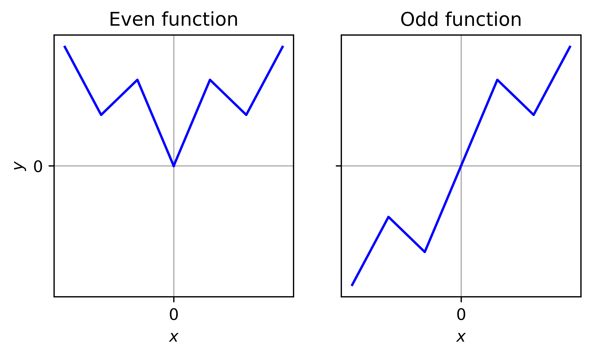

# Fourier Methods

## Learning Objectives

After learning the basic modules of this chapter, you will be able to:

+ Compute the Fourier series of periodic functions.
+ Apply Fourier transform to non-periodic functions.

## Introduction
So far we have been mostly looking at quantities that are temporally or spatially distributed, such as the solutions of ODEs, that are defined as a function of time.  Fourier methods provide a lens to look at these quantities in the **frequency** domain.  This may reveal hidden information that cannot be accessed otherwise.  A few quick examples:

+ Data compression: If we have a data set of 1000 data points
```{math}
\mathcal{D}=\{(n\Delta t, A\sin(n\omega \Delta t)) \mid n=1,2,\cdots,1000\}
```
These are plenty of data - 2000 numbers.  But looking at the frequency domain, it is just a sinusoidal function, and we can **compactly** represent $\mathcal{D}$ by two numbers: the frequency $\omega$ and the amplitude $A$.  This is a reduction of data by a factor of 1000!
+ System diagnostics: Suppose we have an engine, whose shaft operates at 1000 RPM, or approximately 16.67 Hz.  If we measure the vibration level, e.g., the time history of acceleration, we should see a sinusoidal curve at frequency 16.67 Hz.  Suppose we see an additional frequency, say, 23 Hz, in the vibration data, then we would know there is something wrong with the engine.  Modern health monitoring systems of aircraft operate basically under the same principle.

Formally, in this chapter, we will first look at **periodic functions**.  A function $f$ having a period $p$ means that $f(x+p)=f(x)$, and furthermore $f(x)=f(x+2p)=f(x+3p)=\cdots$.  We will see how this function can be represented as a sum of sinusoidal functions, i.e., the so-called **Fourier Series**,
```{math}
f(x) = a_0 + \sum_{n=1}^\infty a_n\cos(\omega_n x) + \sum_{n=1}^\infty b_n\sin(\omega_n x)
```
Subsequently, we will look at the extension of Fourier Series to general **non-periodic** functions, which leads to the **Fourier Transform**.

&clubs; In your future study, you might also see more generalized Fourier methods, that considers "transient" frequencies over time, or "basis" functions other than sinusoidal ones.

## Fourier Series

### Special case: Period $p=2\pi$

If a function $f(x)$ has a period of $2\pi$, then it can be expanded into a series
```{math}
:label: eq:fsp

\begin{aligned}
f(x) = a_0 &+ a_1\cos(x) + a_2\cos(2x) + \cdots \\
           &+ b_1\sin(x) + b_2\sin(2x) + \cdots
\end{aligned}
```
where the **Fourier coefficients** are
```{math}
\begin{aligned}
a_0 &= \frac{1}{2\pi}\int_{-\pi}^\pi f(x) dx \\
a_n &= \frac{1}{\pi}\int_{-\pi}^\pi f(x)\cos(nx) dx \\
b_n &= \frac{1}{\pi}\int_{-\pi}^\pi f(x)\sin(nx) dx
\end{aligned}
```

&clubs; For those who are curious how the formula is derived, the key idea is to use the "orthogonality" property of sinusoidal functions, i.e., $\int_{-\pi}^{\pi}\cos(nx)\sin(mx)dx=0$ for any $n,m$, and $\int_{-\pi}^{\pi}\cos(nx)\cos(mx)dx=0$, $\int_{-\pi}^{\pi}\sin(nx)\sin(mx)dx=0$ unless $n=m$.  Subsequently, we can multiply $\sin$'s and $\cos$'s to both sides of {eq}`eq:fsp` and integrate over $[-\pi,\pi]$.  You will see only one term remains.

#### Review: Even and odd functions

Before we dive into an example, let's first review the concepts of even and odd functions; these will be surprisingly useful later.

When the interval of definition of a function $f(x)$ is symmetric about the origin point, e.g., $[-L,L]$, then we can define

+ Even functions if $f(x)=f(-x)$; the function is symmetric about the $y$-axis
+ Odd functions if $f(x)=-f(-x)$; the function is anti-symmetric about the origin point



There are two key properties that we need to know.  First, rules of product

+ Even $\times$ Even $=$ Even
+ Even $\times$ Odd $=$ Odd
+ Odd $\times$ Odd $=$ Even

This should be fairly easy to show.  For example, for the first rule, if $f(x)$ and $g(x)$ are both even, then $f(-x)g(-x)=f(x)g(x)$.  Hence $h(x)=f(x)g(x)$ is an even function.

&clubs; As a small exercise, try to prove the other two rules.

The second property is for the integrals:

+ If $f$ is even, $\int_{-L}^L f(x) dx = 2\int_0^L f(x) dx$;
+ If $f$ is odd, $\int_{-L}^L f(x) dx = 0$.

The integral property can be understood from a geometric point of view.  For example, for an odd function, since it is anti-symmetric about the origin point, its left and right pieces share the same shape.  But in terms of area under the curve, the left and right areas have opposite signs.  Hence, the integral over $[-L,L]$ adds up two areas of the same size but of opposite signs and results in zero.

&clubs; As a small exercise, try to prove the other rule.

#### Simplification of Fourier series

Combining the two properties of even/odd function, we can simplify many Fourier series calculations.  For example, suppose $f(x)$ is odd, compute
```{math}
\int_{-L}^L f(x)\cos(\omega x)dx
```
First, the interval is symmetric about the origin point, so we can invoke properties of even and odd functions.  On this interval, $\cos(\omega x)$ is even, so $f(x)\cos(\omega x)$ is odd by the first property.  Next, by the second property, the integral of the odd function on a symmetric domain is zero.  Hence, without **any** calculation, we know the above integral is always zero for any odd function.

Similarly, if $f(x)$ is even, then the integral
```{math}
\int_{-L}^L f(x)\sin(\omega x)dx=0
```
is always 0.

Applying above findings to the Fourier series, we now know that

+ If $f(x)$ is odd, then $a_0=a_n=0$, i.e., all $\cos$ terms are gone.
+ If $f(x)$ is even, then $b_n=0$, i.e., all $\sin$ terms are gone.

Intuitively, this should make sense too.  An odd function should be a composition of odd functions **only**, i.e., the $\sin$'s, and similarly $\cos$'s for an even function.

#### A first example

Now let's look at an example of Fourier series. Consider the following piecewise function over $[-\pi,\pi]$ and find its Fourier series expansion step by step.

+ Write down the mathematical expression of the function

This is a piecewise function,
```{math}
f(x) = \left\{
\begin{array}{ll}
1, &\ x\in[-\pi,-\pi/2] \\
0, &\ x\in[-\pi/2,\pi/2] \\
1, &\ x\in[\pi/2,\pi]
\end{array}
\right.
```

+ Decide whether the function is even or odd or neither

We have a symmetric interval.  The function satisfies $f(-x)=f(x)$.  Hence the function is **even**.

This means $b_n=0$ and we only need to compute $a_0$ and $a_n$.

&clubs; One should **always** do this step before any Fourier series calculations to avoid unnecessary calculations.

+ Compute the coefficients.

First, for $a_0$
```{math}
\begin{aligned}
a_0 &= \frac{1}{2\pi}\int_{-\pi}^\pi f(x) dx \\
&= \frac{2}{2\pi}\int_0^\pi f(x) dx \\
&= \frac{1}{\pi}\int_{\pi/2}^\pi 1 dx \\
&= \frac{1}{\pi} \left( \pi-\frac{\pi}{2} \right) = \frac{1}{2}
\end{aligned}
```
where the second equality uses the integral property of even functions, and the third equality incorporates the definition of the piecewise function.

An additional thing to note is the geometrical meaning of this integral.  The integral $\int_{-\pi}^\pi f(x) dx$ is the area under the curve, and $2\pi$ in the leading factor is the length of the interval, hence $a_0$ can be viewed as the **average** of the function $f(x)$ over one period.

Next, we compute $a_n$
```{math}
\begin{aligned}
a_n &= \frac{1}{\pi}\int_{-\pi}^\pi f(x)\cos(nx) dx \\
&= \frac{2}{\pi}\int_0^\pi f(x)\cos(nx) dx \\
&= \frac{2}{\pi}\int_{\pi/2}^\pi \cos(nx) dx \\
&= \frac{2}{\pi} \left. \frac{\sin(nx)}{n} \right|_{\pi/2}^\pi \\
&= -\frac{2}{n\pi}\sin\frac{n\pi}{2}
\end{aligned}
```
where the same tricks as in $a_0$ were used.

Involving $\sin\frac{n\pi}{2}$ is a bit tedious, so let's keep simplifying it.  To start with, we can tabulate the values for the first few $n$'s:

| $n=1$ | $n=2$ | $n=3$ | $n=4$ | $n=5$ | $\cdots$ |
| :---: | :---: | :---: | :---: | :---: | :---: |
| $\sin\frac{\pi}{2}$ | $\sin\frac{2\pi}{2}$ | $\sin\frac{3\pi}{2}$ | $\sin\frac{4\pi}{2}$ | $\sin\frac{5\pi}{2}$ | $\cdots$ |
| $1$ | $0$ | $-1$ | $0$ | $1$ | $\cdots$ |

Due to the periodicity of $\sin$, the values $1,0,-1,0$ repeat as a group.  We can compactly write this relation as
```{math}
\sin\frac{n\pi}{2} =
\left\{
\begin{array}{ll}
(-1)^{\frac{n-1}{2}}, &\ n\text{ odd} \\
0, &\ n\text{ even}
\end{array}
\right.
```
so that $a_n=0$ for $n=2,4,6,\cdots$ and
```{math}
a_n = -\frac{2}{n\pi}(-1)^{\frac{n-1}{2}},\quad n=1,3,5,\cdots
```

&clubs; Similarly, we can find the following relations: $\sin(n\pi)=0$ and $\cos(n\pi)=(-1)^n$.

+ Write down the Fourier series

The Fourier series is therefore
```{math}
f(x) = \frac{1}{2} + \sum_{n=1,3,5,\cdots} -\frac{2}{n\pi}(-1)^{\frac{n-1}{2}}\cos(nx)
```

Practically, one would be only interested in the first few terms of the Fourier series, that should capture the main characteristics of the function $f(x)$.  These are
```{math}
\boxed{f(x) = \frac{1}{2} - \frac{2}{\pi}\cos(x) + \frac{2}{3\pi}\cos(3x) - \frac{2}{5\pi}\cos(5x) + \cdots}
```

+ As an additional step, we also visualize the Fourier series below.

As one increases the number of terms of approximation, shown in the blue curve, we see the series converges to the function $f(x)$ in black curve.  Also, note the high oscillations near the discontinuity of $f(x)$; this is the so-called Gibbs phenomenon, that is unavoidable for jump discontinuities.  The **hint** for us is to avoid as much as possible applying Fourier series to discontinuous functions.

:::{note}
Interactive example omitted during chapter ingestion; migrate the related demo separately if needed.
:::

### General case: Period $p=2L$

Now that we already know how to extend a function of period $2\pi$ into a Fourier series, let's extend the results to a general case where a function has a period of $2L$.

A shortcut is to convert the problem to the one we already solved.  If a function $f(x)$ has a period of $2L$, then with a change of variable $y=\frac{\pi}{L}x$, we can define a new function of period $2\pi$
```{math}
f(x) = f\left(\frac{L}{\pi}y\right) \equiv \tilde{f}(y)
```
with the following Fourier series,
```{math}
\tilde{f}(y) = a_0 + \sum_{n=1}^\infty a_n\cos(ny) + \sum_{n=1}^\infty b_n\sin(ny)
```
with $a_0 = \frac{1}{2\pi}\int_{-\pi}^\pi \tilde{f}(y) dy$, etc.

Next, we simply swap $y$ back to $x$.  The Fourier series becomes
```{math}
f(x) = a_0 + \sum_{n=1}^\infty a_n\cos\left(\frac{n\pi}{L}x\right) + \sum_{n=1}^\infty b_n\sin\left(\frac{n\pi}{L}x\right)
```

The first Fourier coefficient
```{math}
\begin{aligned}
a_0 &= \frac{1}{2\pi}\int_{-\pi}^\pi \tilde{f}(y) dy \\
&= \frac{1}{2\pi}\int_{-\pi}^\pi f(x) d\left(\frac{\pi}{L}x\right) \\
&= \frac{1}{2\pi}\int_{-L}^L f(x) \frac{\pi}{L} dx \\
&= \frac{1}{2L}\int_{-L}^L f(x) dx
\end{aligned}
```
where the second equality changed $y$ to $x$; the third equality changes $dy$ to $dx$, accompanied by the change in the integral interval; lastly we factored out the constants.

&clubs; Try to perform a similar procedure to $a_n$ and $b_n$.

Together, the new Fourier coefficients are
```{math}
\begin{aligned}
a_0 &= \frac{1}{2L}\int_{-L}^L f(x) dx \\
a_n &= \frac{1}{L}\int_{-L}^L f(x)\cos\left(\frac{n\pi}{L}x\right) dx \\
b_n &= \frac{1}{L}\int_{-L}^L f(x)\sin\left(\frac{n\pi}{L}x\right) dx
\end{aligned}
```
where setting $L=\pi$ recovers the earlier special case.

Furthermore, following the idea of even and odd functions, we can define the **Sine series** for odd functions
```{math}
f(x) = \sum_{n=1}^\infty b_n\sin\left(\frac{n\pi}{L}x\right)
```
with
```{math}
b_n = \frac{2}{L}\int_0^L f(x)\sin\left(\frac{n\pi}{L}x\right) dx
```
and the **Cosine series** for even functions
```{math}
f(x) = a_0 + \sum_{n=1}^\infty a_n\cos\left(\frac{n\pi}{L}x\right)
```
with
```{math}
\begin{aligned}
a_0 &= \frac{1}{L}\int_0^L f(x) dx \\
a_n &= \frac{2}{L}\int_0^L f(x)\cos\left(\frac{n\pi}{L}x\right) dx
\end{aligned}
```

**Example**

Let's apply the new formula to the function below
```{math}
f(x) = \left\{
\begin{array}{ll}
0, &\ x\in[-1/2,0] \\
x, &\ x\in[0,1/2]
\end{array}
\right.
```

When compared to the special case of period $2\pi$, we start with an additional step.

+ Identify the period

The total period is 1.  We have defined the period to be $2L$.  So carefully note that we should use
```{math}
L=\frac{1}{2}
```
in our formula.

+ Decide whether the function is even or odd or neither

Since we already have the mathematical expression, we continue with the even/odd classification.

Unfortunately, this function neither even or odd.  We will need to compute all Fourier coefficients.

+ Compute the coefficients.

First, for $a_0$.  Let's try the geometric approach.  The total area in the period is given by the triangular shape with side length $\frac{1}{2}$, which is $\frac{1}{8}$.  The coefficient $a_0$ as the average of the function is hence $a_0 = \frac{1}{8}/(2L) = \frac{1}{8}$.

&clubs; Try to verify the result by definition.

Next, we compute $a_n$
```{math}
\begin{aligned}
a_n &= \frac{1}{L}\int_{-L}^L f(x)\cos\frac{n\pi x}{L} dx \\
&= \frac{1}{L}\int_0^L x\cos\frac{n\pi x}{L} dx \\
&= 2\int_0^{1/2} x\cos(2n\pi x) dx \\
&= 2\left.\left(
\frac{x\sin(2n\pi x)}{2n\pi}
+ \frac{\cos(2n\pi x)}{(2n\pi)^2}
\right)\right|_0^{1/2} \\
&= 2\frac{\cos(n\pi)-1}{(2n\pi)^2} \\
&= 2\frac{(-1)^n-1}{(2n\pi)^2} \\
&= \left\{
\begin{array}{ll}
-\frac{1}{(n\pi)^2}, &\ n\text{ odd} \\
0, &\ n\text{ even}
\end{array}
\right.
\end{aligned}
```
where in the fourth equality we resorted to the **integral table** of common functions,
```{math}
\int x\cos(ax)dx = \frac{\cos(ax)}{a^2} + \frac{x\sin(ax)}{a}
```
Here $a=2n\pi$.  The sine term vanishes only after evaluating at the bounds $x=0$ and $x=\frac{1}{2}$, since $\sin(0)=\sin(n\pi)=0$.  In the second last equality, we used earlier result $\cos(n\pi)=(-1)^n$.  Lastly, note when $n$ is even, $(-1)^n-1=0$, so we are left with only odd terms.

Similarly, we can find $b_n$,
```{math}
b_n = -\frac{\cos(n\pi)}{2n\pi} = -\frac{(-1)^n}{2n\pi}
```

&clubs; Verify $b_n$ by yourself.

+ Write down the Fourier series

The Fourier series is therefore
```{math}
f(x) = \frac{1}{8} - \sum_{n=1,3,5,\cdots} \frac{1}{(n\pi)^2}\cos(2n\pi x) - \sum_{n=1}^\infty \frac{(-1)^n}{2n\pi}\sin(2n\pi x)
```

The first few terms are
```{math}
\boxed{\begin{aligned}
f(x) = \frac{1}{8} &- \frac{1}{\pi^2}\left[ \cos(2\pi x) + \frac{1}{9}\cos(6\pi x) + \cdots \right] \\
&+ \frac{1}{2\pi}\left[ \sin(2\pi x) - \frac{1}{2}\sin(4\pi x) + \cdots \right]
\end{aligned}}
```

### Even and odd extension

So far the Fourier series is defined for periodic functions.  We can extend the idea to non-periodic functions defined on a finite interval, e.g., $f(x)$ for $x\in[0,L]$.  For example, we can do a **simple extension** for $f(x)$ as
```{math}
\tilde{f}(x) = \left\{
\begin{array}{ll}
0, &\ x\in[-L,0] \\
f(x), &\ x\in[0,L]
\end{array}
\right.
```
with a period of $2L$.

Alternatively, we can also do an **odd extension**, again with a period of $2L$,
```{math}
\tilde{f}(x) = \left\{
\begin{array}{ll}
-f(-x), &\ x\in[-L,0] \\
f(x), &\ x\in[0,L]
\end{array}
\right.
```

Lastly, there is also **even extension**, with a period of $2L$,
```{math}
\tilde{f}(x) = \left\{
\begin{array}{ll}
f(-x), &\ x\in[-L,0] \\
f(x), &\ x\in[0,L]
\end{array}
\right.
```

The question is, which extension should we choose?

In the previous section we have seen two characteristics of Fourier series:

+ When the function is even or odd, the series is greatly simplified.
+ When the function has discontinuity, the series does not approximate the function well.

Therefore, based on (1), it is probably more advisable to choose odd or even extension, which would result in Sine or Cosine series.  Based on (2), we should choose the extension that avoids discontinuity - in fact, we will see that it is better to choose the extension that makes the function **more smooth**.

#### Example of function extension

We examine the odd and even extension in more detail through the function $f(x)=\pi-x$ on $[0,\pi]$.

+ Decide the extension type

Observing the function, it is clear that an even extension would result in a continuous periodic function and avoid spurious oscillations in the Fourier series.

Using an even extension, we only need to compute the Cosine series.

+ Define the extended function and the period

The given function is $f(x)=\pi-x$, $x\in[0,\pi]$.  After even extension, it becomes
```{math}
\tilde{f}(x) = \left\{
\begin{array}{ll}
\pi+x, &\ x\in[-\pi,0] \\
\pi-x, &\ x\in[0,\pi]
\end{array}
\right.
```
The period is $2\pi$, hence $L=\pi$.

+ Compute the coefficients.

We only need to compute $a_0$ and $a_n$.

First, for $a_0$.  Again using the geometric approach, we can find $a_0=\frac{\pi}{2}$.

Next, we compute $a_n$
```{math}
\begin{aligned}
a_n &= \frac{2}{\pi}\int_0^\pi f(x)\cos(nx) dx \\
&= \left\{
\begin{array}{ll}
\frac{4}{n^2\pi}, &\ n\text{ odd} \\
0, &\ n\text{ even}
\end{array}
\right.
\end{aligned}
```

&clubs; Verify the details as an exercise.

+ Write down the Fourier series

The first few terms of the Cosine series are
```{math}
\boxed{f(x) = \frac{\pi}{2} + \frac{4}{\pi}\left[ \cos(x) + \frac{1}{9}\cos(3x) + \frac{1}{25}\cos(5x) + \frac{1}{49}\cos(7x) + \cdots \right]}
```

As a comparison, also consider the odd extension of the function.  Following the same procedure as above, we would arrive at a Sine series,
```{math}
f(x) = 2\left[ \sin(x) + \frac{1}{2}\sin(2x) + \frac{1}{3}\sin(3x) + \frac{1}{4}\sin(4x) + \frac{1}{5}\sin(5x) \cdots \right]
```

Comparing the two series, note how the magnitudes of coefficients decay as $n$ increases.  In even extension, the 7th term would have a coefficient $\frac{1}{121}$, that is less than 1\% of the first term and negligible.  In the odd extension, however, even the 10th term is still 10\% the size of the first term.  The comparison means the Cosine series would converge much faster than the Sine series.  The reason is clear: the odd extension results in a jump discontinuity in this example, which is undesirable.

The above discussion can be verified visually in a plotted comparison. Explore how many terms in even extension makes the Cosine series indistinguishable from the extended function, and how about the odd extension?

&clubs; Try to come up with a case where the odd extension is better than the even extension, i.e., a Sine series that converges faster than its Cosine counterpart.

:::{note}
Interactive example omitted during chapter ingestion; migrate the related demo separately if needed.
:::

## Fourier Transform

In the second part of the chapter, we will extend Fourier series further to non-periodic functions on an infinite interval, which ultimately leads to the Fourier transform.

### Fourier integral

To make the introduction of Fourier transform less abrupt, we first present the so-called Fourier integrals.

First consider a Sine series,
```{math}
f(x) = \sum_{n=1}^\infty b_n \sin(\omega_n x)
```
with $\omega_n=\frac{n\pi}{L}$ and
```{math}
b_n = \frac{1}{L}\int_{-L}^L f(x)\sin(\omega_n x)dx
```

Suppose we define
```{math}
b(\omega_n) = \int_{-L}^L f(x)\sin(\omega_n x)dx
```
so the Sine series is
```{math}
f(x) = \sum_{n=1}^\infty \frac{1}{L} b(\omega_n) \sin(\omega_n x)
```

If we had a function of a very long period, i.e., $L\gg 1$, then the gap between neighboring frequencies would be tiny,
```{math}
\Delta\omega = \omega_n-\omega_{n-1} = \frac{\pi}{L},\quad\text{or}\quad \frac{1}{L} = \frac{\Delta\omega}{\pi}
```
The Sine series further transforms into
```{math}
f(x) = \sum_{n=1}^\infty \frac{\Delta\omega}{\pi} b(\omega_n) \sin(\omega_n x)
```
This is actually a Riemann sum over the variable $\omega$!

Taking the limit $L\rightarrow\infty$, we arrive at
```{math}
f(x) = \int_0^\infty B(\omega)\sin(\omega x)d\omega
```
where $B(\omega)=b(\omega)/\pi$.

The integral is valid for a function of an "infinitely long" period, which is basically a non-periodic function over infinite interval.  This leads to the **Sine Integral** for odd functions,
```{math}
B(\omega) = \frac{1}{\pi}\int_{-\infty}^\infty f(x)\sin(\omega x)dx,\quad f(x) = \int_0^\infty B(\omega)\sin(\omega x) d\omega
```
Similarly, we have **Cosine Integral** for even functions,
```{math}
A(\omega) = \frac{1}{\pi}\int_{-\infty}^\infty f(x)\cos(\omega x)dx,\quad f(x) = \int_0^\infty A(\omega)\cos(\omega x) d\omega
```
For a generic function, there is **Fourier Integral**,
```{math}
f(x) = \int_0^\infty A(\omega)\cos(\omega x) + B(\omega)\sin(\omega x) d\omega
```

### Fourier transform

#### Euler formula

Before we dive into the development of Fourier transform, let's brief review the Euler formula.  You may have seen its special case,
```{math}
\exp(i\pi)+1=0
```
where $i$ is the unit imaginary number, i.e., $i^2=-1$.

The general form of Euler formula is
```{math}
\exp(ix) = \cos(x) + i\sin(x)
```
where $x$ is a real number.  An extension is
```{math}
\exp(-ix) = \cos(-x) + i\sin(-x) = \cos(x) - i\sin(x)
```

The special case is recovered by setting $x=\pi$,
```{math}
\exp(i\pi) = \cos(\pi) + i\sin(\pi) = -1,\quad\Rightarrow\quad \exp(i\pi)+1=0
```

#### A non-rigorous derivation of Fourier transform

Next, having the Euler formula in hand and looking back at the Fourier integral, the first thing we can do is
```{math}
\begin{aligned}
A(\omega) - i B(\omega) &= \frac{1}{\pi}\int_{-\infty}^\infty f(x)\left[ \cos(\omega x) - i\sin(\omega x) \right] \\
&= \frac{1}{\pi} \int_{-\infty}^\infty f(x) \exp(-i\omega x) dx \\
&\equiv \hat{f}(\omega)
\end{aligned}
```
In other words, we can evaluate just one integral to obtain both the $A$ and $B$ functions.

Furthermore, we can also transform $\hat{f}(\omega)$ back to $f(x)$,
```{math}
\begin{aligned}
\hat{f}(\omega)\exp(i\omega x) &= \left[ A(\omega) - i B(\omega) \right] \left[ \cos(\omega x) + i\sin(\omega x) \right] \\
&= A(\omega)\cos(\omega x) + B(\omega)\sin(\omega x) + \\
&\quad i \left[ -A(\omega)\sin(\omega x) + B(\omega)\cos(\omega x) \right]
\end{aligned}
```
The real part is the integrand of Fourier integral, which would produce $f(x)$; as for the imaginary part, a detailed calculation would show that the two terms cancels out in the integral.

Together, we end up with the Fourier transform,
```{math}
\begin{aligned}
\text{Fourier transform:}\quad \hat{f}(\omega) &= \frac{1}{\sqrt{2\pi}} \int_{-\infty}^\infty f(x)\exp(-i\omega x)dx \\
\text{Inverse Fourier transform:}\quad f(x) &= \frac{1}{\sqrt{2\pi}} \int_{-\infty}^\infty \hat{f}(\omega)\exp(i\omega x)d\omega \\
\end{aligned}
```

Note again the Fourier transform computes the Sine and Cosine integrals in one shot, and hence is practically more convenient to use.

#### Connection to Laplace transform

By now you may have recognized the similarity of Fourier transform to Laplace transform,
```{math}
F(s) = \int_0^\infty f(x) \exp(-sx)dx
```

The main similarity is that, if we replace $s$ with $i\omega$ in Laplace transform, we **almost** get Fourier transform.

However, there are still two key differences.

+ The integral intervals are different.  Laplace is for $[0,\infty]$ and Fourier is for $[-\infty,\infty]$.  So do not get confused!
+ We already know it is difficult to do inverse Laplace transform.  But it is actually easy to do inverse Fourier transform.  This aspect makes Fourier transform particularly useful in fields such as signal processing.

#### An example

Lastly we show a brief example: finding the Fourier transform of a function
```{math}
f(x) = \left\{
\begin{array}{ll}
\exp(kx), &\ x\leq 0 \\
0, &\ x>0
\end{array}
\right.
```
with $k>0$.

We just apply the definition,
```{math}
\begin{aligned}
\hat{f}(\omega) &= \frac{1}{\sqrt{2\pi}} \int_{-\infty}^\infty f(x)\exp(-i\omega x)dx \\
&= \frac{1}{\sqrt{2\pi}} \int_{-\infty}^0 \exp{(k-i\omega)x}dx \\
&= \frac{1}{\sqrt{2\pi}} \left. \frac{1}{k-i\omega} \exp{(k-i\omega)x} \right|_{-\infty}^0 \\
&= \frac{1}{\sqrt{2\pi}} \frac{1}{k-i\omega} \\
&= \boxed{\frac{1}{\sqrt{2\pi}} \frac{k+i\omega}{k^2+\omega^2}}
\end{aligned}
```
where in the third equality we computed the integral as if $(k-i\omega)$ is a real number, in the fourth equality note that
```{math}
\lim_{x\rightarrow-\infty}\exp{(k-i\omega)x} = 0
```
because $k>0$.  In the last equality, as a convention, the denominator is made real by
```{math}
\frac{1}{k-i\omega} = \frac{k+i\omega}{(k-i\omega)(k+i\omega)} = \frac{k+i\omega}{k^2+\omega^2}
```

#### Application in signal processing

The real practical application of Fourier transform would require the Fast Fourier Transform (FFT) algorithm, which is the numerical implementation of Fourier transform in computers.  However, FFT is out of the scope of this course.  Instead, we try to illustrate the idea via an example of signal denoising.

Suppose we have a drone with an inertial measurement unit (IMU) to measure its acceleration.  Knowing the acceleration is critical, because by integrating it once and twice we can obtain the velocity and position of the drone, respectively.  Nevertheless, the sensor measurement always comes with noise, which can pollute the velocity and position estimations.  The Fourier transform is one of the simplest approaches to denoise the signal.

Specifically, suppose we have a sinusoidal signal,
```{math}
f(t) = \sin(2\pi t)
```
The measurement of this signal is contaminated by some noise
```{math}
y(t) = \sin(2\pi t) + \epsilon(t)
```
Let's use Fourier transform (FT) to reduce such noise and recover the original signal.

First, we can obtain the spectrum of the measured signal, i.e., the magnitudes of the frequency components in the signal. In a representative plot, there is a spike at frequency 1 Hz, which corresponds to the original sinusoidal signal. There are also low-amplitude high-frequency components throughout the spectrum; these are due to the noise.

Intuitively, we could filter the spectrum by cutting off the high-frequency components and then perform an inverse transform to recover the time-domain signal from the filtered spectrum. This technique is called **low-pass filtering** ("low" for low-frequency). In a plotted example, the filtering effectively removes the noise and recovers the sinusoidal signal.

Explore how the choice of the cut-off frequency impacts the recovered signal.

&clubs; For this particular example, there is an even better way to denoise the signal - think about what it is.

:::{note}
Interactive example omitted during chapter ingestion; migrate the related demo separately if needed.
:::

## Summary of Basic Modules

By now you should be able to:

+ Compute Fourier series of periodic functions, esp.
  - Functions of periods $2\pi$ and $2L$
  - Cosine and Sine series for even and odd functions, respectively
  - Half-range extensions for functions defined on half of a period
+ Compute Fourier transform for simple non-periodic functions
