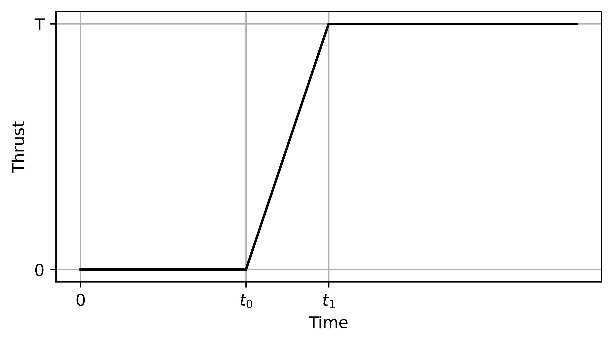
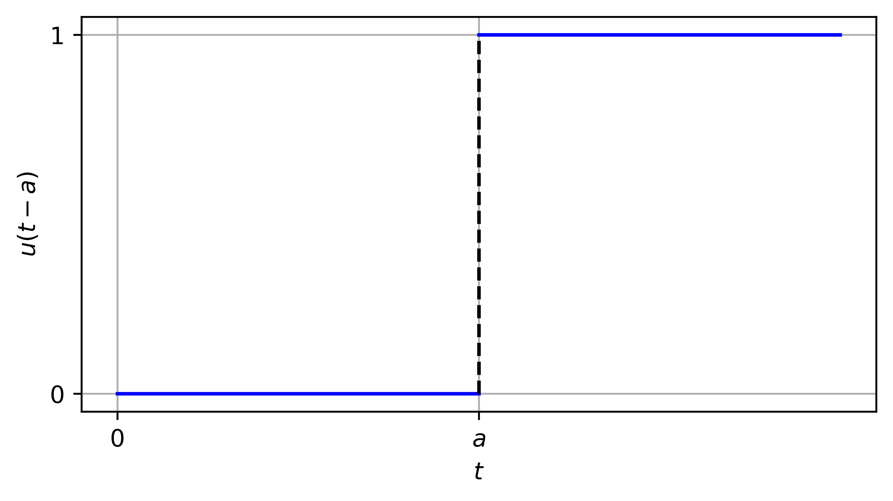
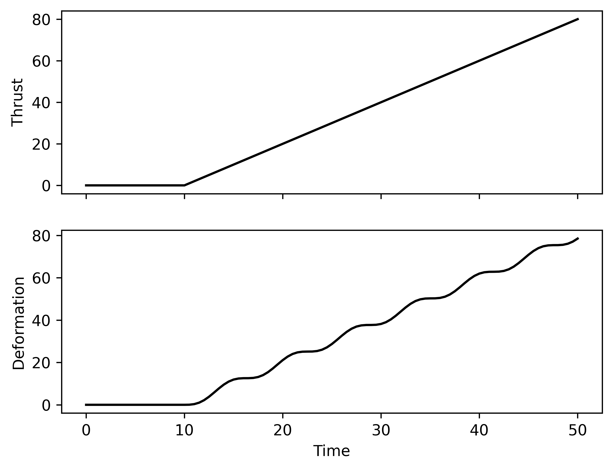
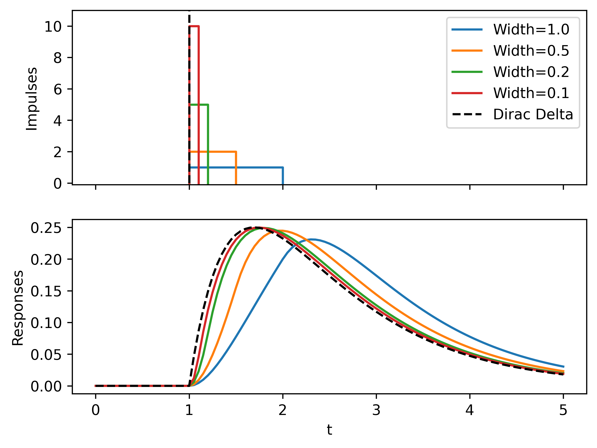

# Laplace Transform

## Learning Objectives

After learning this chapter, you will be able to:

- Perform Laplace Transform and inverse Laplace Transform of common functions.
- Use Laplace Transform to solve ODEs with constant coefficients and nonlinear forcing terms.
- Learn about the unit step function and Dirac delta function.

## Introduction

In this chapter we present Laplace Transform and its application to solve ODEs.

Why would we want to Laplace Transform? The short answer is that we want to save time. Consider the following scenario. Say we have designed an aircraft and want to check its flight quality, namely how it responds to pilot commands (deflection of ailerons, rudder, etc.) and environmental perturbations (gust, turbulence, etc.). The dynamical response of aircraft can be described by an ODE, or specifically an initial value problem (IVP),

```{math}
:label: eq:laplace-model

\begin{aligned}
\text{ODE:} &\quad y'' + a y' + b y = r(t) \\
\text{Initial conditions:} &\quad y(0) = K_0,\quad y'(0) = K_1
\end{aligned}
```

where $a$ and $b$ are constant coefficients, the prime denotes time derivative, $r$ is the time-dependent input, for example pilot commands or environmental perturbations, and $y$ is the aircraft response, for example vertical deviation from level flight, due to the input. If $y$ means displacement, then the initial conditions $y(0)$ and $y'(0)$ mean initial displacement and velocity.

Given a particular input $r(t)$, say a linear ramp input in the deflection of a horizontal rudder, $r(t)=kt$, $t>0$, we know how to solve {eq}`eq:laplace-model`, find the aircraft response, and then analyze the flight quality, for example how fast does the aircraft climb or dive? But how about

- Sinusoidal input, $r(t)=\sin(\omega t)$
- Quadratic input, $r(t)=k t^2$
- Whatever input, $r(t)=\frac{t e^{-t}}{1+t^3}$
- etc.

There are apparently infinitely many possible inputs. Do we need to manually solve each and every case to determine the flight quality? No.

Laplace Transform is one such tool that we can leverage to analyze the performance of a dynamical system, for example an aircraft, for its response to arbitrary external inputs. In the following, we will first define what it is and show its basic properties, then apply it to solve ODEs, and finally show how it helps to simplify system analysis.

## Definition

The Laplace Transform converts a function $f(t)$ in time to a function $F(s)$ in the so-called $s$-domain,

```{math}
:label: eq:lt

F(s) = \int_0^\infty e^{-st} f(t)\,\dd t
```

In the following we will use lower-case to denote a function in time and upper-case for its counterpart in the $s$-domain, and use a shorthand notation $\cL$ for the integral, so {eq}`eq:lt` is concisely written as

```{math}
F(s) = \cL[f(t)]
```

&clubs; The variable $s$ actually lives in the complex plane and relates to the oscillatory frequency and the damping ratio of $f(t)$, but for now let us just treat $s$ as a simple variable.

Formally, we can also introduce the inverse Laplace Transform, denoted

```{math}
f(t) = \cL^{-1}[F(s)]
```

The inverse Laplace Transform, however, does not have a simple, easy-to-evaluate expression similar to {eq}`eq:lt`, and later we will show several ways to perform the inverse transform.

**Examples**

Now let us try some simple examples.

1. $f(t)=t$, $t\geq 0$

```{math}
\begin{aligned}
\cL[f(t)] &= \int_0^\infty e^{-st} t\,\dd t \\
&= -\frac{1}{s} \int_0^\infty t\,\dd (e^{-st}) \\
&= -\frac{1}{s} \left[ te^{-st}\big|_0^\infty - \int_0^\infty e^{-st}\,\dd t \right] \\
&= \frac{1}{s}\int_0^\infty e^{-st}\,\dd t \\
&= \frac{1}{s} \left.\left(-\frac{1}{s}e^{-st}\right)\right|_0^\infty \\
&= \frac{1}{s^2}
\end{aligned}
```

where we used integration by parts in the third row and took limits to $\infty$ in the fourth and fifth rows. From the integral we find

```{math}
\boxed{\cL[t]=\frac{1}{s^2}}
```

2. $f(t)=e^{at}$

```{math}
\begin{aligned}
\cL[f(t)] &= \int_0^\infty e^{-st} e^{at}\,\dd t \\
&= \int_0^\infty e^{-(s-a)t}\,\dd t \\
&= \left.-\frac{1}{s-a}e^{-(s-a)t}\right|_0^\infty \\
&= \left.\left(-\frac{1}{s-a}e^{-(s-a)t}\right)\right|_\infty - \left.\left(-\frac{1}{s-a}e^{-(s-a)t}\right)\right|_0
\end{aligned}
```

It is clear that the second term is $-\frac{1}{s-a}$. As for the first term, if $s-a>0$, then it is zero, and the entire integral evaluates to $\frac{1}{s-a}$; but if $s-a\leq 0$, the term goes to infinity and the integral does not exist. To summarize,

```{math}
\boxed{\cL[e^{at}]=\frac{1}{s-a},\quad s-a>0}
```

Here we see that Laplace Transform does not always exist, but luckily in most engineering applications the transform does exist.

&clubs; We mentioned that $s$ is actually a complex variable, hence to be rigorous we should say the Laplace Transform of $e^{at}$ exists when the real part of $(s-a)$ is positive, or $\operatorname{Re}(s-a)>0$.

## Basic Properties

It would be tedious to evaluate an integral for the Laplace Transform of every single function that we encounter. Next, we explore some properties of Laplace Transform that we can leverage to greatly simplify the calculation.

### Linearity

Suppose we have two functions $f(t)$ and $g(t)$, and know that $\cL[f(t)]=F(s)$ and $\cL[g(t)]=G(s)$, then the Laplace Transform of the linear combination of $f$ and $g$ is equal to the linear combination of $F$ and $G$, or mathematically,

```{math}
\boxed{\cL[af(t)+bg(t)]=aF(s)+bG(s)}
```

for any scalar coefficients $a$ and $b$. This linearity comes from that of the integral,

```{math}
\begin{aligned}
\cL[af(t)+bg(t)] &= \int_0^\infty e^{-st} (af(t)+bg(t))\,\dd t \\
&= \int_0^\infty ae^{-st}f(t)+be^{-st}g(t)\,\dd t \\
&= a\int_0^\infty e^{-st}f(t)\,\dd t + b\int_0^\infty e^{-st}g(t)\,\dd t \\
&= a\cL[f(t)] + b\cL[g(t)] \\
&= aF(s) + bG(s)
\end{aligned}
```

&clubs; The derivation also implies the linearity of the inverse Laplace Transform.

**Examples**

With linearity we can immediately simplify some Laplace Transform calculations. For example, consider the hyperbolic cosine function

```{math}
\cosh(at) = \frac{e^{at}+e^{-at}}{2}
```

and given that we already know $\cL[e^{at}]=\frac{1}{s-a}$, then

```{math}
\begin{aligned}
\cL[\cosh(at)] &= \cL\left[\frac{e^{at}+e^{-at}}{2}\right] \\
&= \frac{1}{2}\cL[e^{at}] + \frac{1}{2}\cL[e^{-at}] \\
&= \frac{1}{2}\frac{1}{s-a} + \frac{1}{2}\frac{1}{s-(-a)}
\end{aligned}
```

Simplifying gives

```{math}
\boxed{\cL[\cosh(at)] = \frac{s}{s^2-a^2}}
```

Similarly, for the hyperbolic sine function $\sinh(at) = \frac{e^{at}-e^{-at}}{2}$, we get

```{math}
\boxed{\cL[\sinh(at)]=\frac{a}{s^2-a^2}}
```

&clubs; If this is the first time that you see hyperbolic sine and cosine functions, here is one reason why we use them.

&clubs; Consider an ODE $y''-a^2y=0$. From the characteristic equation method we know $y(t)=c_1 e^{at} + c_2 e^{-at}$. An alternative way is to write $y(t)=d_1 \cosh(at)+d_2 \sinh(at)$, where one can show that arbitrary coefficients satisfy $c_1=(d_1+d_2)/2$ and $c_2=(d_1-d_2)/2$. The latter version is often preferred due to nice properties of the hyperbolic functions: $\cosh$ is even, $\cosh(t)=\cosh(-t)$, and $\sinh$ is odd, $\sinh(t)=-\sinh(-t)$; derivative relations are $\cosh(at)'=a\sinh(at)$ and $\sinh(at)'=a\cosh(at)$.

&clubs; These functions become particularly useful for some differential equations, such as the Laplace equation.

Mathematicians have worked hard to create tables of Laplace Transform, where the transforms of known functions are given. Using the table and the linearity property of Laplace Transform, we can obtain the transform of many functions easily.

:::{table} Laplace Transform of common functions
:name: tbl:ft

| $f(t)$ | $F(s)$ |
| :---: | :---: |
| $1$ | $1/s$ |
| $t$ | $1/s^2$ |
| $t^2$ | $2!/s^3$ |
| $t^n$ | $n!/s^{n+1}$ |
| $e^{at}$ | $1/(s-a)$ |
| $\cos(\omega t)$ | $s/(s^2+\omega^2)$ |
| $\sin(\omega t)$ | $\omega/(s^2+\omega^2)$ |
| $\cosh(at)$ | $s/(s^2-a^2)$ |
| $\sinh(at)$ | $a/(s^2-a^2)$ |
| $e^{at}\cos(\omega t)$ | $(s-a)/((s-a)^2+\omega^2)$ |
| $e^{at}\sin(\omega t)$ | $\omega/((s-a)^2+\omega^2)$ |
:::

### $s$-Shifting

In the above list, you might have noticed some similarity between the Laplace Transforms of $\cos(\omega t)$ and $e^{at}\cos(\omega t)$, where the transforms differ by the replacement of $s$ by $(s-a)$. This is another property of Laplace Transform, called $s$-shifting. Suppose we know $\cL[f(t)]=F(s)$, then

```{math}
\boxed{\cL[e^{at}f(t)]=F(s-a)}
```

It is easy to derive this property from the definition,

```{math}
\begin{aligned}
\cL[e^{at}f(t)] &= \int_0^\infty e^{-st} e^{at}f(t)\,\dd t \\
&= \int_0^\infty e^{-(s-a)t} f(t)\,\dd t \\
&= \int_0^\infty e^{-s^*t} f(t)\,\dd t \\
&= F(s^*) \\
&= F(s-a)
\end{aligned}
```

where in the third row we introduced a new variable $s^*$, and the key is that the Laplace Transform is an integral with respect to $t$, regardless of the particular $s$ variable used.

**Examples**

Find the Laplace Transform of $t e^{at}$. We already know $\cL[t]=1/s^2$. Let $f(t)=t$ and apply $s$-shifting, then

```{math}
\cL[t e^{at}] = \frac{1}{(s-a)^2}
```

### Derivative

Now we more or less know enough to calculate Laplace Transform, and let us take one step closer to solving ODEs. To do so, we need to know how to calculate the Laplace Transform of derivatives. Suppose $\cL[f(t)]=F(s)$. The first-order time derivative has transform

```{math}
\boxed{\cL[f'(t)] = sF(s) - f(0)}
```

and the second-order time derivative has transform

```{math}
\boxed{\cL[f''(t)] = s^2F(s) - sf(0) - f'(0)}
```

If we think of these terms as those in the IVP that we saw earlier, then we see that the initial conditions come into the Laplace Transforms of the derivatives.

The derivation of the first-order case is by definition,

```{math}
\begin{aligned}
\cL[f'(t)] &= \int_0^\infty e^{-st} f'(t)\,\dd t \\
&= \int_0^\infty e^{-st}\,\dd f(t) \\
&= e^{-st} f(t) \big|_0^\infty - \int_0^\infty f(t)\,\dd (e^{-st}) \\
&= (0-f(0)) - (-s)\int_0^\infty e^{-st} f(t)\,\dd t \\
&= -f(0) + sF(s)
\end{aligned}
```

where we used integration by parts in the third row and assumed $\lim_{t\rightarrow\infty}e^{-st} f(t)=0$ in the fourth row. The assumption is typically valid in engineering applications, as we deal with functions having finite values.

Then the derivation of the second-order case recycles the first-order result,

```{math}
\begin{aligned}
\cL[f''(t)] &= \cL[(f'(t))'] \\
&= s\cL[f'(t)]-f'(0) \\
&= s(sF(s) - f(0))-f'(0) \\
&= s^2 F(s) - sf(0) - f'(0)
\end{aligned}
```

where we effectively apply twice the first-order rule.

&clubs; For the general $n$-th order case, you would get $\cL[f^{(n)}]=s^n F(s) - s^{n-1}f(0) - s^{n-2}f'(0) - \cdots - f^{(n-1)}(0)$.

## Application to ODEs

Now we are ready to solve the IVP posed at the beginning,

```{math}
\begin{aligned}
\text{ODE:} &\quad y'' + a y' + b y = r(t) \\
\text{ICs:} &\quad y(0) = K_0,\quad y'(0) = K_1
\end{aligned}
```

To use Laplace Transform to solve the IVP, we introduce a three-step procedure, or a trilogy. The key idea is to (1) convert the differential equation in time domain to an algebraic one in the $s$-domain, (2) solve the algebraic problem, and then (3) convert the solution in the $s$-domain back to time domain.

To get a better understanding of the procedure, while we go through the trilogy, let us also keep one physical picture in mind. We have a system (sometimes called a plant), such as an aircraft; it is subjected to an input $r(t)$ and returns an output $y(t)$,

```{math}
\boxed{\text{Input: }r(t)}\rightarrow\boxed{\text{Plant: }y'' + a y' + b y}\rightarrow\boxed{\text{Output: }y(t)}
```

### The Trilogy

#### Step 1: Conversion to Algebraic Problem (AP)

Denoting $\cL[r(t)]=R(s)$ and $\cL[y(t)]=Y(s)$, we apply Laplace Transform to both sides of the ODE,

```{math}
\begin{aligned}
\cL[y'' + a y' + b y] &= \cL[r(t)] \\
\cL[y''] + a \cL[y'] + b \cL[y] &= \cL[r(t)] \\
(s^2Y - sy(0) - y'(0)) + a(sY-y(0)) + bY &= R
\end{aligned}
```

The last equation, converted from the ODE, is also called the subsidiary equation, where we know $R$ from the input and $y(0)$ and $y'(0)$ from the initial condition, and the only unknown is $Y$. Solving the subsidiary equation for $Y$ is what we call the algebraic problem.

#### Step 2: Solve for $Y(s)$

Let us reorganize the subsidiary equation,

```{math}
\underbrace{(s^2 + as + b)}_{\equiv 1/Q(s)} Y(s) = R(s) + \underbrace{(s+a) y(0) + y'(0)}_{\equiv I(s)}
```

Then the unknown function is solved as

```{math}
Y(s) = Q(s)R(s) + Q(s)I(s)
```

So far it is just algebra, and now let us endow the terms with physical meaning. Knowing that $Y(s)$ represents the system response, we see that it is composed of two parts: (1) forced response due to the input $Q(s)R(s)$ and (2) initial transients due to initial conditions $Q(s)I(s)$. Furthermore, if we assume zero initial conditions, $I(s)=0$,

```{math}
Q(s) = \frac{Y(s)}{R(s)} = \frac{\text{Output}}{\text{Input}}
```

Hence $Q(s)$ can be viewed as something that transfers the input to the output, and we call it the transfer function. For our current IVP,

```{math}
Q(s) = \frac{1}{s^2 + as + b}
```

which depends only on the system parameters and represents dynamical characteristics inherent to the system. We can view the input-plant-output figure in the $s$-domain as

```{math}
\boxed{\text{Input: }R(s)}\rightarrow\boxed{\text{Plant: }Q(s)}\rightarrow\boxed{\text{Output: }Y(s)}
```

#### Step 3: Find $y(t)$ from $Y(s)$

The last step is to perform the inverse Laplace Transform and convert $Y(s)$ to $y(t)$ to find the system response.

```{math}
y(t) = \cL^{-1}[Y(s)] = \cL^{-1}[Q(s)R(s)] + \cL^{-1}[Q(s)I(s)]
```

**Example**

For simplicity, consider a first-order ODE,

```{math}
y'-y=1,\quad y(0)=1
```

Conducting the trilogy:

- Conversion to Algebraic Problem:

```{math}
\begin{aligned}
sY(s)-y(0)-Y(s) &= 1/s \\
(s-1)Y(s) &= 1/s + y(0) = 1/s+1
\end{aligned}
```

- Solve for $Y(s)$:

```{math}
Y(s) = \frac{1}{s(s-1)} + \frac{1}{s-1}
```

- Find $y(t)$ from $Y(s)$:

```{math}
\begin{aligned}
y(t) &= \cL^{-1}[Y(s)] \\
&= \cL^{-1}\left[\frac{1}{s(s-1)}\right] + \cL^{-1}\left[\frac{1}{s-1}\right] \\
&= \cL^{-1}\left[\frac{1}{s-1}-\frac{1}{s}\right] + \cL^{-1}\left[\frac{1}{s-1}\right] \\
&= 2\cL^{-1}\left[\frac{1}{s-1}\right] - \cL^{-1}\left[\frac{1}{s}\right] \\
&= 2e^{t} - 1
\end{aligned}
```

where in the third row we used the identity $\frac{1}{s(s-1)}=\frac{1}{s-1}-\frac{1}{s}$, and then in the fourth row we used the Laplace Transform table to recover the function in time domain.

### Evaluating Inverse Laplace Transform

Step 3 of the trilogy may appear simple, but as you might have already inferred from the previous example, the inverse Laplace Transform in Step 3 is not always straightforward and can be time consuming. A typical strategy is to use partial fraction decomposition (PFD) to divide $Y(s)$ into simpler terms that we already know how to invert. In the following we present a few typical examples of PFD.

**Example 1**: $\frac{1}{(s+1)(s+2)}$

Note that the numerator is a constant, $1$, so we assume a PFD of constant coefficients as well,

```{math}
\begin{aligned}
\frac{1}{(s+1)(s+2)} &= \frac{A}{s+1} + \frac{B}{s+2} \\
&= \frac{A(s+2)+B(s+1)}{(s+1)(s+2)} \\
&= \frac{(A+B)s+(2A+B)}{(s+1)(s+2)}
\end{aligned}
```

The first and third rows are equal and thus we must have the same numerators, namely $(A+B)s+(2A+B)=1=0\cdot s+1$. This means

```{math}
\left\{
    \begin{array}{l}
    A+B=0 \\
    2A+B=1
    \end{array}
\right.
```

and we get $A=1$ and $B=-1$. The PFD is thus

```{math}
\boxed{\frac{1}{(s+1)(s+2)} = \frac{1}{s+1} - \frac{1}{s+2}}
```

**Example 2**: $\frac{s}{(s+2)^2}$

Here we have just one factor $(s+2)$ in the denominator, but the factor is squared. In this case we typically assume a form having the same factor $(s+2)$ but with all possible orders,

```{math}
\begin{aligned}
\frac{s}{(s+2)^2} &= \frac{A}{(s+2)^2} + \frac{B}{s+2} \\
&= \frac{A+B(s+2)}{(s+2)^2} \\
&= \frac{Bs+A+2B}{(s+2)^2}
\end{aligned}
```

To have $Bs+A+2B=s$, we need $B=1$ and $A=-2$, then the PFD is

```{math}
\boxed{\frac{s}{(s+2)^2} = -\frac{2}{(s+2)^2} + \frac{1}{s+2}}
```

**Example 3**: $\frac{3s+3}{(s^2+1)(s^2+4)}$

This time we have two different factors and a numerator that is linear in $s$, hence we have to assume a more complex form of PFD, where the numerators are linear too,

```{math}
\begin{aligned}
\frac{3s+3}{(s^2+1)(s^2+4)} &= \frac{As+B}{s^2+1} + \frac{Cs+D}{s^2+4} \\
&= \frac{(As+B)(s^2+4) + (Cs+D)(s^2+1)}{(s^2+1)(s^2+4)} \\
&= \frac{(A+C)s^3+(B+D)s^2+(4A+C)s+(4B+D)}{(s^2+1)(s^2+4)}
\end{aligned}
```

Again matching coefficients in the numerator,

```{math}
\left\{
    \begin{array}{l}
    A+C=0 \\
    B+D=0 \\
    4A+C=3 \\
    4B+D=3
    \end{array}
\right.
```

It is a little more tedious, but we can find $A=1$, $B=1$, $C=-1$, and $D=-1$, so the PFD is

```{math}
\boxed{\frac{3s+3}{(s^2+1)(s^2+4)} = \frac{s+1}{s^2+1} - \frac{s+1}{s^2+4}}
```

## Special Inputs: Unit-Step and Dirac Delta

Going toward more practical applications, often we need to deal with two special types of IVPs. The first type involves piecewise inputs that resemble a multi-stage operation. One example is rocket launch, where the input is the thrust from the engine and one of the simplest models is

```{math}
:label: eq:piece

r(t) = \left\{
\begin{array}{ll}
0, &\ t<t_0\quad \text{Before ignition} \\
k(t-t_0), &\ t_0\leq t<t_1\quad \text{Engine start} \\
k(t_1-t_0), &\ t\geq t_1\quad \text{Full throttle}
\end{array}
\right.
```

The second type of IVP involves transient impulses that can emulate sudden impacts on an engineering system. One example is a car crash experiment, where the input to the car is a huge force that lasts for a tiny period of time.



### Unit Step Function and Piecewise Function

We first introduce the unit step function to represent a piecewise function, and then see how it helps to simplify the Laplace Transform. The unit step function is defined as

```{math}
u(t-a) = \left\{
\begin{array}{ll}
0, &\ t<a \\
1, &\ t\geq a
\end{array}
\right.
```

This is as if a switch: the switch is turned off when $t<a$ and once past $t=a$ the switch is instantly turned on. For example, if $f(t)=t^2$, then $f(t)u(t)$ is a function that is zero when $t<0$ and a parabolic curve when $t\geq 0$. Furthermore, since for any function $g(t)$, $g(t-a)$ means shifting the function to the right by $a$, then in the previous example $f(t-a)u(t-a)$ represents half of a parabolic curve that starts from $t=a$ and everything left of $t=a$ is zero.



Taking a step further, using two unit step functions, we can represent a function over a finite interval. Since $u(t-a)-u(t-b)$ is a function that is $1$ when $a\leq t < b$ and $0$ otherwise, then for any function $f(t)$, $f(t)(u(t-a)-u(t-b))$ is only a segment of $f(t)$ over the interval $a\leq t < b$.

Then we are ready to represent a piecewise function using unit step functions. Taking {eq}`eq:piece` for example, we can write

```{math}
\begin{aligned}
r(t) &= \underbrace{k(t-t_0)(u(t-t_0)-u(t-t_1))}_{\text{Engine start}} + \underbrace{k(t_1-t_0) u(t-t_1)}_{\text{Full throttle}} \\
&= k(t-t_0)u(t-t_0) + (-k(t-t_0)+k(t_1-t_0))u(t-t_1) \\
&= k(t-t_0)u(t-t_0) - k(t-t_1)u(t-t_1)
\end{aligned}
```

where we did not write out the first segment since it is zero. Instead of a large bracket of three lines, we use two unit step functions to represent the input in one line.

Subsequently, if we are able to do Laplace Transform of a function having a unit step function, then we can solve IVPs having piecewise functions.

Let us first look at the unit step function alone,

```{math}
\begin{aligned}
\cL[u(t-a)] &= \int_0^\infty e^{-st}u(t-a)\,\dd t \\
&= \int_0^a e^{-st}\cdot 0\,\dd t + \int_a^\infty e^{-st}\cdot 1\,\dd t \\
&= -\frac{1}{s}e^{-st} \big|_a^\infty \\
&= \frac{e^{-as}}{s}
\end{aligned}
```

Furthermore, if we know $\cL[f(t)]=F(s)$, then there is a $t$-shifting property of Laplace Transform,

```{math}
\boxed{\cL[f(t-a)u(t-a)]=e^{-as}F(s)}
```

The $t$-shifting is derived as follows

```{math}
\begin{aligned}
\cL[f(t-a)u(t-a)] &= \int_0^\infty e^{-st}f(t-a)u(t-a)\,\dd t \\
&= \int_a^\infty e^{-st}f(t-a)\,\dd t \\
&= \int_a^\infty e^{-as}e^{-s(t-a)}f(t-a)\,\dd t \\
&= \int_0^\infty e^{-as}e^{-st'}f(t')\,\dd t' \\
&= e^{-as} F(s)
\end{aligned}
```

where in the fourth row we used the change of variable $t'=t-a$.

Using $t$-shifting, we can find the Laplace Transform of piecewise functions, and thus solve the corresponding IVPs. If we solve an IVP with $n$ pieces of inputs using analytical methods, we would need to solve each interval sequentially as if they were individual IVPs, solving one interval and identifying the new initial conditions for the next. Using Laplace Transform, we solve the IVP once.

**Example**

With the $t$-shifting property, we can solve an IVP with piecewise inputs. Suppose a rocket is flexible, so that when it is subjected to a thrust, the rocket not only flies upward, but also vibrates along its axis. Consider the IVP for the rocket deformation,

```{math}
y''+y=r(t),\quad y'(0)=y(0)=0
```

with

```{math}
r(t) = \left\{
\begin{array}{ll}
0, &\ t\leq a \\
k(t-a), &\ t>a
\end{array}
\right.
```

We first represent the input using the unit step function. There are only two pieces and thus one unit step is sufficient: $r(t)=k(t-a)u(t-a)$. Then it is the usual trilogy.

- Conversion to Algebraic Problem:

```{math}
(s^2+1)Y(s) = \cL[k(t-a)u(t-a)]
```

To use $t$-shifting to compute the right-hand side, identify $f(t)=kt$ and $\cL[kt]=\frac{k}{s^2}$, then

```{math}
\cL[k(t-a)u(t-a)] = e^{-as}\cL[kt] = \frac{ke^{-as}}{s^2}
```

- Solve for $Y(s)$:

```{math}
Y(s) = \frac{ke^{-as}}{s^2(s^2+1)}
```

- Find $y(t)$ from $Y(s)$:

```{math}
\begin{aligned}
y(t) &= \cL^{-1}\left[\frac{ke^{-as}}{s^2(s^2+1)}\right] \\
&= \cL^{-1}\left[\frac{ke^{-as}}{s^2}\right] - \cL^{-1}\left[\frac{ke^{-as}}{s^2+1}\right] \\
&= k(t-a)u(t-a) - k\sin(t-a)u(t-a)
\end{aligned}
```

where we used the PFD $\frac{1}{s^2(s^2+1)}=\frac{1}{s^2}-\frac{1}{s^2+1}$; in the second row, the first term has already been obtained in Step 1, and in the second term we know from the Laplace Transform table that $\cL[\sin t]=\frac{1}{s^2+1}$ and can apply $t$-shifting in reverse.

Hence the response is

```{math}
\boxed{y(t) = (k(t-a) - k\sin(t-a))u(t-a)}
```

The solution means that upon ignition, the rocket deformation has two modes of motion, both of which can be dangerous: static compression ($k(t-a)$, buckling of the hull) and longitudinal vibration ($k\sin(t-a)$, destabilizing flight dynamics).



### Dirac Delta Function and Sudden Impulse

Lastly, we turn to IVPs with impulse inputs. First consider a realistic impulse, meaning that the duration and amplitude of the impulse are finite, and thus the total impulse energy is finite. We use unit step functions to represent this impulse,

```{math}
r(t) = h (u(t-a)-u(t-b))
```

with duration $b-a$, amplitude $h$, and total energy $h(b-a)$.

**Example, Part I**

Consider a car crash experiment, where we can model the impact as $r(t)=u(t-1)-u(t-2)$, that is, an impulse of amplitude $1$ that starts at $t=1$ and ends at $t=2$. Suppose the car bumper system is modeled as

```{math}
y''+3y'+2y = r(t),\quad y'(0)=y(0)=0
```

Solve the IVP with the trilogy.

- Conversion to Algebraic Problem:

```{math}
(s^2+3s+2)Y(s) = \cL[u(t-1)-u(t-2)] = \frac{1}{s}(e^{-s} - e^{-2s})
```

- Solve for $Y(s)$:

```{math}
Y(s) = \frac{e^{-s} - e^{-2s}}{s(s^2+3s+2)}
```

- Find $y(t)$ from $Y(s)$:

Note the PFD $\frac{1}{s(s^2+3s+2)} = \frac{1/2}{s}-\frac{1}{s+1}+\frac{1/2}{s+2}$, so

```{math}
y(t) = \cL^{-1}[Y(s)] = \cL^{-1}\left[ (e^{-s} - e^{-2s}) \left(\frac{1/2}{s}-\frac{1}{s+1}+\frac{1/2}{s+2}\right) \right]
```

If we perform inverse Laplace Transform without the $e^{-as}$ terms,

```{math}
\begin{aligned}
&\ \cL^{-1}\left[ \frac{1/2}{s}-\frac{1}{s+1}+\frac{1/2}{s+2} \right] \\
&= \cL^{-1}\left[\frac{1/2}{s}\right] - \cL^{-1}\left[\frac{1}{s+1}\right] + \cL^{-1}\left[\frac{1/2}{s+2}\right] \\
&= \frac{1}{2} - e^{-t} + \frac{1}{2}e^{-2t} \equiv f(t)
\end{aligned}
```

Then using $t$-shifting, we find the final response

```{math}
\boxed{y(t) = f(t-1)u(t-1) - f(t-2)u(t-2)}
```

This solution is rather cumbersome. One impulse has two unit steps, and we have to carry around two $e^{-as}$ terms throughout the solution; unit step introduces an extra factor $1/s$ that complicates the PFD; $f(t)$ has three terms, so $y(t)$ has six terms, which can be difficult to analyze and interpret.

This is where the Dirac delta function $\delta(t)$ comes into play. It is an idealization of the finite impulse and simplifies the solution and analysis of impulse-related IVPs. Specifically, Dirac delta is an impulse having zero duration, infinite amplitude, and finite total impulse energy. Formally, we define

```{math}
\delta(t-a) = \left\{
\begin{array}{ll}
\infty, &\ t=a \\
0, &\ \text{Otherwise}
\end{array}
\right.
```

and

```{math}
\int_{-\infty}^\infty \delta(t-a)\,\dd t = 1
```

The integral says that the total impulse energy is unity. The Dirac delta has an indicator property that, for any function $g(t)$,

```{math}
\int_{-\infty}^\infty g(t)\delta(t-a)\,\dd t = g(a)
```

so that $\delta(t-a)$ acts as if it picks out the value of $g(t)$ at $t=a$.

Using the indicator property, the Laplace Transform is easy to find,

```{math}
\cL[\delta(t-a)] = \int_0^\infty e^{-st}\delta(t-a)\,\dd t = \boxed{e^{-as}}
```

**Example, Part II**

Now turn back to the previous example. The finite impulse model had total energy $1$ starting at $t=1$, so here we replace the input with a Dirac delta at $t=1$:

```{math}
y''+3y'+2y = r(t) = \delta(t-1),\quad y'(0)=y(0)=0
```

The trilogy:

- Conversion to Algebraic Problem:

```{math}
(s^2+3s+2)Y(s) = \cL[\delta(t-1)] = e^{-s}
```

- Solve for $Y(s)$:

```{math}
Y(s) = \frac{e^{-s}}{s^2+3s+2}
```

- Find $y(t)$ from $Y(s)$:

```{math}
\begin{aligned}
y(t) &= \cL^{-1}\left[ \frac{e^{-s}}{s^2+3s+2} \right] \\
&= \cL^{-1}\left[ \frac{e^{-s}}{s+1} \right] - \cL^{-1}\left[ \frac{e^{-s}}{s+2} \right]
\end{aligned}
```

If we perform inverse Laplace Transform without the $e^{-as}$ term,

```{math}
\begin{aligned}
&\ \cL^{-1}\left[\frac{1}{s+1}\right] - \cL^{-1}\left[\frac{1}{s+2}\right] \\
&= e^{-t} - e^{-2t}
\end{aligned}
```

Then using $t$-shifting, we find the final response

```{math}
\boxed{y(t) = (e^{-(t-1)} - e^{-2(t-1)})u(t-1)}
```

Clearly, the Dirac delta greatly simplifies the solution procedure by eliminating the shortcomings mentioned earlier with finite impulses. Even better, the Dirac delta solution matches quantitatively well with the finite-impulse one, and hence Dirac delta has been widely used in many engineering applications.



See an interactive example in {doc}`M1_impulse`.


## Exploration by Interaction

From previous courses you may have seen the concept of resonance. For a spring-mass-damper system, when the excitation frequency is closer to the system frequency, the system response becomes maximized and unbounded if there is no damping.

Laplace Transform gives us a new way to look at resonance, via the concept of poles. Specifically, if we write the governing equation

```{math}
y'' + 2\zeta\omega_0 y' + \omega_0^2 y = \exp(-\sigma t)\cos(\omega t)
```

where $\omega_0$ is the natural frequency, $\zeta$ is damping ratio, $y$ is the displacement, and the right-hand side is an input with decay rate $\sigma$ and frequency $\omega$. The transfer function is

```{math}
Q(s) = \frac{1}{s^2 + 2\zeta\omega_0 s + \omega_0^2}
```

The Laplace Transform of the input is

```{math}
R(s) = \frac{s+\sigma}{(s+\sigma)^2+\omega^2}
```

While looking at the interaction, let us fix $\omega_0=2$ and sweep over different $\omega$.

- First, let $\zeta=0$ and $\sigma=0$. Locate the roots of the denominators of $Q(s)$ and $R(s)$ on the right figure, which shows the $s$-plane. The slider controls the value of $\omega$, and the time-domain response is shown on the left figure. This is standard resonance, so we know when $\omega=\omega_0$, the amplitude of response becomes maximized, in fact unbounded. On the $s$-plane, we see that resonance corresponds to when the roots overlap.
- Next, let $\zeta=0.2$ and $\sigma=0$. Same drill: find the roots. Then, as you change the input frequency, when is the response maximized? How does the response amplitude correlate to the relative locations between the two sets of roots? How would your answer change with different values of $\zeta$?
- Lastly, let $\zeta=0.2$ and $\sigma=0.1$. After locating the roots, first guess at what $\omega$ will produce the maximum response amplitude, and then verify your guess. How would your answer change with different values of $\sigma$?

The roots of the denominator of $Q(s)$ are called poles, and determine the dynamic characteristics of the system. With knowledge of the poles, one can infer the system behavior without actually finding the time-domain solution.

Two more things to explore if you are interested:

- Turn on the gain plot. We plot contours of the absolute value of $Q(s)$, or more accurately the log of $|Q(s)|$ due to the rapid change in $|Q(s)|$. How is $|Q(s)|$ related to the response amplitude? The answer explains why $|Q(s)|$ is called gain.
- With all the above knowledge, explore the overdamped case, namely $\zeta>1$.

:::{container} course-interactive course-interactive-m1-periodic-excite
Interactive example loading...
:::

Also in {doc}`M1_periodic_excite`.

## Summary of Basic Modules

By now you should be able to:

- Perform Laplace Transform (LT) and inverse Laplace Transform (ILT) of common functions.
  - Compute LT by definition, or by utilizing the properties of linearity and $s$-shifting.
  - Compute ILT using the LT table and partial fraction decomposition.
- Use LT to solve ODEs with constant coefficients and nonlinear forcing terms.
  - Know the derivative properties of LT (first-order and second-order).
  - Use the LT trilogy to solve an ODE: derive the subsidiary equation, solve it, and do ILT.
  - Have an idea of transfer function: a ratio between output and input.
- Learn about the unit step function and Dirac delta function.
  - Know the definition and LT of the unit step and Dirac delta functions.
  - Perform LT and ILT with the $t$-shifting property.
  - Solve ODEs involving the two functions.
