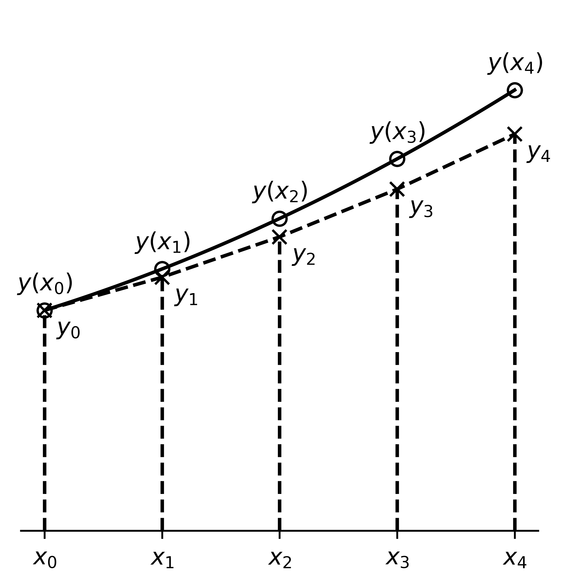
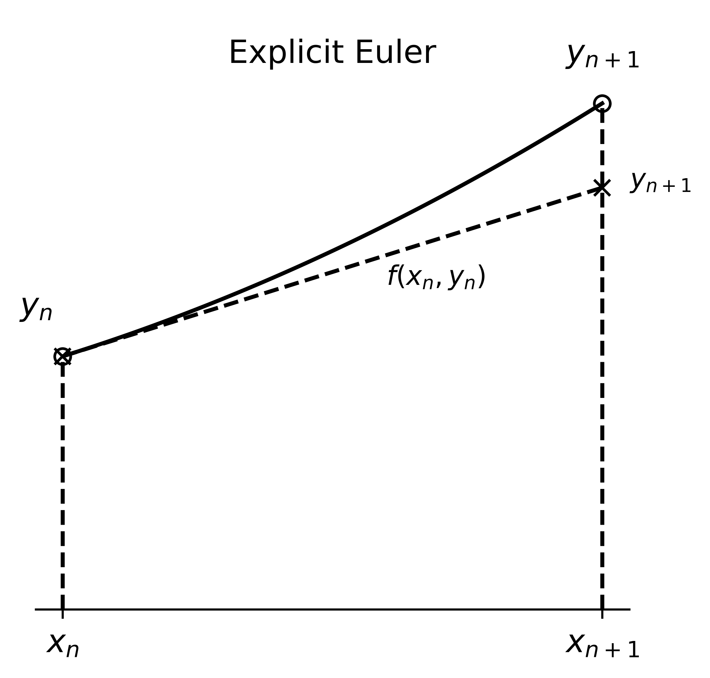
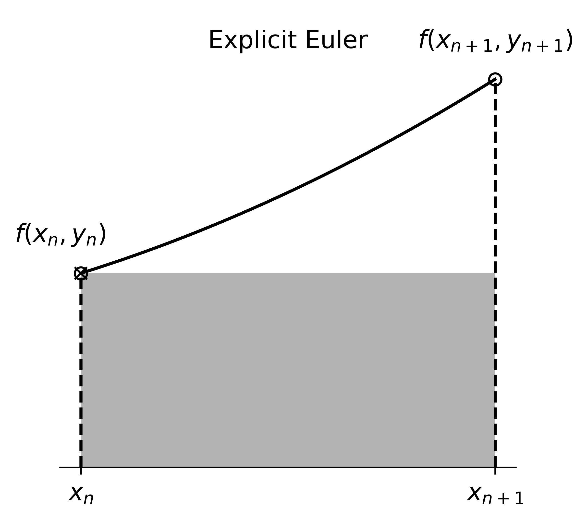
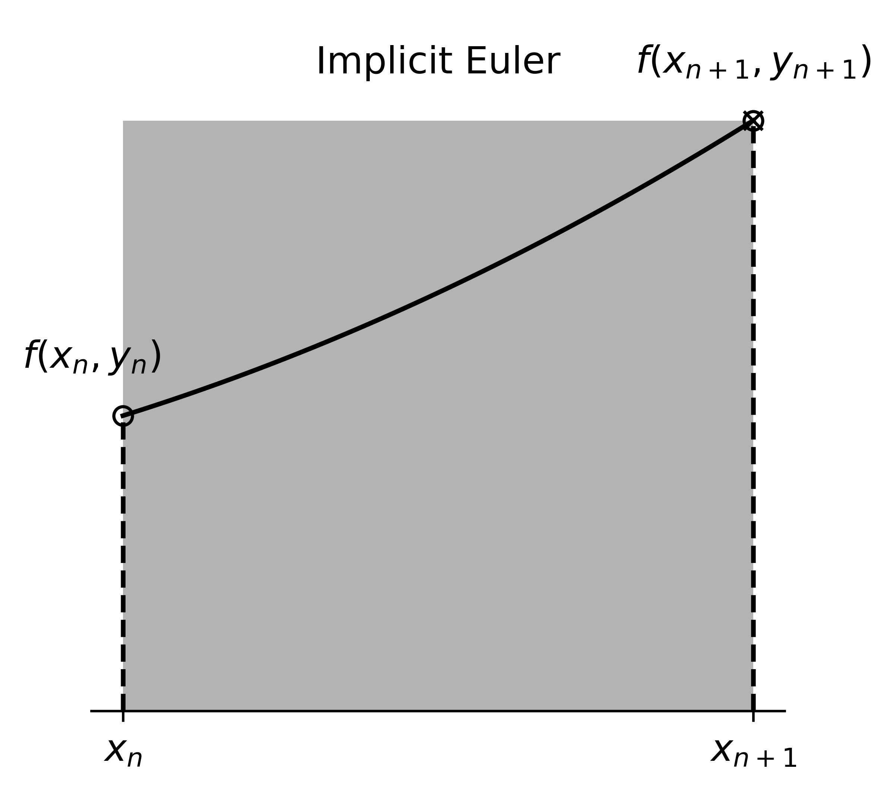
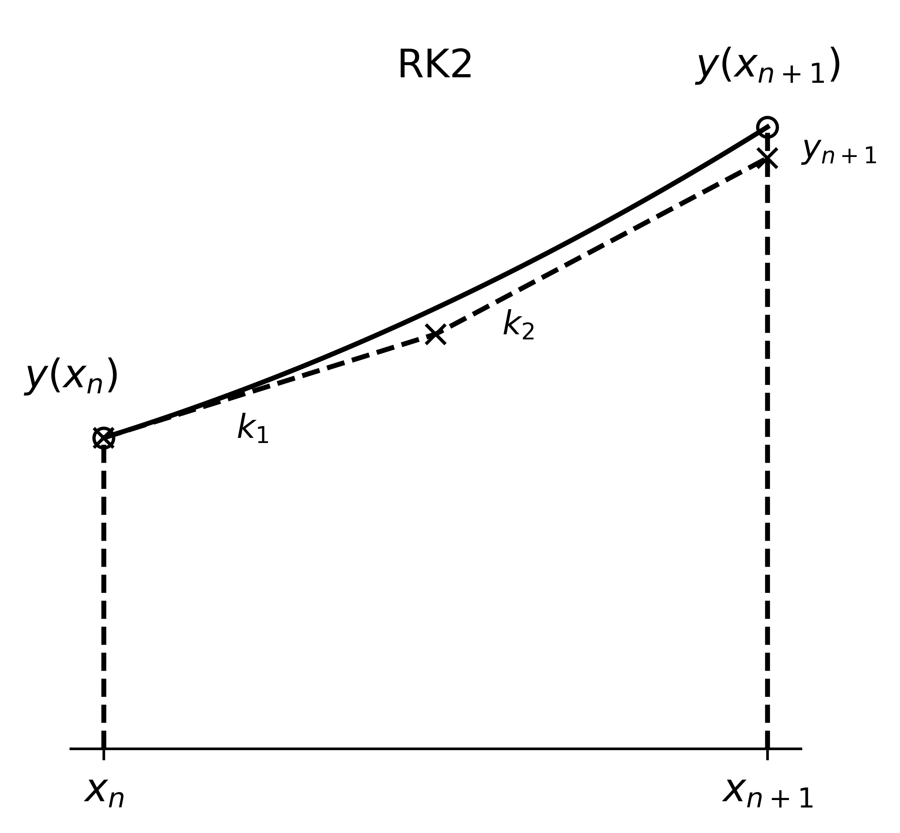

# Numerical Methods for ODEs

## Learning Objectives

After learning this chapter, you will be able to:

+ Learn about a few common numerical ODE methods.
+ Understand several ways to assess a numerical method.
+ Apply the numerical methods to solve first-order and higher-order ODEs.


## Introduction
From the motivating chapter, we already see an example of aircraft flight dynamics, where the ODE is nonlinear and cannot be solved by analytical methods.  However, often for a comprehensive assessment of the aircraft dynamical stability and handling quality, one does need the solutions to the nonlinear ODE for the accurate prediction of the aircraft motion.  Another example of nonlinear ODE is the orbital dynamics, e.g., rendezvous, where two spacecraft need to meet up.  The spacecraft are governed by rigid body dynamic equations and influenced by celestial gravitation forces, and the resulting ODE's are highly nonlinear.  Yet, the rendezvous requires highly accurate predictions of spacecraft motion, perhaps with errors less than centimeters over a thousand-kilometer-long trajectory, otherwise the spacecraft may miss each other or, even worse, crash into each other.  Therefore in this example we again need a way to solve the nonlinear ODE's for orbital dynamics.

The tools to be introduced in this chapter are general methods that can be used to solve nonlinear ODE's with the help of computers.  Specifically, we focus on the solution of the following Initial Value Problem (IVP),
```{math}
:label: eq:model

\begin{aligned}
\text{ODE:} &\quad y' = f(x,y) \\
\text{Initial conditions:} &\quad y(x_0) = y_0 \\
\text{Interval:} &\quad x_0\leq x\leq x_f
\end{aligned}
```
where $y'=\dd y/\dd x$, $f(x,y)$ is a nonlinear function, $y(x)$ denotes the true solution, and $[x_0,x_f]$ is the interval on which we look for the solution.  The goal is to find the solution given the known values $(x_0,y_0)$ from the initial conditions.

&clubs; While we are starting with a first-order ODE of a scalar unknown, later we will see that the methods presented in this chapter can be adapted easily to solve first-order ODE's of multiple unknowns and higher-order ODE's.

See an interactive example in {doc}`M2_double_pendulum`.

## Problem Formulation
The first thing to know about numerical methods is that they produce only approximate solutions.  The approximation, ultimately, comes from the digital representation of numbers in a computer: there is no way to *truly* represent a continuous range of numbers in the computer, and everything needs to be discretized in one way or another.  Specific to the IVP, the discretization means we can only find a sequence of points
```{math}
\{(x_0,y_0), (x_1,y_1), (x_2,y_2), \cdots, (x_N,y_N)\}
```
that lie on or near the true solution $y=y_{\text{true}}(x)$, instead of the value of $y$ at any $x$.  This is the price to pay when we turn to a numerical method, instead of an analytical, exact, method.  Yet, for nonlinear ODE's, there are really not many choices.



Furthermore, we simplify the problem a little more.  Suppose we choose a fixed **step size** of $h$, meaning that we distribute the $x$'s evenly over the interval $[x_0,x_f]$ with a space of $h$ between neighboring $x$'s.  This way we know $x_i=x_0+ih$ for $i=1,2,\cdots,N$, and our goal is to find the only unknowns $y_1,y_2,\cdots,y_N$.  We define the numerical IVP as
```{math}
\begin{aligned}
\text{Given:} &\quad y' = f(x,y),\ y(x_0) = y_0 \\
\text{Find:} &\quad y_n = y(x_n),\ x_n=x_0+nh,\ n=1,2,\cdots, N
\end{aligned}
```


## A First Taste: Explicit Euler Method

### Definition
We will start with the first and simplest numerical method, that dates back to the 18th century, called **explicit Euler method**, or sometimes called forward Euler method.  This method forms the basis for the development of the subsequent and many other methods.

We first show two complementary ways of how the method works.

+ **Taylor series expansion**: To find $y_1$,
```{math}
\begin{aligned}
y_1 &= y(x_1) \\
&= y(x_0+h) \\
&= y(x_0) + \ddf{y}{x}(x_0) h + \frac{\dd^2 y}{\dd x^2}(x_0) h^2 + ...
\end{aligned}
```

Looking at the last equation: from initial condition, the first term is $y(x_0)=y_0$; from the ODE, the second terms is $\ddf{y}{x}(x_0)h=y'(x_0)h=f(x_0,y_0)h$; the rest terms are denoted $O(h^2)$.  The Big-$O$ notation $O(h^n)$ means that the terms are proportional to $h^n$, or, "grows" like $h^n$.  In this notation, the second term would be $O(h)$.  When $h$ is small, say 0.01, then $O(h)$ and $O(h^2)$ would be on the orders of 0.01 and 0.0001, and $O(h)\gg O(h^2)$; in other words, $O(h^2)$ is negligible when compared to $O(h)$.

Given the above discussion, the derivation continues as
```{math}
\begin{aligned}
y_1 &= y_0 + f(x_0,y_0) h + O(h^2) \\
&\approx y_0 + f(x_0,y_0) h
\end{aligned}
```
where in the last step we ignored the $O(h^2)$ terms, or **truncated** the second-order terms.  Once $y_1$ is known, we can continue to find $y_2$, $y_3$, etc., and in general,
```{math}
y_{n+1} = y_n + h f(x_n,y_n)
```
This is the explicit Euler method.  The "explicit" means that, once the quantities at step $n$, $(x_n,y_n)$, are known, the unknown $y_{n+1}$ at the next step can be computed immediately.

&clubs; Later we will see an "implicit" version, where $y_{n+1}$ cannot be computed immediately.




+ **Riemann sum**: Another way to look at the ODE is to integrate it on both sides from $x_0$ to $x_1$,
```{math}
\begin{aligned}
\int_{x_0}^{x_1} y' \dd x &= \int_{x_0}^{x_1} f(x,y) \dd x \\
y(x_1) - y(x_0) &= \int_{x_0}^{x_1} f(x,y) \dd x \\
y_1 - y_0 &= \int_{x_0}^{x_1} f(x,y) \dd x
\end{aligned}
```
How to evaluate the integral?  From calculus, we could apply the left rule of Riemann sum,
```{math}
\int_{x_0}^{x_1} f(x,y) \dd x = f(x_0,y_0)h + O(h^2)
```
Then, combining the above equations and truncating the second-order term, we arrive at
```{math}
y_1 = y_0 + f(x_0,y_0)h
```
which is again the explicit Euler method.

&clubs; Riemann sum has other rules, such as right and trapezoidal rules, and we will see that those correspond to different numerical ODE methods.




**Example**

Let's try the explicit Euler method on a simple ODE,
```{math}
y'+y=0,\ y(0)=1
```
The goal is to find $y(0.1)$ with a step size of $h=0.1$.

The ODE is chosen because it has an analytical solution $y(x)=\exp(-x)$ and $y(0.1)=\exp(-0.1)\approx 0.905$.  This way we can assess the accuracy of the numerical method.

First, let's write the problem in the standard numerical IVP form.  The ODE in standardized form is $y'=f(x,y)=-y$.  The initial conditions are $x_0=0$, $y_0=1$.  Given the step size $h=0.1$, $x_1=x_0+h=0.1$, and $y(0.1)=y_1$.  Thus the IVP is
```{math}
\begin{aligned}
\text{Given:} &\quad y' = -y,\ y(0) = 1 \\
\text{Find:} &\quad y_1 = y(0.1),\ h=0.1
\end{aligned}
```

Next, to find $y_1$, just one step of explicit Euler is needed,
```{math}
\begin{aligned}
y_1 &= y_0 + h f(x_0,y_0) \\
&= y_0 + h (-y_0) \\
&= 1 + 0.1\times (-1) \\
&= \boxed{0.9}
\end{aligned}
```

The numerical solution $y_1=0.9$ is very close to the true solution $y(0.1)\approx 0.905$.  To quantify the error, we can define the **absolute error**
```{math}
\epsilon_{abs} = |\text{Approx.}-\text{True}| = |y_1-y(0.1)| = 0.005
```
and the **relative error**
```{math}
\epsilon_{rel} = \frac{|\text{Approx.}-\text{True}|}{|\text{True}|}\times 100\% = \frac{|y_1-y(0.1)|}{|y(0.1)|}\times 100\% \approx 0.55\%
```
While the criteria for error magnitude may vary between engineering applications, an error lower than 5\% is typically considered good.

If the value of $y(0.2)$ is wanted, which is $y_2$, one can just do one more explicit Euler step,
```{math}
\begin{aligned}
y_2 &= y_1 + h (-y_1) \\
&= 0.9 + 0.1\times (-0.9) \\
&= 0.81
\end{aligned}
```
The exact solution is $y(0.1)=\exp(-0.2)\approx 0.819$, with a relative error of 1.1\% - still reasonably low.


### Error Analysis
Next, let's more accurately quantify the error of explicit Euler method.  Recall that in the derivation based on Taylor series expansion, we truncated the second-order terms $O(h^2)$, which would result in a **local truncation error**, $\epsilon_{\text{local}}$.  This means, at step $1$, while $y_0$ is known precisely, the solution $y_1$ still has an error $\epsilon_{\text{local}}=O(h^2)$ that is proportional to $h^2$.  Going to step $2$, the error in $y_2$ will come from both the error carried over from $y_1$, which is $O(h^2)$, and a new truncation error $O(h^2)$.  Computing $N$ explicit Euler steps over the interval $[x_0,x_f]$ will produce $N$ times truncation errors that are all accumulated in $y_N$.  The error in $y_N$ is thus $O(N h^2)$.

Over the interval $[x_0,x_f]$ that we would like to find the solution, if a step size $h$ is used, then $N=\frac{x_f-x_0}{h}$ steps are needed.  So the error in $y_N$ is further refined as
```{math}
O(N h^2) = O\left( \frac{x_f-x_0}{h} h^2 \right) = O\left( (x_f-x_0) h \right) = O(h)
```
where since Big-$O$ only cares about proportionality, the constant factor $(x_f-x_0)$ is ignored.  This analysis shows that the **global error**, $\epsilon_{\text{global}}$, of explicit Euler method over the interval of interest is $O(h)$, i.e., of first order.  This drop of order of accuracy is due to the accumulation of local truncation errors at every step.  We call the explicit Euler method as **first-order accurate**.

**Example**

Let's revisit the previous example and examine the implication of the order of accuracy.  Intuitively, if $\epsilon_{\text{global}}=O(h)$, we should expect that the global error is proportional to step size $h$.

First, as a reference, let's find $y(1.0)$ with $h=0.1$.  To simplify the explicit Euler procedure for this *particular* problem, we derive a formula as a shortcut,
```{math}
\begin{aligned}
y_{n+1} &= y_n + h (-y_n) \\
&= (1-h)y_n \\
&= (1-h)^2y_{n-1} = (1-h)^3y_{n-2} = \cdots = (1-h)^{k+1}y_{n-k} \\
&= (1-h)^{n+1}y_0
\end{aligned}
```
where the second row shows a recursive relation $y_{i+1}=(1-h)y_i$ for any $i$, in the third row the recursion is applied repeatedly for $k$ times, and lastly the recursion is brought to an end with the initial condition $y_0$.

The value of $y(1.0)$ should correspond to $y_{10}$, and using the shortcut formula,
```{math}
y_{10} = (1-h)^{10} y_0 = 0.9^{10} \times 1 \approx 0.349
```
The true solution is $y(1.0)=\exp(-1.0)\approx 0.368$, and the relative error is about 5\%.

Next let's decrease $h$ and see how the numerical solution behaves.

| $h$    | $y_n$ at $x=1$ | Abs. Err. |
| :---   | :---: | ---:  |
| 0.1    | 0.349 | 0.019 |
| 0.05   | 0.358 | 0.009 |
| 0.025  | 0.363 | 0.005 |
| 0.0125 | 0.366 | 0.002 |

From the results we draw two conclusions.  First, as $h$ decreases, the error decreases and the numerical solution is closer to the true solution.  This trend is called **convergence**.  Convergence tells us at least the numerical solution is giving us reasonable results.  Second, every time $h$ is halved, the error is approximately halved as well.  This is aligned with our intuition, $\epsilon_{\text{global}}=O(h)$, and hence explicit Euler method is demonstrated to be first-order accurate.


### Numerical Stability

Having examined the error characteristics when the step size $h$ decreases, a curious question would be how the numerical solution behaves when $h$ increases?  Ideally the solution should still be qualitatively similar to the true solution, though possibly with a high numerical error.

**Example**

Revisiting again our ODE example.  The true solution is $y(x)=\exp(-x)$ and hence as $x$ increases $y$ should monotonically decay to zero.  Does the explicit Euler solution preserve this monotonic decaying behavior with large $h$?  Reusing the shortcut formula, $y_n=(1-h)^n y_0$ with $y_0=1$, we check the numerical solution with a series of increasing values of $h$.

| $h$  | $y_n$ | Behavior |
| :--- | :---:      | :---:  |
| 0.1  | $0.9^n$    | Monotonic decay |
| 1.0  | $0$        | Monotonic decay |
| 1.5  | $(-0.5)^n$ | Decaying oscillation |
| 2.0  | $(-1)^n$   | Oscillation between $-1$ and $1$ |
| 3.0  | $(-2)^n$   | Diverging oscillation |

When $h\leq 1$, the explicit Euler solution behaves qualitatively correct: it decays monotonically to zero as $n$ increases.  However, things go wrong when $h>1$, the solution becomes oscillatory that is not true in the true solution; furthermore, at a large $h$, e.g., $h=3$, the solution may "explode", i.e., grow unbounded, which may cause an overflow error in a computer.  The behavior that the numerical solution does not stay bounded for any step size $h$ is called **conditional stability**.  From the example, we see that explicit Euler method is a conditionally stable method, and thus we cannot use an arbitrarily step size in solving the IVP.


## Better Stability: Implicit Euler Method

There are at least two issues with a conditionally stable method.  One is that often one does not know the exact condition of the step size for the solution to be stable, and one would need to determine the step size by trial and error; in fact, sometimes the condition may vary depending on the interval of interest, and more frequent tuning in $h$ is required.  The other issue is that sometimes one is only interested in the so-called steady-state solution of an IVP, which is the ODE solution when $x\rightarrow\infty$, and to minimize the computational cost, it would be ideal to use a step size that is as large as possible.

&clubs; The more general scenario is called the stiff ODE's, meaning that the solution contains components that evolve at drastically different time scales.  One example is combustion in a turbine engine.  The chemical reactions happen at scales much less than milliseconds, while the gas flow dynamics evolve at scales of milliseconds to seconds.  If an explicit method were used, the simulation of combustion would need a step size at the chemical time scale and one second of simulation can take over millions of steps to compute, which is intractable.  While if an implicit method were used, one can typically use a much large step size at the fluid time scale and much fewer and tractable number of steps to complete the simulation.

To mitigate the stability issue, people introduce implicit methods.  Here we discuss the most basic one, the **implicit Euler method**, or sometimes called backward Euler method.  The derivation is very similar to the explicit Euler method.

### Definition

+ **Taylor series expansion**: Instead of at $x=x_0$, this time we perform the expansion at $x=x_1$,
```{math}
\begin{aligned}
y_0 &= y(x_0) \\
&= y(x_1-h) \\
&= y(x_1) - \ddf{y}{x}(x_1) h + \frac{\dd^2 y}{\dd x^2}(x_0) h^2 + ... \\
&= y_1 - f(x_1,y_1) h + O(h^2) \\
&\approx y_1 - f(x_1,y_1) h
\end{aligned}
```
where we again identified and truncated the second-order term.  Rearranging the result,
```{math}
y_1 \approx y_0 + h f(x_1,y_1)
```
and generalizing to an arbitrary step $n$, we arrive at the implicit Euler method
```{math}
y_{n+1} = y_n + h f(x_{n+1},y_{n+1})
```
The new method is implicit, because the unknown solution $y_{n+1}$ is expressed in terms of not only the known solution $y_n$ but also the unknown $y_{n+1}$ itself, and one needs to solve a nonlinear equation in order to find $y_{n+1}$.

Also, from the truncation, we know the implicit Euler has also a second-order local truncation error, a first-order global error, and hence is **first-order accurate**.

+ **Riemann sum**: We can also look at the integral version.  Earlier we have derived
```{math}
y_1 - y_0 = \int_{x_0}^{x_1} f(x,y) \dd x
```
If we apply the right rule of Riemann sum,
```{math}
\int_{x_0}^{x_1} f(x,y) \dd x = f(x_1,y_1)h + O(h^2)
```
Then, combining the above equations and truncating the second-order term, we arrive at
```{math}
y_1 = y_0 + f(x_1,y_1)h
```
which is again the implicit Euler method.




**Example**

Before examining the stability of implicit Euler method, let's explore the implication of an "implicit" method.  To do so, we consider a nonlinear ODE,
```{math}
y' = -y^2,\quad y(0)=1
```
and the goal is to find $y_1=y(0.1)$ with step size $h=0.1$.

Using explicit Euler method, we would get
```{math}
y_1 = y_0 + h f(x_0,y_0) = y_0 + h (-y_0^2) = 1.0 + 0.1\times (-1.0^2) = 0.9
```

Using implicit Euler method, we would get
```{math}
y_1 = y_0 + h f(x_1,y_1) = y_0 + h (-y_1^2) = 1.0 + 0.1\times (-y_1^2)
```
resulting in a quadratic equation of $y_1$,
```{math}
0.1y_1^2 + y_1 - 1.0 = 0
```
Luckily, for quadratic equations, we know the exact solution formula, which gives us two roots
```{math}
y_{1,1}=0.916,\quad y_{1,2}=-10.9
```
Which root to choose?  Since the solution is expected to be smooth, we select the root that is closer to $y_0=1.0$, so $y_1=0.916$.

Comparing the procedures of the two methods, clearly the implicit method takes much more effort to compute even one step.  Hopefully, this extra effort gives us a better numerical stability, that we are going to examine next.


### Numerical Stability

We show the stability of implicit Euler method using again the ODE example of $y'=-y$.  Recall that the true solution is $y(x)=\exp(-x)$ and hence as $x$ increases $y$ should monotonically decay to zero.

**Example**

First, similar to the explicit case, let's derive a shortcut formula to simplify the implicit Euler procedure for this *particular* problem,
```{math}
\begin{aligned}
y_{n+1} &= y_n + h (-y_{n+1}) \\
\Rightarrow (1+h)y_{n+1} &= y_n \\
\Rightarrow y_{n+1} &= \frac{1}{1+h}y_n \\
&= \frac{1}{(1+h)^2}y_{n-1} = \cdots = \frac{1}{(1+h)^{k+1}}y_{n-k} \\
&= \frac{1}{(1+h)^{n+1}}y_0
\end{aligned}
```
where in the first three rows, we directly solve for $y_{n+1}$ from the implicit formula, which is possible for the given linear ODE, then we again repeatedly apply the recursive relation until the initial condition is reached.

Next, with initial condition $y_0=1$, we have $y_n=\frac{1}{(1+h)^n} y_0$, and let's check the numerical solution with a series of increasing values of $h$.

| $h$  | $y_n$ | Behavior |
| :--- | :---:       | :---:  |
| 0.1  | $(1/1.1)^n$ | Monotonic decay |
| 1.0  | $(1/2)^n$   | Monotonic decay |
| 2.0  | $(1/3)^n$   | Monotonic decay |
| 3.0  | $(1/4)^n$   | Monotonic decay |

For all $h$ that we checked, the implicit Euler solution does reserve the correct trend that the solution decay monotonically to zero as $x\rightarrow\infty$.  No oscillations or explosions like explicit Euler solutions.  In fact we can show that the preceding statement is true for any step sizes.  The behavior that the numerical solution stay bounded for any step size is called **unconditional stability**.  For an unconditionally stable method, such as the implicit Euler method, we can use an arbitrarily step size in solving the IVP, and the choice of step size mainly depends on the accuracy of solution that one desires.


At this point we can summarize the comparison between the explicit and implicit Euler methods as follows,

|     | Explicit | Implicit |
| --- | --- | --- |
| Efficiency | $\star\star\star$ | $\star$ (Need eqn. solve) |
| Accuracy   | $\star$ (First-order) | $\star$ (First-order) |
| Stability  | $\star$ (Cond. stable) | $\star\star\star$ (Uncond. stable) |

Clearly there is a trade-off between the two methods in terms of computational efficiency and numerical stability.  But note here we listed the accuracy as $\star$ for both methods.  This is because there are many more methods providing higher accuracy, that will be presented next.


## Better Accuracy: Higher-Order Methods

### Motivation

The previous Euler methods are first-order methods, with a global error of $\epsilon_{\text{global}}=O(h)$.  In general, $p$th-order method has a global error of $\epsilon_{\text{global}}=O(h^p)$.  The higher-order methods, having $p>1$, implies faster convergence when compared to the first-order methods; this means a larger step size would be needed to achieve the same accuracy, or the same step size can achieve lower prediction error.

One of the main motivations for higher-order methods is the computational efficiency.  Consider an orbital dynamics problem that we want to predict the location of a spacecraft in 100 days.  Suppose the error is 100 meters when the step size is 0.1 day, and we would like to bring the error down to 0.01 meter.  For a first-order method, since $\epsilon=O(h)$ (dropping subscript global for conciseness), the new step size $h^*$ should be
```{math}
\frac{\epsilon(h^*)}{\epsilon(h=0.1)} = \frac{0.01}{100} \Rightarrow \frac{h^*}{0.1} = \frac{1}{10000} \Rightarrow h^* = \frac{1}{100000} \text{(day)}
```
This means one needs $100\times 100000=10^7$ steps to achieve the desired prediction.

For a second-order method, $\epsilon=O(h^2)$,
```{math}
\frac{\epsilon(h^*)}{\epsilon(h=0.1)} = \frac{0.01}{100} \Rightarrow \left(\frac{h^*}{0.1}\right)^2 = \frac{1}{10000} \Rightarrow h^* = \frac{1}{1000} \text{(day)}
```
This time only $100\times 1000=10^5$ steps are needed.

How about a fourth-order method, $\epsilon=O(h^4)$,
```{math}
\frac{\epsilon(h^*)}{\epsilon(h=0.1)} = \frac{0.01}{100} \Rightarrow \left(\frac{h^*}{0.1}\right)^4 = \frac{1}{10000} \Rightarrow h^* = \frac{1}{100} \text{(day)}
```
Even less - only $100\times 100=10^4$ steps are needed.  The fewer number of steps implies faster prediction of spacecraft trajectory and shorter turnaround time if the trajectory needs to be replanned, e.g., to avoid unexpected fly-by asteroids.

### Improved Euler Method

We have seen the explicit and implicit Euler methods,
```{math}
\begin{aligned}
\text{Explicit:}&\ y_{n+1} = y_n + hf(x_n,y_n) \\
\text{Implicit:}&\ y_{n+1} = y_n + hf(x_{n+1},y_{n+1})
\end{aligned}
```
An intuitive thought might be to average the two methods and produce
```{math}
y_{n+1} = y_n + \frac{h}{2}(f(x_n,y_n) + f(x_{n+1},y_{n+1}))
```
This actually turns out to be a second-order accurate method, called the **trapezoidal rule**.

&clubs; While we do not provide the detailed proof here, the second-order accuracy can be shown by expanding both $y_{n+1}$ and $f(x_{n+1},y_{n+1})$ in Taylor series, and compare the two sides.  One would find that the difference is $O(h^3)$, showing third-order local truncation error, which implies second-order global error.

&clubs; Think about how this method is related to Riemann sum.

A problem with trapezoidal rule is that it is implicit, that is rooted in the implicit Euler component.  Here comes a clever modification of the trapezoidal rule that makes the method explicit while maintaining the second-order accuracy.  This modified form is based on the so-called the **predictor-corrector scheme**.
```{math}
\begin{aligned}
\text{Predictor:}&\ y_{n+1}^* = y_n + hf(x_n,y_n) \\
\text{Corrector:}&\ y_{n+1} = y_n + \frac{h}{2}(f(x_n,y_n) + f(x_{n+1},y_{n+1}^*))
\end{aligned}
```
where the predictor provides an estimate of $y_{n+1}$, denoted $y_{n+1}^*$, and the corrector uses this estimate to produce the final answer of $y_{n+1}$.  Throughout the procedure, no equation solve is needed, even though the corrector step is adapted from implicit Euler method.  The new method is called the **improved Euler method**.

**Example**

Let's examine the improvement of the new method using the previous example of $y'=-y$, $y(0)=1$.  Let's find $y(1.0)$ with $h=0.1$.

Starting with $y_1=y(0.1)$.  First, perform a predictor step,
```{math}
y_1^* = y_0 + h f(x_0,y_0) = y_0 + h (-y_0) = 1.0 + 0.1\times (-1.0) = 0.9
```
Next, perform a corrector step,
```{math}
\begin{aligned}
y_1 &= y_0 + \frac{h}{2}(f(x_0,y_0) + f(x_1,y_1^*)) = y_0 + \frac{h}{2} (-y_0-y_1^*) \\
&= 1.0 + \frac{0.1}{2}\times (-1.0-0.9) = 0.905
\end{aligned}
```
Recall that the truth $y(0.1)\approx 0.9048$, and the prediction is accurate up to the third digit.  Continuing with the predictor-corrector procedure, we have

| Step  | Expl. | Impr. | Truth |
| :---: | :---: | :---: | :---: |
| 1  | 0.9000 | 0.9050 | 0.9048 |
| 2  | 0.8100 | 0.8190 | 0.8187 |
| 3  | 0.7290 | 0.7412 | 0.7408 |
| .  | ...    | ...    | ...    |
| 10 | 0.3487 | 0.3685 | 0.3679 |

Clearly, the improved Euler is significantly better than the explicit Euler method, where the relative error of $y(1)$ is improved by one order of magnitude, from 5.2\% to 0.16\%.


### Runge-Kutta Methods

Geometrically speaking, $y'(x)$ represents the slope of the curve $y(x)$ at $x$ and is given by $f(x,y)$.  The explicit and implicit Euler methods use the slope at $x_n$ and $x_{n+1}$, respectively, to predict $y_{n+1}$, while the improved Euler method uses a more sophisticated way to estimate the slope.  In fact, we can reformulate the predictor-corrector scheme for improved Euler method in the following,
```{math}
\begin{aligned}
k_1 &= f(x_n,y_n) \\
k_2 &= f(x_n+h,y_n+hk_1) \\
y_{n+1} &= y_n + h \bar{k} = y_n + h \frac{k_1 + k_2}{2}
\end{aligned}
```
where $k_2$ is equivalent to $f(x_{n+1},y_{n+1}^*)$, as $x_n+h=x_{n+1}$ and $y_n+hk_1=y_{n+1}^*$, and the last step is effectively the corrector step but written using an estimated slope $\bar{k}$.



The reason to write the methods in terms of slope estimation is to introduce an important family of methods, the **Runge-Kutta methods**.  These methods can be viewed as a systematic way to accurately estimate the slope needed for predicting $y_{n+1}$.  The most commonly used methods are the explicit second-order and fourth-order methods, denoted **RK2** and **RK4**, respectively.

The RK2 method reads,
```{math}
\begin{aligned}
k_1 &= f(x_n,y_n) \\
k_2 &= f(x_n+(h/2),y_n+(h/2)k_1) \\
y_{n+1} &= y_n + h k_2
\end{aligned}
```
and RK4 involves two more steps
```{math}
\begin{aligned}
k_1 &= f(x_n,y_n) \\
k_2 &= f(x_n+(h/2),y_n+(h/2)k_1) \\
k_3 &= f(x_n+(h/2),y_n+(h/2)k_2) \\
k_4 &= f(x_n+h,y_n+hk_3) \\
y_{n+1} &= y_n + h \left( \frac{k_1+2k_2+2k_3+k_4}{6} \right)
\end{aligned}
```
While the RK4 method appears complex, once it is implemented in a computer program, the method can be used to solve many ODEs efficiently and accurately.  In fact, RK4 forms the basis of the commonly used ODE solvers in MATLAB (i.e., `ode45`) and in SciPy (i.e., `solve_ivp`).


### Comparison

Here again we can compare the methods in terms of efficiency, accuracy, and stability.  The higher-order methods introduced in this section are all explicit, which means they are typically more efficient to evaluate than implicit methods, though less efficient than explicit Euler method (that requires just one step).  The price to pay for explicitness is the stability, that the introduced higher-order methods are still conditionally stable, though typically more stable than explicit Euler method.

|     | Explicit | Implicit | Higher-order |
| --- | --- | --- | --- |
| Efficiency | $\star\star\star$ | $\star$ | $\star\star$ |
| Accuracy   | $\star$ | $\star$ | $\star\star\star$ |
| Stability  | $\star$ | $\star\star\star$ | $\star\star$ |

With all the methods at hand, the practical question is how does one choose the right method with the right parameters for a given problem.  Here are some rules of thumb:

+ If you have a standard ODE solver (e.g., `ode45` or `solve_ivp`) at hand, then just use it, starting with the RK4 method; otherwise, try implementing one of the improved Euler, RK2, or RK4 methods, and solve the problem.
+ To verify the correctness of the solution, generate a series of solutions using a decreasing series of step sizes (e.g., $h$, $0.5h$, $0.25h$, etc.), and check if the solutions converge with decreasing step sizes.
+ If convergence can be achieved with relatively large step size, but one needs really high accuracy, then switch to a higher-order method.
+ If even achieving the convergence requires a tiny step size, then it is possible that an implicit method is needed.


## Generalization to Higher-Order ODE's

So far we have been only discussing ODE's having only one unknown and only first-order derivative.  How about ODE's such as the one for 6-DOF flight dynamics, that have several unknowns and higher-order derivatives?

### Vector-Valued ODE's

First of all, the methods presented so far can be applied *without* modification to a system of first-order ODE's, or vector-valued first-order ODE's.  Denote the ODE's as,
```{math}
\vy' = \vf(x,\vy),\ \vy(0)=\vy_0
```
where boldface indicates vector.  Then, for example, the improved Euler method can be written as
```{math}
\begin{aligned}
\vk_1 &= \vf(x_n,\vy_n) \\
\vk_2 &= \vf(x_n+h,\vy_n+h\vk_1) \\
\vy_{n+1} &= \vy_n + h \frac{\vk_1 + \vk_2}{2}
\end{aligned}
```
where the $\vk$'s are vector-valued slopes.

**Example**

Let's consider a system of ODE's with 2 unknowns,
```{math}
\left\{\begin{array}{ll}
y_1' &= y_2 \\
y_2' &= -y_1
\end{array}\right.
,\quad
\left\{\begin{array}{ll}
y_1(0) &= 0 \\
y_2(0) &= 1
\end{array}\right.
```
Let's solve the IVP numerically using step size $h=0.1$.  To start with, let's identify the vector form.

&clubs; We assume vectors are in columns.

Clearly,
```{math}
\vy=[y_1,y_2]^T
```
then
```{math}
\vf(x,\vy) = [y_2,-y_1]^T
```
and
```{math}
\vy_0 = [y_1(0),y_2(0)]^T = [0,1]^T
```

Then, apply the improved Euler method.  The first estimate of slope is
```{math}
\vk_1 = \vf(0,\vy_0) = [1,0]^T
```
the second estimate is
```{math}
\vk_2 = \vf(x_n+h,\vy_n+h\vk_1) = \vf(0.1, [0.1,1]^T) = [1,-0.1]^T
```
and the solution is
```{math}
\begin{aligned}
\vy_1 &= \vy_0 + h \frac{\vk_1 + \vk_2}{2} \\
&= [0,1]^T + 0.1 \frac{[1,0]^T + [1,-0.1]^T}{2} \\
&= [0.1, 0.995]^T
\end{aligned}
```
The true solution is $y_1(x)=\sin(x)$ and $y_2(x)=\cos(x)$, so $\vy(0.1)\approx[0.0998,0.995]^T$.  The relative error is
```{math}
\begin{aligned}
\epsilon_{rel} &= \frac{\norm{\vy_{\text{num}}-\vy_{\text{true}}}}{\norm{\vy_{\text{true}}}} \times 100\% \\
&= \frac{\sqrt{(0.1-\sin(0.1))^2+(0.995-\cos(0.1))^2}}{\sqrt{\sin^2(0.1)+\cos^2(0.1)}} \times 100\% \\
&\approx 0.02\%
\end{aligned}
```

### Higher-Order ODE's

Next, we show that higher-order ODE's can be converted to a system of first-order ODE's, and thus one can again apply the learned methods to solve the problems.

Take a second-order ODE for example,
```{math}
y''+2\zeta\omega y'+\omega^2y=r(x),\ y(0)=K_0,\ y'(0)=K_1
```
One can choose two variables, $z_1=y$ and $z_2=y'$, and rewrite the equation in terms of $\vz=[z_1,z_2]^T$.  To do so, first rearrange the ODE,
```{math}
y'' = - 2\zeta\omega y' - \omega^2y + r(x)
```
and note that $y''=z_2'$, so the ODE can be written using $\vz$,
```{math}
z_2' = - 2\zeta\omega z_2 - \omega^2 z_1 + r(x)
```
Also, between $z_1$ and $z_2$, we know
```{math}
z_1'=z_2
```
Then, combining the above equations, we get vector-valued first-order ODE's, $\vz'=\vf(x,\vz)$,
```{math}
\begin{bmatrix} z_1 \\ z_2 \end{bmatrix}' =
\begin{bmatrix} z_2 \\ - 2\zeta\omega z_2 - \omega^2 z_1 + r(t) \end{bmatrix}
```
The ODE's are paired with the initial conditions,
```{math}
\vz(0) = \begin{bmatrix} z_1(0) \\ z_2(0) \end{bmatrix} = \begin{bmatrix} y(0) \\ y'(0) \end{bmatrix} = \begin{bmatrix} K_0 \\ K_1 \end{bmatrix}
```

**Example**

Let's convert the following IVP to a vector form,
```{math}
y''+y=0,\ y(0)=0,\ y'(0)=1
```

Introduce $z_1=y$ and $z_2=y'$, then
```{math}
z_2' = y'' = -y = -z_1
```
and
```{math}
z_1' = z_2
```
so the ODE system is
```{math}
\vz' = \begin{bmatrix} z_1 \\ z_2 \end{bmatrix}' =
\begin{bmatrix} z_2 \\ -z_1 \end{bmatrix} \equiv \vf(x,\vz)
```
and the associated initial conditions are
```{math}
\vz(0) = [0,1]^T
```

This is exactly the problem solved in the previous section.


## Exploration by Interaction

This interactive example compares several numerical methods for the linear ODE,
including (1) Explicit Euler, (2) Implicit Euler, (3) RK2, and (4) RK4.

```{math}
\dot{x}=kx,\qquad x(0)=x_0.
```

Try changing the parameter $k$, the initial condition $x_0$, the final time
$t_f$, and the step size $h$.  Explore:

- See if changing step size changes the errors in solution as we learned from class.
- Does the initial condition impact solution stability and accuracy?
- Is implicit Euler always "stable"?

:::{container} course-interactive course-interactive--linear-ode
Interactive example loading...
:::

Also in {doc}`M2_linear_ode`.  An interactive example with more complex ODE's is in {doc}`M2_Euler_method_comparison`.


## Summary of Basic Modules

By now you should be able to:

+ Know a few numerical ODE methods.
  - Explicit and Implicit Euler methods, and their differences
  - Improved Euler method
  - Runge-Kutta methods: RK2 and RK4
+ Properties of ODE methods.
  - Order of accuracy, and its connection to global error and local truncation error
  - Conditional and unconditional stability, and the connection to step size
+ Apply the methods to solve ODE numerically.
  - Solve first-order ODE's.
  - Convert higher-order ODE's to vectorized first-order ODE's and solve it.
