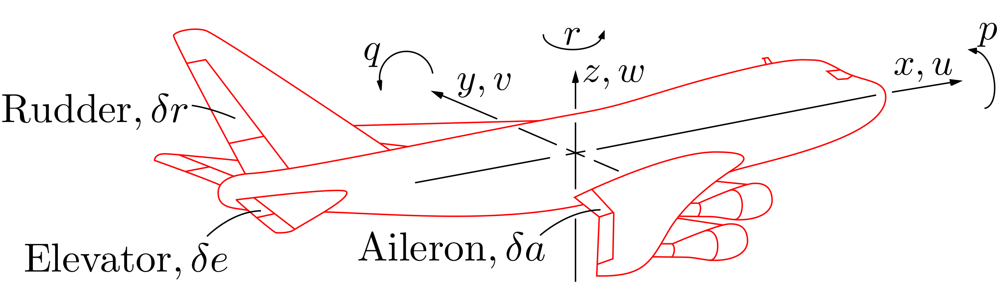
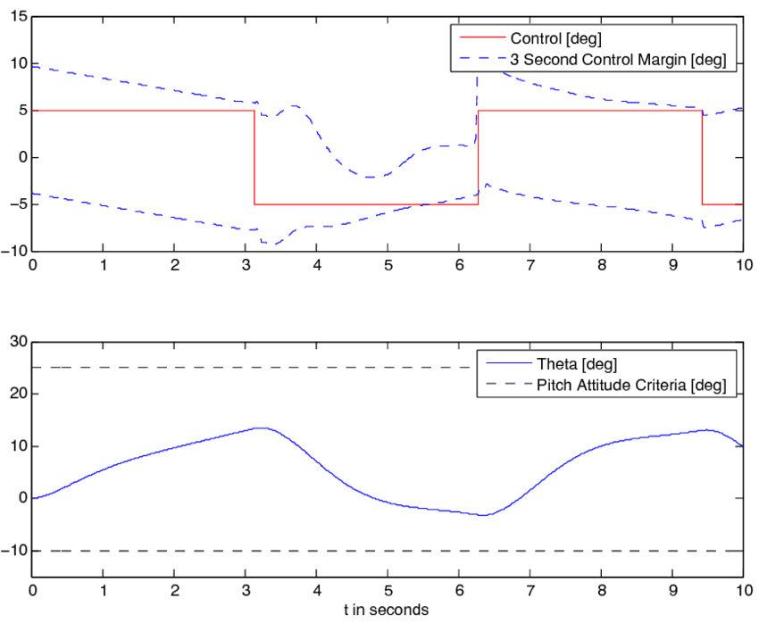

# Why More Methods for Solving ODEs?

We know very well how to solve ODEs with constant coefficients and relatively
simple right-hand side (RHS) terms, for example, the integral factor method
and the characteristic equation method. However, in engineering applications,
there are cases where we would need or prefer methods other than those methods.
A few examples:

- ODE with complex RHS

  ```{math}
  y'' + a y' + b y = r(t)
  ```

  Still constant coefficients on the left-hand side (LHS), but with some
  strange $r(t)$, such as a sawtooth wave. It would be hard to find its
  particular solution. Is there a *less cumbersome* method?

  > This is where we introduce **Laplace Transform**.

- Nonlinear LHS

  ```{math}
  y'' + a(y,t) y' + b(y,t) y = r(t)
  ```

  Now even the method of characteristic equation would not work, as the
  coefficients become functions. We need a *totally new* method.

  > This is where we introduce **Numerical Methods** for ODEs.

- Both RHS and LHS are linear

  ```{math}
  y'' + a y' + b y = c
  ```

  This one looks very simple, and even the characteristic equation might be too
  "heavy" for this problem. Is there a *simpler* method?

  > This is where we introduce **Linear Algebra and the Eigenvalue Problem**.

## Example: Flight Dynamics of an Aircraft

Let us look at a more concrete example. For a fixed-wing aircraft, under
appropriate assumptions, its motion is governed by the six-degree-of-freedom
rigid-body dynamics,

```{math}
\begin{aligned}
\ddot{x} &= \ddf{}{t}(u+qz-ry) \\
\ddot{y} &= \ddf{}{t}(v+rx-pz) \\
\ddot{z} &= \ddf{}{t}(w+py-qx) \\
L &= I_x \dot{p} + (I_z-I_y)qr - I_{xz}(pq+\dot{r}) \\
M &= I_y \dot{q} + (I_x-I_z)rp - I_{xz}(p^2-r^2) \\
N &= I_z \dot{r} + (I_y-I_x)pq - I_{xz}(qr-\dot{p})
\end{aligned}
```

This is a complex system of ODEs, involving 9 variables: displacements
$x,y,z$, velocities $u,v,w$, and angular velocities $p,q,r$, as well as
aerodynamic forces $L,M,N$. It is nonlinear, involving products of different
variables. Next, we simplify the equations to just one ODE and show that, even
so, the analytical method for ODEs is not good enough.



Assume the aircraft is in level flight, so there is no roll or yaw and we do
not care about the displacements. What remains is the pitch, and the pitch rate
is $q$. Then there is only one equation left:

```{math}
:label: eq:simp1

M = I_y \dot{q}
```

Here $M$ is aerodynamic moment and $I_y$ is moment of inertia. This is simply
Newton's second law of motion for planar rotation.

Next, view the pitch rate as the rate of change in angle of attack $\alpha$,
that is, $q = \dot{\alpha}$, and use a simple aerodynamic model,

```{math}
:label: eq:simp2

M = -k\alpha - c\dot{\alpha} + g\delta
```

where $k$, $c$, and $g$ are aerodynamic coefficients, and $\delta$ is the
deflection angle of the elevator. Combining {eq}`eq:simp1` and
{eq}`eq:simp2`, we arrive at an ODE,

```{math}
:label: eq:simp3

I_y\ddot{\alpha} + c\dot{\alpha} + k\alpha = g\delta
```

You might find this equation familiar from sophomore mechanics: it behaves like
a mass-spring-damper system. Although {eq}`eq:simp3` may appear simple to
solve, in aircraft flight dynamics one might still encounter the following
questions:

- Atmospheric turbulence may perturb the aircraft, and the elevator input
  $\delta(t)$ may vary over time to maintain level flight. This input can be
  very complex. How do we handle this kind of input?
- The aerodynamic model may not remain linear. There can be nonlinear effects
  such as viscous effects, hysteresis, and vortex interactions, requiring a
  model such as

  ```{math}
  M = -k(\alpha,\dot{\alpha},\ddot{\alpha})\alpha
      - c(\alpha,\dot{\alpha},\ddot{\alpha})\dot{\alpha}
      + g\delta
  ```

  How do we handle the resulting nonlinear ODE?
- For on-board automatic control of the aircraft, it needs to decide $\delta$
  in real time to maintain stability. This requires solving the ODE very
  efficiently. How do we achieve that efficiency?

We address these three questions respectively by Laplace transform, numerical
ODE methods, and linear algebra.


