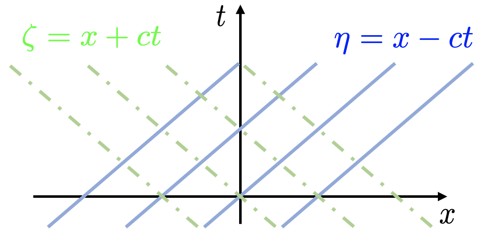

# Partial Differential Equations - Method of Characteristics

## Learning Objectives

After learning this chapter, you will be able to:

+ Use the d'Alembert solution to solve wave equations.
+ Classify 2nd-order PDE's based on the number of characteristics.

## Introduction

The concept of characteristics for Partial Differential Equations (PDE's) is particularly important for aerospace engineers.

+ When you see shockwaves forming around jet fighters - there are characteristics.
+ When you see the wings vibrating in wind - there are characteristics.
+ When you see the "Mach disks" from the jet engine exhaust - there are characteristics.

The model problem that we will focus on in this chapter is the **linear wave equation**,
```{math}
u_{tt} = c^2u_{xx}
```
One way to grasp the idea is to think it as a string vibration problem. The $u_{tt}$ term gives the inertial term and the $c^2u_{xx}$ gives the elastic term - so the wave equation is effectively a mass-spring system, in the continuous sense.

The linear wave equation serves as the basis to understand many more complex problems. One example is the aeroelastic flutter of aircraft wings. A relatively simple model is
```{math}
\underbrace{mu_{tt}}_{\text{Inertial}} + \underbrace{EIu_{xxxx}}_{\text{Elastic}} = \underbrace{f(u,u_t,u_{tt})}_{\text{Aero loads}}
```
If you have been exposed to a structures course, you would note that this is the Euler beam equation; the only difference is that on the right-hand side a nonlinear term is added to represent the aerodynamic loads. Connecting back to the wave equation, we see the flutter equation is essentially a wave equation, where we still have an inertial term, but have a higher-order elastic term and a non-homogeneous right-hand side term.

In this chapter, we will first solve the wave equation by SoV, show how the solution reveals the so-called characteristics of the wave equation, and solve the equation again by the **Method of Characteristics** (MoC). Lastly, we will discuss when MoC is applicable to solve the PDE's.

## Solution of the Wave Equation

We will focus on the solution of the following IVP,
```{math}
\begin{aligned}
\text{PDE:}&\ u_{tt} = c^2u_{xx} \\
\text{BC's:}&\ u(0,t) = 0,\quad u(L,t) = 0 \\
\text{IC's:}&\ u(x,0) = f(x),\quad u_t(x,0) = g(x)
\end{aligned}
```

Using terminology from the previous chapter, the IVP has two homogeneous Dirichlet BC's, one non-homogeneous Dirichlet IC and one non-homogeneous Neumann IC.

Here one would immediately note the difference with the previous IVP's: now here are two IC's. Mathematically this is because the derivative in $t$ is second order; this would result in two unknown coefficients that need two conditions to determine. Physically, in the context of string vibration, the Dirichlet IC is the initial displacement and the Neumann IC is the initial velocity. Recall the mass-spring system, it has the same set of IC's.

### Application of SoV

By now you should be able to solve the IVP by yourself using the SoV. The three main steps are outlined below.

**Step 1: Separate the variables**

Assume the solution satisfies the following form
```{math}
u(x,t) = F(x)G(t)
```

+ Step 1.1: Apply SoV to the PDE to obtain ODE's

From the PDE
```{math}
\begin{aligned}
u_{tt} &= c^2u_{xx} \\
(F(x)G(t))_{tt} &= c^2(F(x)G(t))_{xx} \\
F(x)G''(t) &= c^2 F''(x)G(t) \\
\Rightarrow \frac{G''(t)}{c^2G(t)} &= \frac{F''(x)}{F(x)} = -k
\end{aligned}
```
The two ODE's are
```{math}
\begin{aligned}
F''(x)+kF(x) &= 0 \\
G''(t)+c^2kG(t) &= 0
\end{aligned}
```

+ Step 1.2: Apply SoV to the homogeneous BC's

We have two homogeneous BC's,
```{math}
\begin{aligned}
\text{BC 1:}&\ u(0,t) = F(0)G(t) = 0 \Rightarrow F(0)=0 \\
\text{BC 2:}&\ u(L,t) = F(L)G(t) = 0 \Rightarrow F(L)=0
\end{aligned}
```
Both IC's are non-homogeneous, we can do nothing for them at this point.

+ Step 1.3: Summary

So far we have found two ODE's and two BC's
```{math}
\begin{aligned}
F''(x)+kF(x) &= 0,\quad F(0)=F(L)=0 \\
G''(t)+c^2kG(t) &= 0
\end{aligned}
```

**Step 2: Solve for eigenfunctions**

+ Step 2.1: Solve the ODE with enough BC's

We first solve for $F(x)$. Using the Table of Eigenfunctions, the solution is
```{math}
F_n(x) = a_n \sin(p_nx),\quad p_n= \frac{n \pi}{L},\quad n=1,2,\cdots
```
with
```{math}
k_n=p_n^2
```

+ Step 2.2: Solve the remaining ODE

Knowing $k$, the ODE for $G$ becomes,
```{math}
G''(t)+c^2p_n^2G(t)=0
```
The characteristic equation is $\lambda^2+c^2p_n^2=0$ with roots $\lambda_{1,2}=\pm cp_n i$. The solution is
```{math}
G(t) = A_n\cos(\lambda_nt) + B_n\sin(\lambda_nt),\quad \lambda_n = \frac{cn\pi}{L}
```

+ Step 2.3: Summary

At this point we have found the full eigenfunction
```{math}
u_n(x,t) = F_n(x)G_n(t) = \left[ A_n\cos\left(\frac{cn \pi}{L}t\right) + B_n\sin\left(\frac{cn \pi}{L}t\right) \right] \sin\left(\frac{n \pi}{L}x\right)
```

Physically, we can view $F_n(x)$ as **mode shapes** and $G_n(t)$ as the **amplitude**. For example, the first mode ($n=1$) is just a half-Sine wave, and it oscillates at a frequency of $\frac{c\pi}{L}$. Higher-order modes have more waves in the spatial coordinate and oscillate faster at frequencies of $\frac{cn\pi}{L}$.

From the point of view of music, the vibrating string would make a sound, whose base frequency is given by $\frac{c\pi}{L}$, and the higher-order modes produce the harmonics at multiples of the base frequency.

&clubs; We lumped the unknown coefficients $a_n$ in $F_n(x)$ into $A_n$ and $B_n$.

**Step 3: Solve the complete problem**

Lastly, we use the IC's to pinpoint the unique solution, as a linear combination of all the $u_n$'s.

+ Step 3.1: Write down the series for solution

To do so, assume the full solution is
```{math}
u(x,t) = \sum_{n=1}^\infty \left[ A_n\cos(\lambda_n t) + B_n\sin(\lambda_n t) \right] \sin(p_nx)
```

+ Step 3.2: Evaluate the solution at the IC's

For the Dirichlet IC, which corresponds to the initial displacement
```{math}
u(x,0) = \sum_{n=1}^\infty A_n \sin(p_nx) = f(x)
```
For the Neumann IC, which corresponds to the initial velocity
```{math}
\begin{aligned}
u_t(x,t) &= \sum_{n=1}^\infty \lambda_n\left[ -A_n\sin(\lambda_n t) + B_n\cos(\lambda_n t) \right] \sin(p_nx) \\
u_t(x,0) &= \sum_{n=1}^\infty \lambda_n B_n \sin(p_nx) \\
&= g(x)
\end{aligned}
```

+ Step 3.3: Determine the unknown coefficients

Both IC's correspond to Sine series.

For the Dirichlet IC, we simply have
```{math}
A_n = \frac{2}{L}\int_0^L f(x)\sin\left(\frac{n \pi}{L}x\right) dx
```

For the Neumann IC, we have
```{math}
\lambda_n B_n = \frac{2}{L}\int_0^L g(x)\sin\left(\frac{n \pi}{L}x\right) dx
```
or
```{math}
B_n = \frac{2}{cn\pi}\int_0^L g(x)\sin\left(\frac{n \pi}{L}x\right) dx
```

Up to this point all coefficients are determined.

### Numerical example

Now let's try the solution with some numbers.

Consider a special case of zero initial velocity, with $L=\pi$,
```{math}
\begin{aligned}
u(x,0) &= 0.1x(\pi-x) \equiv f(x) \\
u_t(x,0) &= 0 \equiv g(x)
\end{aligned}
```

In this case $B_n=0$ and
```{math}
\begin{aligned}
A_n &= \frac{2}{\pi}\int_0^\pi [0.1x(\pi-x)]\sin(nx) dx \\
&= \left\{
\begin{array}{ll}
\frac{0.8}{n^3\pi},&\ n\text{ odd} \\
0,&\ n\text{ even}
\end{array}
\right.
\end{aligned}
```
So the solution is
```{math}
u(x,t) = \sum_{n=1,3,\cdots} \frac{0.8}{n^3\pi}\cos(nct)\sin(nx)
```

Collectively, the solution represents an oscillating parabolic pattern. But this pattern can be decomposed into a sum of mode shapes that are in harmonic motion. The frequencies of these modes are controlled by $c$, which later will be revealed to be the "wave speed".

If we think the problem as string vibration, the string makes a sound that is dominated by the base frequency, because the first mode has the highest amplitude; the modal amplitudes decay quickly as $n$ increases, hence the sound would only contain the first few higher harmonics that are discernable to human ears.


Access an interactive example in {doc}`M5_2_wave_sov_2d`.  The 3D version is in {doc}`M5_2_wave_sov_3d`.


## Characteristics in the Wave Equation

Now we transform the solutions found by SoV and reveal the existence of characteristics in the wave equations.

### Identification of characteristics

In the previous numerical example, the solution was
```{math}
u(x,t) = \sum_{n=1,3,\cdots} \frac{0.8}{n^3\pi}\cos(nct)\sin(nx)
```
Let's invoke a trigonometric identity
```{math}
\cos\alpha\sin\beta = \frac{1}{2}[ \sin(\alpha+\beta) + \sin(\beta-\alpha) ]
```
Then, with $\alpha=nct$ and $\beta=nx$, the solution transforms as
```{math}
\begin{aligned}
u(x,t) &= \sum_{n=1,3,\cdots} \frac{0.8}{n^3\pi} \frac{1}{2}[ \sin(nx+nct) + \sin(nx-nct) ] \\
&= \frac{1}{2} \sum_{n=1,3,\cdots} \frac{0.8}{n^3\pi} \sin[n\underbrace{(x+ct)}_{=\zeta}] + \frac{1}{2} \sum_{n=1,3,\cdots} \frac{0.8}{n^3\pi} \sin[n\underbrace{(x-ct)}_{=\eta}] \\
&= \frac{1}{2}f(\zeta) + \frac{1}{2}f(\eta)
\end{aligned}
```
The key step is in the second equality. If we think $\zeta=x+ct$ as one variable, then the first summation is a Sine series in $\sin(n\zeta)$, which would exactly sum up to the initial condition, but with a change in variable. Same can be done to the second summation, which introduced another variable $\eta=x-ct$.

Now the question is, what is the significance of the variables $\zeta=x+ct$ and $\eta=x-ct$? To see this, let's swap back the $x$ and $t$ variables in the solution,
```{math}
u(x,t) = \frac{1}{2}f(x+ct) + \frac{1}{2}f(x-ct)
```
First, think in the geometric sense, $f(x+ct)$ translates $f(x)$ to the left by $ct$ and $f(x-ct)$ translates $f(x)$ to the right by $ct$. The distance of translation is proportional to the time $t$.

Therefore, we can have an alternative view of the wave solution in this example:

+ At $t=0$, the wave starts as a shape of $f(x)$.
+ When $t>0$, the wave splits evenly into two; one moves left $f(x+ct)$ and the other moves right $f(x-ct)$.
+ The solution is a superposition of the **left-running** and **right-running** components, which interestingly results in a **standing** wave.
+ The wave moves at a speed of $c$, hence the name **wave speed**.

Furthermore, if we imagine the "paths" of the left- and right-running components on a $x-t$ plane, then we would see actually the paths are two families of straight lines
```{math}
\zeta = x+ct,\quad \eta=x-ct
```
for arbitrary values of $\zeta$ and $\eta$. These are exactly the two special variables that we identified earlier.



### D'Alembert solution

Now we take a more general treatment of the wave equation. The intuition is from the previous figure. The PDE is defined in the $x-t$ coordinates, but what if we "tilt" the coordinates and look at the solutions in the $\eta-\zeta$ coordinates. In the new coordinates, the waves would propagate along the $\zeta$ and $\eta$ axes in a **decoupled** manner.

In the following, we sketch the process of mathematically implementing this intuition. But practically, one only needs to work with the d'Alembert solution that is the end product of this derivation.

#### Derivation

We start by applying a coordinate transformation to replace $x,t$ by $\eta,\zeta$ in the wave equation. One can show that the PDE would be transformed into
```{math}
u_{\eta\zeta} = 0
```

The transformation is achieved using the chain rule of derivatives. For example, knowing
```{math}
\eta_t = (x-ct)_t = -c,\quad \zeta_t = (x+ct)_t = c
```
we have
```{math}
u_t = u_\eta\eta_t+u_\zeta\zeta_t = -cu_\eta+cu_\zeta
```
thus $u_t$ is expressed in terms of $u_\zeta$ and $u_\eta$. Performing the chain rule multiple times, we can express $u_{tt}$ and $u_{xx}$ in terms of $u_{\eta\eta}$, $u_{\zeta\zeta}$, and $u_{\eta\zeta}$.

The PDE would be surprisingly simple to solve by integrating twice,
```{math}
\begin{aligned}
\int u_{\eta\zeta} d\zeta &= \int 0 d\zeta \\
u_\eta &= \phi(\eta) \\
\int u_\eta d\eta &= \int \phi(\eta) d\eta \\
u(\eta,\zeta) &= F(\eta) + G(\zeta)
\end{aligned}
```
Note that here the $u$ has two variables, so the integral "constant" is a function, and in the last equality we introduced $F(\eta)$ such that $F'(\eta)=\phi(\eta)$. The integral results suggest $u(\eta,\zeta)$ is the sum of two **univariate** functions.

Next, we can use the IC's to determine the unknown functions, $F(\eta)$ and $G(\zeta)$.

Since at $t=0$, $\eta=\zeta=x$, the Dirichlet IC becomes
```{math}
u(x,0) = F(x) + G(x) = f(x)
```
Leveraging earlier chain rule derivation,
```{math}
u_t(x,t) = -cF'(\eta) + cG'(\zeta)
```
so the Neumann IC becomes
```{math}
u_t(x,0) = -cF'(x) + cG'(x) = g(x)
```
Integrate the Neumann IC on both side over a domain on $x$-axis, say $[\alpha,x]$, we get
```{math}
-cF(x)+cG(x) = \int_\alpha^x g(s)ds + K
```
where $K$ is an integral constant.

Combining the results from the two IC's, we can solve for $F(x)$ and $G(x)$, which are
```{math}
\begin{aligned}
F(x) &= \frac{1}{2}f(x) - \frac{1}{2c}\int_\alpha^x g(s)ds + \frac{1}{2}K \\
G(x) &= \frac{1}{2}f(x) + \frac{1}{2c}\int_\alpha^x g(s)ds - \frac{1}{2}K
\end{aligned}
```

Lastly, replacing the $x$ in $F(x)$ with $\eta$ and the $x$ in $G(x)$ with $\zeta$, and add up $F(\eta)$ and $G(\zeta)$, we would end up the so-called **d'Alembert solution**,
```{math}
u(x,t) = \frac{1}{2}[f(x+ct)+f(x-ct)] + \frac{1}{2c}\int_{x-ct}^{x+ct} g(x) dx
```

We have seen the first part of the solution, that is due to the initial displacement $f(x)$, in our earlier example. Recall that, physically, the part means the wave due to $f(x)$ splits evenly and travel in opposite directions.

The new, second part accounts for the effect of initial velocity, $g(x)$. Physically, the integral means the solution at location $x$ and time $t$ is influenced by $g(x)$ over the entire domain of $[x-ct,x+ct]$.

#### Examples

To apply the d'Alembert solution, let's examine two examples.

**Example 1**

Let's consider $f(x)=0.1\sin(\pi x)$ and $g(x)=0$ on $x\in[0,\pi]$. Apply the formula,
```{math}
\begin{aligned}
u(x,t) &= \frac{1}{2}[f(x+ct)+f(x-ct)] \\
&= \frac{0.1}{2}\left\{ \sin[\pi(x+ct)] + \sin[\pi(x-ct)] \right\} \\
&= 0.1\sin(\pi x)\cos(\pi ct)
\end{aligned}
```
We obtain a solution that describes the harmonic oscillation of a sinusoidal mode shape.

**Example 2, Take 1**

Let's consider our earlier example, $f(x)=0.1x(\pi-x)$ and $g(x)=0$ on $x\in[0,\pi]$. Apply the formula,
```{math}
\begin{aligned}
u(x,t) &= \frac{1}{2}[f(x+ct)+f(x-ct)] \\
&= \frac{0.1}{2}\left[ \pi(x+ct) - (x+ct)^2 + \pi(x-ct) - (x-ct)^2 \right] \\
&= 0.1(\pi x - x^2 + c^2t^2)
\end{aligned}
```
Does this solution seem too simple to be true?

If we focus on the string vibration with fixed ends, so $u(0,t)=u(\pi,t)=0$. But the solution would give $u(0,t)=u(\pi,t)=0.1 c^2t^2\neq 0$.

**Example 2, Take 2**

What is wrong? In fact, to satisfy the BC's, the IC's that we apply should be **extended** to be the appropriate Fourier series. Example 1 worked without the extension because the IC's already satisfy the BC's and are periodic.

In other words, there is no free lunch: The d'Alembert solution does **not** avoid the Fourier series expansion that one would encounter in SoV.

The correction solution procedure is to perform an odd extension of $f(x)$, which we have already done earlier,
```{math}
f(x) = \sum_{n=1,3,\cdots} \frac{0.8}{n^3\pi}\sin(nx)
```
**Then** we apply the formula
```{math}
\begin{aligned}
u(x,t) &= \frac{1}{2}[f(x+ct)+f(x-ct)] \\
&= \sum_{n=1,3,\cdots} \frac{0.8}{n^3\pi} \frac{1}{2}[\sin(nx+nct)+\sin(nx-nct)] \\
&= \sum_{n=1,3,\cdots} \frac{0.8}{n^3\pi} \sin(nx)\cos(nct)
\end{aligned}
```
This correctly recovers our earlier solution.

Access an interactive example in {doc}`M5_2_wave_moc_2d`.

## Classification of Second-Order PDE's

Lastly, let's discuss when a second-order PDE has characteristics, so that MoC is applicable. This amounts to the classification of these PDE's.

We state the conclusion below without a proof.

Consider a general form of PDE having two variables,
```{math}
Au_{xx}+2Bu_{xy}+Cu_{yy} = F(x,y,u,u_x,u_y)
```
where the right-hand side is an **arbitrary** function that may include the coordinates, the unknown function, as well as its first-order derivatives. Also, the variables are generic, and $y$ could be replaced by $t$.

Define a discriminant
```{math}
\Delta = AC-B^2
```
There are three types of PDE's,

|  | Type | Solution |
| :---: | :---: | :---: |
| $\Delta<0$ | Hyperbolic | SoV or MoC |
| $\Delta=0$ | Parabolic | SoV |
| $\Delta>0$ | Elliptic | SoV |

The **hyperbolic** equations are the PDE's that have **two** families of characteristics, and can be solved by either SoV or MoC. This corresponds to wave equations. In fact, for
```{math}
u_{tt}-c^2 u_{xx} = 0
```
The coefficients are
```{math}
A=-c^2,\ B=0,\ C=1
```
so
```{math}
\Delta = -c^2 < 0
```

&clubs; One can also verify that $u_{\eta\zeta}$ is hyperbolic too.

The **parabolic** equations are the PDE's that have **one** family of characteristics, and are solved by SoV. This corresponds to unsteady heat transfer equations. In fact, for
```{math}
u_t-c^2 u_{xx} = 0
```
The coefficients are
```{math}
A=-c^2,\ B=0,\ C=0
```
where $C$ is zero because there is no $u_{tt}$; $u_t$ does **not** count. So
```{math}
\Delta = 0
```

The **elliptic** equations are the PDE's that have **zero** characteristics, and are solved by SoV. This corresponds to steady heat transfer equations. In fact, for
```{math}
u_{xx} + u_{yy} = 0
```
The coefficients are
```{math}
A=1,\ B=0,\ C=1
```
so
```{math}
\Delta = 1 > 0
```

Knowing the type of PDE's is critical for the choice of the solution method. In the Numerical PDE chapters, we will see how the types impact the choice the numerical schemes.

## Summary of Basic Modules

By now you should be able to:

+ Use the d'Alembert solution to solve wave equations
  - How many BC's and IC's are needed? What do they mean physically?
  - What are the two families of characteristics in the wave equation?
  - Solve the IVP with: Initial displacement only; Initial velocity only; Both initial displacement and velocity
  - When do the IC's need to be expanded into Fourier Series first?
+ Classify 2nd-order PDE's based on the number of characteristics
  - How to compute the discriminant?
  - What are the hyperbolic, parabolic, and elliptic equations? How many characteristics does each of them have?
