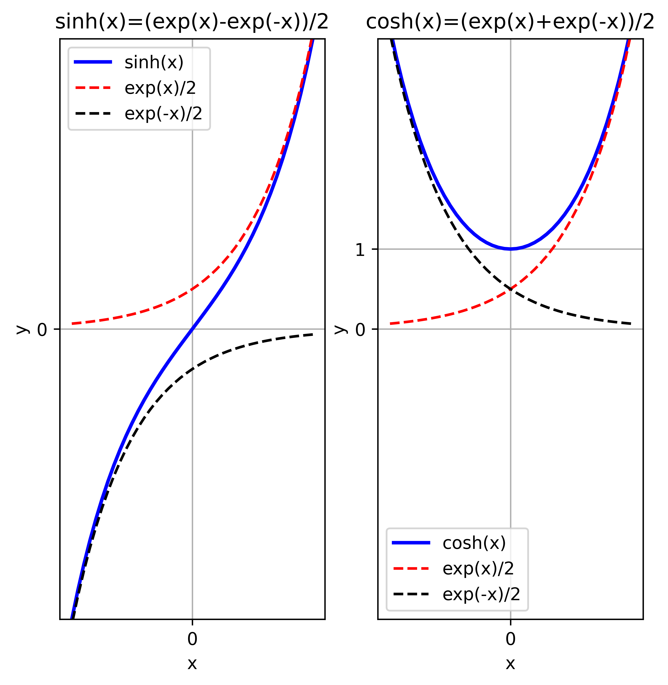
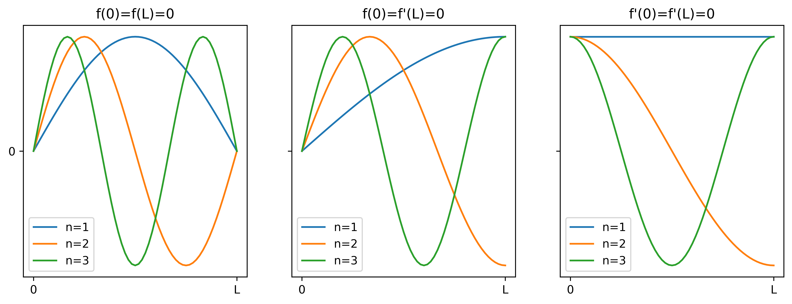

# Partial Differential Equations - Separation of Variables

## Learning Objectives

After learning this chapter, you will be able to:

+ Identify three basic types of PDE: Unsteady heat transfer, Steady heat transfer, and String vibration.
+ Differentiate between initial conditions and the three types of boundary conditions (BC's).
+ Use separation of variables to solve initial value problems (IVP) and boundary value problems (BVP).


## Introduction

Partial Differential Equations (PDEs) have been used to characterize many problems in aerospace engineering.  In fact, PDEs appear in almost every main disciplines and applications of aerospace engineering, ranging from aerodynamics to structural dynamics, from aircraft flight control to deep space electric propulsion, from hypersonic thermal protection to helicopter icing protection.

Since we will deal with many partial derivatives, the following short-hand notations will be used throughout this and the following chapters.
```{math}
\ppf{f}{x}\equiv f_x,\quad \pppf{f}{x}\equiv f_{xx}
```
similarly we can write $f_{yy}$, $f_{xy}$, etc.

If $f$ is a function of only one variable, say $x$, then
```{math}
\ddf{f}{x}\equiv f',\quad \frac{\dd^2 f}{\dd x^2}\equiv f'',\quad \cdots
```


## Catalogue of PDEs

### Types of PDEs

Just to name a few PDEs that we deal with in engineering:

+ Aerodynamicists solve the following equations, perhaps daily, to design the aerodynamic shape of aircraft, engine, etc.
  - Navier-Stokes (NS) equations (for viscous flow)
  - Euler equations (for inviscid flow, simplified from NS)
  - Potential flow equations (simplified from Euler)
+ Structural engineers solve the following equations, again daily, to design aircraft structures
  - Stress equilibrium equations (for static problems)
  - Elastodynamics equations (for dynamics and vibration)
+ And there are much more,
  - Hamilton-Jacobi-Bellman equation (for control engineering)
  - Heat transfer equations (for thermal engineering)
  - Maxwell equations (for electrical engineering)
  - etc.

What the course will cover are the representative and simplified versions of the above PDEs.  Specifically, we will look at the following types of PDE.

| | PDE | Typical problem | Order | Characteristics |
| :---: | :---: | :---: | :---: | :---: |
| 1 | $u_t=c^2u_{xx}$ | 1D unsteady heat transfer | 2nd | Parabolic |
| 2 | $u_{xx}+u_{yy}=0$ | 2D steady heat transfer | 2nd | Elliptic |
| 3 | $u_{tt}=c^2u_{xx}$ | 1D wave equation | 2nd | Hyperbolic |
| 4 | $u_t=cu_x$ | 1D transport equation | 1st | N/A |

In the first column, $c$ is a constant and the variables $x$, $y$, $t$ are chosen based on the typical physical meaning, which we will explain later.

The second column lists a typical problem that the PDE represents.  But of course the PDEs may represent more phenomena.  Type 2 also appears in the potential flow equation, Type 3 also appears in some elastodynamics equations, and Type 4 is almost everywhere in aerodynamics.

The third column lists the highest order of derivative in the PDE.  Hence the first three types are usually referred to as **second-order PDEs**, and the last one **first-order PDE**.  Depending on the order of PDEs, different solution methods need to be used.

The fourth column lists the so-called "characteristics" that further classifies the second-order PDEs.  Practically, knowing the characteristics of a PDE helps us determine the best approach to solve it.  We will come back to this in the following chapter.

This chapter will focus on the first two types of PDE, i.e., 1D unsteady heat transfer and 2D steady heat transfer, and the method of **separation of variables** (SoV) for solving these PDEs.  We choose the physical context to be heat transfer, since it is relatively easier to imagine and comprehend, but again these PDEs apply to a much wider range of problems.

&clubs; The following two chapters will deal with Types 3 and 4 of PDE, respectively, using the method of characteristics.


### Linearity of PDE

Most of the PDEs that we deal with here are **linear**.  This means the unknown function $u$ and its derivatives do not appear in the same term.  For example, terms such as $cu$ and $cu_{xx}$, with constant $c$, are linear, and terms such as $uu_x$ and $u^2$ are nonlinear.  The main implication of linearity is the **superposition of solutions**.

For example, for a PDE
```{math}
u_t=ku_{xx}
```
we can verify that both $u_1 = \exp(-kt)\cos(x)$ and $u_2 = \exp(-9kt)\cos(3x)$ satisfy the PDE, i.e.,
```{math}
(u_1)_t - k(u_1)_{xx}=0,\quad (u_2)_t - k(u_2)_{xx}=0
```
Then the linear combination $u_3=c_1u_1+c_2u_2$ would satisfy the PDE too, for any constants $c_1$ and $c_2$, because
```{math}
\begin{aligned}
&\ (c_1u_1+c_2u_2)_t-k(c_1u_1+c_2u_2)_{xx} \\
&= c_1(u_1)_t + c_2(u_2)_t - c_1 k(u_1)_{xx} - c_2 k(u_2)_{xx} \\
&= c_1[(u_1)_t - k(u_1)_{xx}] + c_2 [(u_2)_t - k(u_2)_{xx}] \\
&= 0
\end{aligned}
```
where in the first equality the linearity of derivatives is used and the second equality factors out the constants.

The linearity is one of the critical properties that we leverage to solve the PDEs listed above.


### Definition of a PDE problem

To give a proper definition of a PDE problem, let's first think about what is the "solution to a PDE".

The rule of thumb is, if we have a solution to a PDE, this solution should be **unique**, otherwise it may not have appropriate physical meaning.  For example, in heat transfer, it would be a violation of physics if there are two temperatures at the same point of a heat conductor.

**Equation**

Say we look at the Type 1 PDE, on an interval $x\in[-\pi,\pi]$,
```{math}
u_t=ku_{xx}
```
This equation represents the temperature distribution over a 1D domain (e.g., a metallic bar) $[-\pi,\pi]$, and the evolution of this temperature over time.

There would be so many different $u$'s that satisfy the PDE, say,
```{math}
\begin{gather*}
u_1 = \exp(-kt)\cos(x),\quad u_2 = \exp(-9kt)\cos(3x),\\
u_3=\exp(-kt)\sin(x),\quad u_4=x^2+2kt,\quad u_5=x^2-\pi^2+2kt,\\
u_6=c_1u_3+c_2u_5
\end{gather*}
```
In fact, given the linearity, there is literally infinitely many functions that can satisfy the PDE.


**Boundary conditions (BC's)**

To make the solution unique, we can try to incorporate BC's.  The domain is 1D, so we can apply BC's at the two ends, for example,
```{math}
u(-\pi,t) = 0,\quad u(\pi,t) = 0
```
which means enforcing zero temperature change at the two ends.

With the BC's, we can verify that only $u_3,u_5,u_6$ satisfy the BC's, and $u_1,u_2,u_4$ are eliminated.


**Initial condition (IC)**

The solution is still not unique.  Note that the BC's only constrain the $x$ coordinate.  We can also incorporate the IC to constrain the $t$ coordinate.  For example,
```{math}
u(x,0) = \sin(x)
```
which specifies the temperature distribution at $t=0$.

With the IC, there is only one solution left, $u_3=\exp(-kt)\sin(x)$.  In fact this is the only possible solution.

In the above example, to pinpoint a unique solution, we needed a combination of the PDE, two BC's, and one IC
```{math}
\begin{aligned}
\text{PDE:}&\ u_t=ku_{xx} \\
\text{BC's:}&\ u(-\pi,t) = 0,\quad u(\pi,t) = 0 \\
\text{IC:}&\ u(x,0) = \sin(x)
\end{aligned}
```
This combination forms the so-called **Initial Value Problem** (IVP).  This is the direct extension of the IVP concept from ODE's.  In addition, for a problem having only boundary conditions, we call it **Boundary Value Problem** (BVP).  Later we will see many forms of IVP and BVP, involving different types and numbers of BC's and IC's.


## Separation of variables

In the following sections, we will solve IVP's and BVP's using the method of separation of variables.  To do so, we will first introduce the concept of eigenfunctions, as the main building block of SoV.

### Motivating example

Let's look at our earlier IVP again.
```{math}
\begin{aligned}
\text{PDE:}&\ u_t=ku_{xx} \\
\text{BC's:}&\ u(-\pi,t) = 0,\quad u(\pi,t) = 0 \\
\text{IC:}&\ u(x,0) = \sin(x)
\end{aligned}
```
The solution is
```{math}
u(x,t)=\exp(-kt)\sin(x)
```
It is essentially saying the **shape** of the IC, $\sin(x)$, remains the same over time, just the amplitude decays over time.

More importantly, the form of solution suggests that the variables $x$ and $t$ are **separated** into two functions.

Conversely, if we were to solve the IVP, what if we just **assume** a solution of the following form
```{math}
u(x,t) = g(t)\sin(x)
```
which automatically satisfies the BC's.  To satisfy the IC, we just need
```{math}
g(0) = 1
```
Substituting this solution into the PDE
```{math}
\begin{aligned}
u_t &= ku_{xx} \\
(g(t)\sin(x))_t &= k(g(t)\sin(x))_{xx} \\
g'(t)\sin(x) &= -kg(t)\sin(x) \quad x\text{ derivative is gone!}\\
\Rightarrow g'(t) &= -kg(t)
\end{aligned}
```
Guess what, the PDE simplifies to an ODE!

With the earlier IC $g(0) = 1$, it is easy to solve the ODE, $g(t)=\exp(-kt)$.  Therefore
```{math}
u(x,t) = g(t)\sin(x) = \exp(-kt)\sin(x)
```
which is exactly the solution we found earlier.


### Concept of eigenfunctions

Reviewing the previous example, we can see that the "magic" is the function $f(x)=\sin(x)$, that has the special properties

+ $f''(x) = -f(x)$, i.e., its derivative is a multiple of itself.
+ Satisfies the BC's, regardless of $t$.

The properties lead to the elimination of the derivative in $x$.

These special functions are called **eigenfunctions**.  Next we discuss a general approach for finding eigenfunctions, and will provide a **Table of Eigenfunctions** that we can refer to later.

#### Solutions of homogeneous linear ODE's

Since the focus is on second-order PDEs, we consider eigenfunctions associated with the second-order derivative.  The eigenfunction should satisfy an ODE
```{math}
f'' = -k f
```
where $k$ is unknown and the negative sign is a convention.  Different choice of BC's would result in different pairs of $f(x)$ and $k$.

&clubs; You might notice the similarity of the ODE with the matrix eigenvalue problems.  For matrices, we had $Ax=\lambda x$.  In the ODE, $()''$ is as if a matrix (in the sense that it is linear) and $-k$ is as if $\lambda$, i.e., the eigenvalue.  Drawing from this similarity, the solution $f(x)$ is thus called the eigenfunction.

As an example, consider the following problem
```{math}
f'' + kf = 0,\quad f(0)=f(L)=0
```

Since $k$ is unknown beforehand, we need to discuss three cases of $k$.

**Case 1**: $k<0$

For convenience, let's write $k=-p^2$.  The characteristic equation is $\lambda^2-p^2=0$ and the solution is $\lambda_{1,2}=\pm p$.  Hence the ODE solution should be in the form of
```{math}
f(x)=A \cosh (p x)+B \sinh (p x)
```
Next, use the BC's
```{math}
f(0) = 0 \Rightarrow A\underbrace{\cosh(0)}_{=1}+B\underbrace{\sinh(0)}_{=0}=0 \Rightarrow A=0
```
and
```{math}
f(L) = 0 \Rightarrow \underbrace{A}_{=0} \cosh (p L)+B \underbrace{\sinh (p L)}_{\text{Nonzero}}=0 \Rightarrow B=0
```
Hence, from the BC's, we must have $A=B=0$, meaning $f(x)=0$.  This leads to a trivial solution, that is unwanted.

&clubs; For case 1, you may be more familiar with another form of solution, $A'\exp(px)+B'\exp(-px)$.  This is equivalent to the $\cosh$/$\sinh$ form, but the latter is easier to use.  For example, we got rid of $\sinh(0)$ easily.



**Case 2**: $k=0$

The ODE simplifies to $f''=0$.  Integrate twice we get $f(x)=Ax+B$.

Next, use the BC's
```{math}
f(0)=0 \Rightarrow B=0
```
and
```{math}
f(L)=0 \Rightarrow AL+B=0 \Rightarrow A=0
```
We got $A=B=0$ and $f(x)=0$.  This is again a trivial solution.

**Case 3**: $k>0$

For convenience, let's write $k=p^2$.  The characteristic equation is $\lambda^2+p^2=0$ and the solution is $\lambda_{1,2}=\pm pi$.  Hence the ODE solution should be in the form of
```{math}
f(x)=A \sin (p x)+B \cos (p x)
```
Next, use the BC's
```{math}
f(0) = 0 \Rightarrow A\underbrace{\sin(0)}_{=0}+B\underbrace{\cos(0)}_{=1}=0 \Rightarrow B=0
```
and
```{math}
f(L) = 0 \Rightarrow A \sin (p L)+\underbrace{B}_{=0} \cos(pL)=0 \Rightarrow A \sin (p L)=0
```

Since we would like non-trivial solutions, $A$ has to be non-zero.  To achieve so, we must have
```{math}
\sin (p L)=0
```
this leads to
```{math}
p=\frac{n\pi}{L},\quad n=1,2,3,\cdots
```

**Summary**

Hence the solution to the example problem only exists for
```{math}
k=p^2 = \left( \frac{n \pi}{L} \right)^2,\quad n=1,2,3,\cdots
```
and the possible solutions are
```{math}
f_{n}(x)=A \sin \left(\frac{n \pi}{L} x\right)
```

The ODE solution discussed here has several major differences from what we have been dealing with before,

+ The coefficient $A$ is undetermined.
+ There are infinitely many pairs of $f_n$ and $k_n$ that satisfy the ODE.




#### Table of Eigenfunctions

For what we will discuss later, there are only 4 possible combinations of BC's.  The corresponding eigenfunctions are listed in the table below.  Later we will directly cite results from this table.

| BC's | $k$ | Solution |
| :--- | :----: | ---: |
| $f(0)=f(L)=0$ | $\left(\frac{n \pi}{L}\right)^{2}, n=1,2 \cdots$ | $A_{n} \sin \left(\frac{n \pi}{L} x\right)$ |
| $f(0)=f'(L)=0$ | $\left(\frac{2 n-1}{2} \frac{\pi}{L}\right)^{2}, n=1,2 \cdots$ | $A_{n} \sin \left(\frac{2 n-1}{2} \frac{\pi}{L} x\right)$ |
| $f'(0)=f(L)=0$ | $\left(\frac{2 n-1}{2} \frac{\pi}{L}\right)^{2}, n=1,2 \cdots$ | $A_{n} \cos \left(\frac{2 n-1}{2} \frac{\pi}{L} x\right)$ |
| $f'(0)=f'(L)=0$ | $\left(\frac{n \pi}{L}\right)^{2}, n=0,1,2 \cdots$ | $A_0$ \& $A_{n} \cos \left(\frac{n \pi}{L} x\right)$ |


### Trying SoV for IVP

Next let's walk thought the steps of SoV on a particular IVP for 1D unsteady heat transfer,
```{math}
\begin{aligned}
\text{PDE:}&\ u_t=c^2u_{xx} \\
\text{BC's:}&\ u(0,t) = 0,\quad u(a,t) = 0 \\
\text{IC:}&\ u(x,0) = u_0(x)
\end{aligned}
```
You can view the problem as the heat conduction on a metallic bar of length $a$ with an initial temperature distribution $u_0(x)$.  We will see the physical meaning of the constant $c$ once the solution is found.

&clubs; But intuitively, what do you think does $c$ influence?

#### The detailed steps of SoV

**Step 1: Separate the variables**

Assume the solution satisfies the following form
```{math}
u(x,t) = F(x)G(t)
```
and apply this form to simplify the PDE, BC's, and IC.

+ Step 1.1: Apply SoV to the PDE to obtain ODE's

From the PDE
```{math}
\begin{aligned}
u_t &= c^2u_{xx} \\
(F(x)G(t))_t &= c^2(F(x)G(t))_{xx} \\
F(x)G'(t) &= c^2 F''(x)G(t)
\end{aligned}
```

Grouping functions of the same variables, we get
```{math}
\frac{G'(t)}{c^2 G(t)} = \frac{F''(x)}{F(x)} \boxed{= -k}
```
Here comes the **first critical** trick: The LHS is a function of $t$ and the RHS is a function of $x$.  The two sides can only be equal if they are **both constant**, which we denote as $-k$.

Thus we obtain two ODE's
```{math}
\frac{G'(t)}{c^2 G(t)} = -k\quad\Rightarrow\quad G'(t)+c^2kG(t)=0
```
and
```{math}
\frac{F''(x)}{F(x)} = -k\quad\Rightarrow\quad F''(x)+kF(x)=0
```

+ Step 1.2: Apply SoV to the BC's

From the first BC
```{math}
u(0,t) = F(0)G(t) = 0 \quad \boxed{\Rightarrow\quad F(0)=0}
```
Here comes the **second critical** trick: $G(t)$ is a non-zero function that may change over $t$, while $F(0)$ is a scalar.  To satisfy the equality for any $t$, the only way is to set $F(0)=0$.

From the second BC, we apply the same trick
```{math}
u(a,t) = F(a)G(t) = 0 \quad \boxed{\Rightarrow\quad F(a)=0}
```

Can we do anything to the IC?  The answer is no.  Suppose we let
```{math}
u(x,0) = F(x)G(0) = u_0(x)
```
But $G(0)$ can be any arbitrary non-zero value.  Nothing can be inferred from this equation.

&clubs; The deeper reason is that this condition is "non-homogeneous".  We will revisit this later.

+ Step 1.3: Summary

So far we have found two ODE's
```{math}
G'(t)+c^2kG(t)=0,\quad F''(x)+kF(x)=0
```
and two BC's for ODE's
```{math}
F(0)=0,\quad F(a)=0
```

**Step 2: Solve for eigenfunctions**

+ Step 2.1: Solve the ODE with enough BC's

Looking at the ODE's resulting from SoV, we found enough BC's for solving $F(x)$.  In fact, this is a case covered in the Table of Eigenfunctions.  The solutions for $F(x)$ are
```{math}
F_n(x) = B_n \sin(p_nx),\quad p_n= \frac{n \pi}{a},\quad n=1,2,\cdots
```
with
```{math}
k_n=p_n^2
```

+ Step 2.2: Solve the remaining ODE

Knowing $k$, the ODE for $G$ becomes,
```{math}
G'(t)+c^2p_n^2G(t)=0
```
and the solution is
```{math}
G_n(t) = \exp(-\lambda_n^2 t),\quad \lambda_n=cp_n=\frac{cn\pi}{a}
```

+ Step 2.3: Summary

At this point we have found the function that satisfies the assumed form,
```{math}
u_n(x,t) = F_n(x)G_n(t) = B_n \sin\left(\frac{n\pi}{a}x\right)\exp(-\lambda_n^2 t),\quad n=1,2,\cdots
```
These infinitely many solutions, by construction, satisfies the PDE and the BC's.

&clubs; In some literature $u_n(x,t)$ is also called the eigenfunction.  Technically they do satisfy our definition.  We will also refer to $u_n(x,t)$ as eigenfunction when there is no ambiguity.

**Step 3: Solve the complete problem**

Lastly, only the IC has not been used.  As you might guess, the IC will be used to pinpoint the unique solution, as a linear combination of all the $u_n$'s.

+ Step 3.1: Write down the series for solution

To do so, assume the full solution is
```{math}
u(x,t) = \sum_{n=1}^\infty u_n(x,t) = \sum_{n=1}^\infty B_n \sin\left(\frac{n\pi}{a}x\right)\exp(-\lambda_n^2 t)
```

+ Step 3.2: Evaluate the solution at the IC

For the IC, we evaluate the solution at $t=0$, which eliminates the $\exp$'s,
```{math}
u(x,0) = u_0(x) = \sum_{n=1}^\infty B_n \sin\left(\frac{n\pi}{a}x\right)
```

+ Step 3.3: Determine the unknown coefficients

The right-hand side is a Sine series.  So this is as if we apply an odd extension to $u_0(x)$.  Hence the coefficients $B_n$ can be found from our knowledge in Fourier series,
```{math}
B_n = \frac{2}{a}\int_0^au_0(x)\sin\left(\frac{n\pi}{a}x\right) dx
```

**Verification**

As a sanity check, let's confirm that the solution that we found is indeed the solution to the IVP.

+ Each $u_n(x,t)$ satisfies the PDE, and the PDE is linear, so the series sum of $u_n(x,t)$ satisfies the PDE.
+ Each $u_n(x,t)$ satisfies the BC's, so does the series sum.
+ At $t=0$, the solution reduces to a Sine series that sums to $u_0(x)$, and hence satisfies the IC.


#### A numerical example

With the derived solution, let's consider the IVP with $a=2\pi$ and a specific IC,
```{math}
u_0(x) = \left\{
\begin{array}{ll}
x,&\ x\in[0,\pi] \\
2\pi-x,&\ x\in(\pi,2\pi]
\end{array}
\right.
```

All that remains to be solved is $B_n$,
```{math}
\begin{aligned}
B_n &= \frac{2}{a} \int_0^a u_0(x) \sin \left(\frac{n \pi}{a} x\right) d x \quad(a=2 \pi) \\
&= \frac{8}{n^2 \pi}(-1)^{\frac{n-1}{2}}
\end{aligned}
```

&clubs; Verify the integral yourself; by now you should be familiar with Sine integrals.

The solution is thus
```{math}
\begin{aligned}
u(x, t) &= \sum_{n=1}^{\infty} u_n(x, t) \\
&= \frac{8}{\pi}\left[\sin \left(\frac{x}{2}\right) \exp \left(-\frac{c^2}{4} t\right)-\frac{1}{9} \sin \left(\frac{3 x}{2}\right) \exp \left(-\frac{9 c^2}{4} t\right) + \cdots\right]
\end{aligned}
```
The visualization of this solution is provided in the interaction below.

Now we are ready to explore the effect of $c$: it controls how fast the exponentials decays.  If $c$ is large, all terms except the first term will quickly disappear.  Physically, $c$ characterizes how fast the heat propagates.  If $c$ is large, the thermal energy would equilibrate quickly; macroscopically, this means the temperature distribution becomes smooth quickly.

In addition, we can also observe what happens when $t\rightarrow\infty$.  Mathematically, all exponentials go to zero, and $u(x,t)=0$.  Physically this means the temperature evens out, and this is due to the BC's.  Fixing the temperature to 0 at the two ends effectively serves as heat sinks, to which all thermal energy will escape eventually.  This is how mathematics connects to the laws of physics.

:::{note}
Interactive visualization omitted during ingestion and should be migrated separately if needed.
:::


## More on 1D Unsteady Heat Transfer

In the presentation of the SoV, we deliberately selected one of the simplest IVP's to solve.  There are some practical and more complex factors that we need to be aware of.

### Dependency of eigenfunctions on BC's

In the previous example, we set the values of the unknown function at the two ends, and they are effectively the "heat sink" in the context of heat transfer.  What if we specify the values of the derivatives of the unknown functions instead?

Let's try having
```{math}
u_x(0,t)=u_x(a,t)=0
```

As a thought experiment, the change in BC's alters the BC's for the ODE of $F(x)$, and this would alter the eigenfunction.  In the current case, we would get $\cos$'s instead of $\sin$'s, and a different set of eigenvalues.  The change in eigenfunction mainly impact the matching of IC.  Instead of a Sine series, now the IC needs to be approximated by a Cosine series, which completely changes how the temperature distribution evolves.

From the visualization, we can see that the temperature distribution at not only the middle peak but also the two ends smooths out, and over time the distribution flattens into a non-zero line.  Physically, zero derivative BC's correspond to "insulated ends", meaning no thermal energy can leave or enter the domain.  Hence, there is a conservation of energy in the domain.  Furthermore, since the heat transfer tends to make the temperature distribution as smooth as possible, ultimately the distribution becomes flat at equilibrium.

As an exercise, think about what would happen if one picks a mixed set of BC's
```{math}
u(0,t)=u_x(a,t)=0
```
This solution is also available in the interaction.  Try to make sense of this solution.

:::{note}
Interactive visualization omitted during ingestion and should be migrated separately if needed.
:::


### Non-homogeneous cases

So far the IVP's have been relatively simple, because the PDE and the BC's all equal to zero.  This is the homogeneous case.

In the non-homogeneous case, which is more common in practice, the PDE may contain terms that are not a function of the unknown functions, and the BC's may equal to non-zero terms.  As a comparison,

| | Homogeneous | Non-homogeneous |
| :-: | :---: | :---: |
| PDE | $u_t=c^2u_{xx}$ | $u_t=c^2u_{xx}+g(x,t)$ |
| BC's | $Blah=0$ | $Blah=f_1(t)\neq 0$ |
|      | $Blah=0$ | $Blah=f_2(t)\neq 0$ |
| IC | $u(x,0)=u_0(x)$ | $u(x,0)=u_0(x)$ |

The basic principle of dealing with non-homogeneous problem is to reduce it to

+ A homogeneous problem that we know how to solve, or are already solved,
+ plus a simpler non-homogeneous problem that is easy to solve.

We present an example of a non-homogenous IVP below.

#### Example - analytical part

Consider the following IVP
```{math}
\begin{aligned}
\text{PDE:}&\ u_t=c^2u_{xx} \\
\text{BC's:}&\ u(0,t) = T_1,\quad u(a,t) = T_2 \\
\text{IC:}&\ u(x,0) = u_0(x) + \frac{T_2-T_1}{a}x+T_1
\end{aligned}
```
where the BC's now become non-homogeneous when $T_1\neq 0$ and/or $T_2\neq 0$.  We modified the IC for easier treatment later.

**Step 1: Split the solution**

Assume the solution is composed of a homogenous component $u^H$ and a non-homogeneous one $u^{NH}$.  Empirically, for heat transfer problems, we usually assume $u^{NH}(x)$, that is independent of $t$.  Therefore,
```{math}
u(x,t) = u^H(x,t) + u^{NH}(x)
```

By definition, the homogenous component should satisfy, at least
```{math}
\begin{aligned}
\text{PDE:}&\ u^H_t=c^2u^H_{xx} \\
\text{BC's:}&\ u^H(0,t) = 0,\quad u^H(a,t) = 0
\end{aligned}
```

We will see that the IC for $u^H$ would be determined once $u^{NH}$ is solved.

**Step 2: Solve for non-homogeneous component**

First, from the PDE,
```{math}
\begin{aligned}
\text{Original:}&\ (u^H + u^{NH})_t=c^2(u^H + u^{NH})_{xx} \\
\text{Homogenous:}&\ u^H_t=c^2u^H_{xx}
\end{aligned}
```
Subtracting the two, we found
```{math}
u^{NH}_t=c^2u^{NH}_{xx}
```
But $u^{NH}$ is only a function of $x$, so
```{math}
u^{NH}_{xx} = 0
```
This is the ODE for $u^{NH}$.

Second, from the first BC,
```{math}
\begin{aligned}
\text{Original:}&\ (u^H + u^{NH})_{x=0}=T_1 \\
\text{Homogenous:}&\ u^H(0,t)=0
\end{aligned}
```
Subtracting the two, we see $u^{NH}(0,t)=T_1$.  Similarly from the second BC, $u^{NH}(a,t)=T_2$.  These define the BC's for the ODE.

Using the ODE with the two BC's, the non-homogeneous component is solved to be
```{math}
u^{NH}(x) = \frac{T_2-T_1}{a}x+T_1
```

**Step 3: Complete and solve the homogeneous IVP**

The IVP for homogenous component is still missing the IC.

Knowing the non-homogeneous component
```{math}
\begin{aligned}
\text{Original:}&\ (u^H + u^{NH})_{t=0}=u_0(x) + \frac{T_2-T_1}{a}x+T_1 \\
\text{Non-homogenous:}&\ u^{NH}(x) = \frac{T_2-T_1}{a}x+T_1
\end{aligned}
```
Subtracting the two, we find the IC for the homogeneous component,
```{math}
u^H(x,0) = u_0(x)
```

Up to this point, the original non-homogeneous IVP has been **reduced** to a homogeneous IVP, which we actually has solved before, which produces a Sine series.

The final solution is thus
```{math}
u(x,t) = \frac{T_2-T_1}{a}x+T_1 + \left[ \text{a Sine series as homogeneous part} \right]
```


#### Example - numerical part

Now let's visualize the solution for a particular choice of $T_1$ and $T_2$.  Observing how the temperature evolves, we see that the BC's still more or less serve as heat sinks, that the peak of temperature keeps decaying.  However, the difference is, this time the temperature does not reduce to zero and instead converge to the non-homogeneous component.  Physically, this is because the non-homogeneous component represents the **steady state** of the unsteady heat transfer problem.

In fact, if we assume the temperature will reach equilibrium as $t\rightarrow\infty$, then at equilibrium the temperature distribution is no longer a function of $t$.  The original IVP then simplifies to
```{math}
\begin{aligned}
\text{PDE:}&\ 0=u_{xx} \\
\text{BC's:}&\ u(0) = T_1,\quad u(a) = T_2 \\
\text{IC:}&\ \text{No longer matter}
\end{aligned}
```
This is exactly the equation we solved for the non-homogeneous component!

&clubs; Explore how the non-homogeneous IVP solutions change when other types of BC's are used.

:::{note}
Interactive visualization omitted during ingestion and should be migrated separately if needed.
:::


## Steady Heat Transfer in 2D

As the last part of this chapter, we switch the gear a bit and look at the steady heat transfer.  Here we will also introduce a formal definition of different types of BC's; this will give us a new perspective on the IVPs that we solved before.

### Terminology of boundary value problems

We will consider the steady heat transfer on a rectangular domain of side lengths $a$ and $b$.  The PDE is
```{math}
u_{xx}+u_{yy}=0,\quad x\in [0,a],\ y\in[0,b]
```
On all the four sides of the domain we prescribe BC's.  Since the problem does not involve time and all conditions are BC's, it is referred to as a **Boundary Value Problem** (BVP).

An example BVP is
```{math}
\begin{aligned}
\text{PDE:}&\ u_{xx}+u_{yy}=0 \\
\text{BC 1:}&\ u_x(0,y) = 0 \\
\text{BC 2:}&\ u_x(a,y) = 0 \\
\text{BC 3:}&\ u(x,0) = 0 \\
\text{BC 4:}&\ u(x,b) = \Delta T(x)
\end{aligned}
```

Since every BC can have the function or the derivative (or something else) be specified, and the right-hand side can be zero or non-zero, there can be many combinations of BC's and thus many different BVP's.  The make things a bit more organized, we introduce

+ **Dirichlet** BC: Value of the unknown function is specified.  For example, BC's 3 and 4 in the above BVP.
+ **Neumann** BC: Value of the derivative of the unknown function is specified.  For example, BC's 1 and 2 in the above BVP.
+ **Robin** BC: Value of the combination of the function and the derivative is specified.  An example is
```{math}
u(0,y)+2u_x(0,y) = 0
```

A BVP having all Dirichlet BC's, regardless of whether homogeneous, is called a **Dirichlet problem**; similarly for **Neumann problem** and **Robin problem**.  All the other BVP's are called **mixed problems**.  The example BVP has two types of BC's and thus is a mixed problem.

For illustrative purpose, we show an example Neumann problem below
```{math}
\begin{aligned}
\text{PDE:}&\ u_{xx}+u_{yy}=0 \\
\text{BC 1:}&\ u_x(0,y) = Q_1(y) \\
\text{BC 2:}&\ u_x(a,y) = 0 \\
\text{BC 3:}&\ u_y(x,0) = 0 \\
\text{BC 4:}&\ u_y(x,b) = Q_2(x)
\end{aligned}
```
While all BC's are Neumann, two of them are non-homogeneous.  Also, note the direction of the derivative - it is always normal to the boundary.  For example, $u_x(0,y)$ is for the vertical edge at $x=0$, the direction normal to this edge is along the $x$-axis, hence the derivative in this Neumann BC is $u_x$.

&clubs; The IC in unsteady heat transfer can be viewed as a non-homogeneous Dirichlet BC.  In this sense, the IVP can be viewed as a special type of BVP.


### Solving BVP's by SoV

We illustrate the solution of BVP by the example mixed problem.  Like before, we take the three main steps of SoV.

**Step 1: Separate the variables**

Assume the solution satisfies the following form
```{math}
u(x,y) = F(x)G(y)
```

+ Step 1.1: Apply SoV to the PDE to obtain ODE's

From the PDE
```{math}
\begin{aligned}
u_{xx}+u_{yy} &= 0 \\
(F(x)G(y))_{xx} + (F(x)G(y))_{xx} &= 0 \\
\Rightarrow F(x)G''(y) &= - F''(x)G(y) \\
\Rightarrow -\frac{G''(y)}{G(y)} &= \frac{F''(x)}{F(x)} \boxed{= -k}
\end{aligned}
```
where we used the same trick again to group the functions and force them to equal to a constant, which we denote as $-k$.

Thus we obtain two ODE's
```{math}
\begin{aligned}
F''(x)+kF(x) &= 0 \\
G''(y)-kG(y) &= 0
\end{aligned}
```

The main difference with the unsteady heat transfer is that both ODE's are now second-order.  This is because both terms in the PDE are second-order.


+ Step 1.2: Apply SoV to the homogeneous BC's

We have three homogeneous BC's,
```{math}
\begin{aligned}
\text{BC 1:}&\ u_x(0,y) = F'(0)G(y) = 0 \Rightarrow F'(0)=0 \\
\text{BC 2:}&\ u_x(a,y) = F'(a)G(y) = 0 \Rightarrow F'(a)=0 \\
\text{BC 3:}&\ u(x,0) = F(x)G(0) = 0 \Rightarrow G(0)=0
\end{aligned}
```
Here again we applied the trick to identify the term that needs to be zero.

Similar to the IC in the unsteady problem, we can do nothing to the non-homogeneous BC at this point.

&clubs; Since IC is also non-homogeneous, that is why we did not do SoV for IC in the IVP case.

+ Step 1.3: Summary

So far we have found two ODE's and three BC's
```{math}
\begin{aligned}
F''(x)+kF(x) &= 0,\quad F'(0)=F'(a)=0 \\
G''(y)-kG(y) &= 0,\quad G(0)=0
\end{aligned}
```

We got three BC's for these two ODE's because there are three homogeneous BC's in the BVP.

**Step 2: Solve for eigenfunctions**

+ Step 2.1: Solve the ODE with enough BC's

Looking at the ODE's resulting from SoV, we found enough BC's for solving $F(x)$.  Using the Table of Eigenfunctions, the solution is
```{math}
F_n(x) = A_n \cos(p_nx),\quad p_n= \frac{n \pi}{a},\quad n=0,1,2,\cdots
```
with
```{math}
k_n=p_n^2
```

Due to the combination of BC's, we have a special case of $n=0$, that needs to be treated carefully.

+ Step 2.2: Solve the remaining ODE

Knowing $k$, the ODE for $G$ becomes,
```{math}
G''(y)-p_n^2G(y)=0
```

When $n>0$, the general solution is
```{math}
G_n(y) = a_n\sinh(p_ny)+b_n\cosh(p_ny)
```
Using the BC,
```{math}
G_n(0) = a_n\sinh(0)+b_n\cosh(0) = b_n = 0
```
Hence the solution is
```{math}
G_n(y) = a_n\sinh(p_ny)
```

When $n=0$, the ODE is $G''(y)=0$, and the solution is $G(y)=ay+b$.  Using the BC $G(0)=0$, we find $b=0$, so
```{math}
G_0(y) = ay
```

+ Step 2.3: Summary

At this point we have found the function $u_n(x,y) = F_n(x)G_n(y)$ that satisfies the assumed form.

```{math}
u_n(x,y) = \left\{
\begin{array}{ll}
A_n \cos(p_nx)\sinh(p_ny),&\ n>0 \\
A_0y,&\ n=0
\end{array}
\right.
```

Note here we ignored the coefficients $a_n$ in $G_n(y)$, because both $A_n$ and $a_n$ are unknown and we just lump them into one unknown coefficient for each $u_n$.


**Step 3: Solve the complete problem**

Lastly, we use the non-homogeneous BC to pinpoint the unique solution, as a linear combination of all the $u_n$'s.

+ Step 3.1: Write down the series for solution

To do so, assume the full solution is
```{math}
u(x,y) = A_0y + \sum_{n=1}^\infty A_n \cos(p_nx)\sinh(p_ny),\quad p_n=\frac{n\pi}{a}
```

+ Step 3.2: Evaluate the solution at the non-homogeneous BC

```{math}
u(x,b) = \Delta T(x) = A_0b + \sum_{n=1}^\infty A_n \cos\left(\frac{n\pi}{a}x\right)\sinh\left(\frac{n\pi b}{a}\right)
```

+ Step 3.3: Determine the unknown coefficients

Note that the $\sinh$ part is just a constant, so $u(x,b)$ is effectively a Cosine series.

Suppose we expand $\Delta T(x)$ into a Cosine series,
```{math}
\Delta T(x) = C_0 + \sum_{n=1}^\infty C_n\cos\left(\frac{n\pi}{a}x\right)
```
with
```{math}
C_0 = \frac{1}{a}\int_0^a \Delta T(x) dx,\quad C_n = \frac{2}{a}\int_0^a \Delta T(x)\cos\left(\frac{n\pi}{a}x\right) dx
```

Then we can compare with $u(x,b)$ term by term as
```{math}
C_0 = A_0b,\quad C_n = A_n \sinh\left(\frac{n\pi b}{a}\right)
```
and hence
```{math}
\begin{aligned}
A_0 &= \frac{C_0}{b} = \frac{1}{ab}\int_0^a \Delta T(x) dx \\
A_n &= \frac{2}{a\sinh\left(\frac{n\pi b}{a}\right)}\int_0^a \Delta T(x)\cos\left(\frac{n\pi}{a}x\right) dx
\end{aligned}
```


## Summary of Basic Modules

By now you should be able to:

+ Understand two of the three basic types of PDE:
  - Unsteady 1D heat transfer: How many BC's and IC's are needed?  What do they mean physically?
  - Steady 2D heat transfer: How many BC's are needed?  Are IC's needed?  What do they mean physically?
+ Differentiate between the three types of BC's, as well as the BVP's
  - BC's: Dirichlet, Neumann, Robin
  - BVP's: Dirichlet, Neumann, Robin, and Mixed
  - What are homogeneous and non-homogeneous BC's?
+ Use separation of variables to solve 2nd-order IVP's and BVP's
  - Separate the PDE into two ODE's, and identify appropriate BC's for the ODE's
  - Solve the ODE's to derive the eigenfunctions, leveraging the table for homogeneous ODE solutions.
  - Determine the coefficients of eigenfunctions using Fourier Series from the IC or non-homogeneous BC's.

