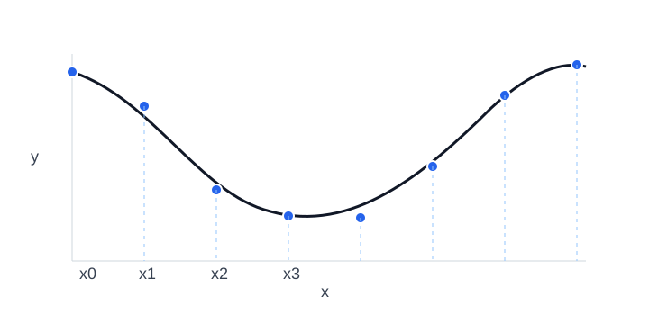
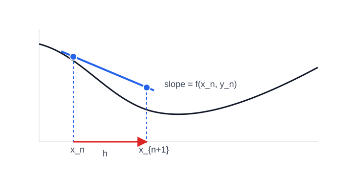
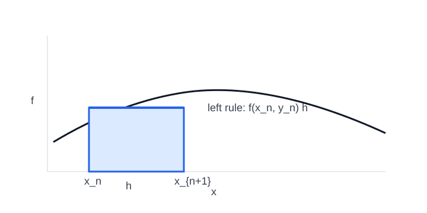

# Numerical Methods for ODEs

## Learning Objectives

After learning the basic modules of this chapter, you will be able to:

+ Learn about a few common numerical ODE methods.
+ Understand several ways to assess a numerical method.
+ Apply the numerical methods to solve first-order and higher-order ODEs.


## Introduction
From the motivating chapter, we already see an example of aircraft flight dynamics, where the ODE is nonlinear and cannot be solved by analytical methods.  However, often for a comprehensive assessment of the aircraft dynamical stability and handling quality, one does need the solutions to the nonlinear ODE for the accurate prediction of the aircraft motion.  Another example of nonlinear ODE is the orbital dynamics, e.g., rendezvous, where two spacecraft need to meet up.  The spacecraft are governed by rigid body dynamic equations and influenced by celestial gravitation forces, and the resulting ODE's are highly nonlinear.  Yet, the rendezvous requires highly accurate predictions of spacecraft motion, perhaps with errors less than centimeters over a thousand-kilometer-long trajectory, otherwise the spacecraft may miss each other or, even worse, crash into each other.  Therefore in this example we again need a way to solve the nonlinear ODE's for orbital dynamics.

The tools to be introduced in this chapter are general methods that can be used to solve nonlinear ODE's with the help of computers.  Specifically, we focus on the solution of the following Initial Value Problem (IVP),
```{math}
:label: eq:model

\begin{aligned}
\text{ODE:} &\quad y' = f(x,y) \\
\text{Initial conditions:} &\quad y(x_0) = y_0 \\
\text{Interval:} &\quad x_0\leq x\leq x_f
\end{aligned}
```
where $y'=\dd y/\dd x$, $f(x,y)$ is a nonlinear function, $y(x)$ denotes the true solution, and $[x_0,x_f]$ is the interval on which we look for the solution.  The goal is to find the solution given the known values $(x_0,y_0)$ from the initial conditions.

&clubs; While we are starting with a first-order ODE of a scalar unknown, later we will see that the methods presented in this chapter can be adapted easily to solve first-order ODE's of multiple unknowns and higher-order ODE's.

## Problem Formulation
The first thing to know about numerical methods is that they produce only approximate solutions.  The approximation, ultimately, comes from the digital representation of numbers in a computer: there is no way to *truly* represent a continuous range of numbers in the computer, and everything needs to be discretized in one way or another.  Specific to the IVP, the discretization means we can only find a sequence of points
```{math}
\{(x_0,y_0), (x_1,y_1), (x_2,y_2), \cdots, (x_N,y_N)\}
```
that lie on or near the true solution $y=y_{\text{true}}(x)$, instead of the value of $y$ at any $x$.  This is the price to pay when we turn to a numerical method, instead of an analytical, exact, method.  Yet, for nonlinear ODE's, there are really not many choices.



Furthermore, we simplify the problem a little more.  Suppose we choose a fixed **step size** of $h$, meaning that we distribute the $x$'s evenly over the interval $[x_0,x_f]$ with a space of $h$ between neighboring $x$'s.  This way we know $x_i=x_0+ih$ for $i=1,2,\cdots,N$, and our goal is to find the only unknowns $y_1,y_2,\cdots,y_N$.  We define the numerical IVP as
```{math}
\begin{aligned}
\text{Given:} &\quad y' = f(x,y),\ y(x_0) = y_0 \\
\text{Find:} &\quad y_n = y(x_n),\ x_n=x_0+nh,\ n=1,2,\cdots, N
\end{aligned}
```


## A First Taste: Explicit Euler Method

### Definition
We will start with the first and simplest numerical method, that dates back to the 18th century, called **explicit Euler method**, or sometimes called forward Euler method.  This method forms the basis for the development of the subsequent and many other methods.

We first show two complementary ways of how the method works.

+ **Taylor series expansion**: To find $y_1$,
```{math}
\begin{aligned}
y_1 &= y(x_1) \\
&= y(x_0+h) \\
&= y(x_0) + \ddf{y}{x}(x_0) h + \frac{\dd^2 y}{\dd x^2}(x_0) h^2 + ...
\end{aligned}
```

Looking at the last equation: from initial condition, the first term is $y(x_0)=y_0$; from the ODE, the second terms is $\ddf{y}{x}(x_0)h=y'(x_0)h=f(x_0,y_0)h$; the rest terms are denoted $O(h^2)$.  The Big-$O$ notation $O(h^n)$ means that the terms are proportional to $h^n$, or, "grows" like $h^n$.  In this notation, the second term would be $O(h)$.  When $h$ is small, say 0.01, then $O(h)$ and $O(h^2)$ would be on the orders of 0.01 and 0.0001, and $O(h)\gg O(h^2)$; in other words, $O(h^2)$ is negligible when compared to $O(h)$.

Given the above discussion, the derivation continues as
```{math}
\begin{aligned}
y_1 &= y_0 + f(x_0,y_0) h + O(h^2) \\
&\approx y_0 + f(x_0,y_0) h
\end{aligned}
```
where in the last step we ignored the $O(h^2)$ terms, or **truncated** the second-order terms.  Once $y_1$ is known, we can continue to find $y_2$, $y_3$, etc., and in general,
```{math}
y_{n+1} = y_n + h f(x_n,y_n)
```
This is the explicit Euler method.  The "explicit" means that, once the quantities at step $n$, $(x_n,y_n)$, are known, the unknown $y_{n+1}$ at the next step can be computed immediately.

&clubs; Later we will see an "implicit" version, where $y_{n+1}$ cannot be computed immediately.




+ **Riemann sum**: Another way to look at the ODE is to integrate it on both sides from $x_0$ to $x_1$,
```{math}
\begin{aligned}
\int_{x_0}^{x_1} y' \dd x &= \int_{x_0}^{x_1} f(x,y) \dd x \\
y(x_1) - y(x_0) &= \int_{x_0}^{x_1} f(x,y) \dd x \\
y_1 - y_0 &= \int_{x_0}^{x_1} f(x,y) \dd x
\end{aligned}
```
How to evaluate the integral?  From calculus, we could apply the left rule of Riemann sum,
```{math}
\int_{x_0}^{x_1} f(x,y) \dd x = f(x_0,y_0)h + O(h^2)
```
Then, combining the above equations and truncating the second-order term, we arrive at
```{math}
y_1 = y_0 + f(x_0,y_0)h
```
which is again the explicit Euler method.

&clubs; Riemann sum has other rules, such as right and trapezoidal rules, and we will see that those correspond to different numerical ODE methods.




**Example**

Let's try the explicit Euler method on a simple ODE,
```{math}
y'+y=0,\ y(0)=1
```
The goal is to find $y(0.1)$ with a step size of $h=0.1$.

The ODE is chosen because it has an analytical solution $y(x)=\exp(-x)$ and $y(0.1)=\exp(-0.1)\approx 0.905$.  This way we can assess the accuracy of the numerical method.

First, let's write the problem in the standard numerical IVP form.  The ODE in standardized form is $y'=f(x,y)=-y$.  The initial conditions are $x_0=0$, $y_0=1$.  Given the step size $h=0.1$, $x_1=x_0+h=0.1$, and $y(0.1)=y_1$.  Thus the IVP is
```{math}
\begin{aligned}
\text{Given:} &\quad y' = -y,\ y(0) = 1 \\
\text{Find:} &\quad y_1 = y(0.1),\ h=0.1
\end{aligned}
```

Next, to find $y_1$, just one step of explicit Euler is needed,
```{math}
\begin{aligned}
y_1 &= y_0 + h f(x_0,y_0) \\
&= y_0 + h (-y_0) \\
&= 1 + 0.1\times (-1) \\
&= \boxed{0.9}
\end{aligned}
```

The numerical solution $y_1=0.9$ is very close to the true solution $y(0.1)\approx 0.905$.  To quantify the error, we can define the **absolute error**
```{math}
\epsilon_{abs} = |\text{Approx.}-\text{True}| = |y_1-y(0.1)| = 0.005
```
and the **relative error**
```{math}
\epsilon_{rel} = \frac{|\text{Approx.}-\text{True}|}{|\text{True}|}\times 100\% = \frac{|y_1-y(0.1)|}{|y(0.1)|}\times 100\% \approx 0.55\%
```
While the criteria for error magnitude may vary between engineering applications, an error lower than 5\% is typically considered good.

If the value of $y(0.2)$ is wanted, which is $y_2$, one can just do one more explicit Euler step,
```{math}
\begin{aligned}
y_2 &= y_1 + h (-y_1) \\
&= 0.9 + 0.1\times (-0.9) \\
&= 0.81
\end{aligned}
```
The exact solution is $y(0.1)=\exp(-0.2)\approx 0.819$, with a relative error of 1.1\% - still reasonably low.


### Error Analysis
Next, let's more accurately quantify the error of explicit Euler method.  Recall that in the derivation based on Taylor series expansion, we truncated the second-order terms $O(h^2)$, which would result in a **local truncation error**, $\epsilon_{\text{local}}$.  This means, at step $1$, while $y_0$ is known precisely, the solution $y_1$ still has an error $\epsilon_{\text{local}}=O(h^2)$ that is proportional to $h^2$.  Going to step $2$, the error in $y_2$ will come from both the error carried over from $y_1$, which is $O(h^2)$, and a new truncation error $O(h^2)$.  Computing $N$ explicit Euler steps over the interval $[x_0,x_f]$ will produce $N$ times truncation errors that are all accumulated in $y_N$.  The error in $y_N$ is thus $O(N h^2)$.

Over the interval $[x_0,x_f]$ that we would like to find the solution, if a step size $h$ is used, then $N=\frac{x_f-x_0}{h}$ steps are needed.  So the error in $y_N$ is further refined as
```{math}
O(N h^2) = O\left( \frac{x_f-x_0}{h} h^2 \right) = O\left( (x_f-x_0) h \right) = O(h)
```
where since Big-$O$ only cares about proportionality, the constant factor $(x_f-x_0)$ is ignored.  This analysis shows that the **global error**, $\epsilon_{\text{global}}$, of explicit Euler method over the interval of interest is $O(h)$, i.e., of first order.  This drop of order of accuracy is due to the accumulation of local truncation errors at every step.  We call the explicit Euler method as **first-order accurate**.

**Example**

Let's revisit the previous example and examine the implication of the order of accuracy.  Intuitively, if $\epsilon_{\text{global}}=O(h)$, we should expect that the global error is proportional to step size $h$.

First, as a reference, let's find $y(1.0)$ with $h=0.1$.  To simplify the explicit Euler procedure for this *particular* problem, we derive a formula as a shortcut,
```{math}
\begin{aligned}
y_{n+1} &= y_n + h (-y_n) \\
&= (1-h)y_n \\
&= (1-h)^2y_{n-1} = (1-h)^3y_{n-2} = \cdots = (1-h)^{k+1}y_{n-k} \\
&= (1-h)^{n+1}y_0
\end{aligned}
```
where the second row shows a recursive relation $y_{i+1}=(1-h)y_i$ for any $i$, in the third row the recursion is applied repeatedly for $k$ times, and lastly the recursion is brought to an end with the initial condition $y_0$.

The value of $y(1.0)$ should correspond to $y_{10}$, and using the shortcut formula,
```{math}
y_{10} = (1-h)^{10} y_0 = 0.9^{10} \times 1 \approx 0.349
```
The true solution is $y(1.0)=\exp(-1.0)\approx 0.368$, and the relative error is about 5\%.

Next let's decrease $h$ and see how the numerical solution behaves.

| $h$    | $y_n$ at $x=1$ | Abs. Err. |
| :---   | :---: | ---:  |
| 0.1    | 0.349 | 0.019 |
| 0.05   | 0.358 | 0.009 |
| 0.025  | 0.363 | 0.005 |
| 0.0125 | 0.366 | 0.002 |

From the results we draw two conclusions.  First, as $h$ decreases, the error decreases and the numerical solution is closer to the true solution.  This trend is called **convergence**.  Convergence tells us at least the numerical solution is giving us reasonable results.  Second, every time $h$ is halved, the error is approximately halved as well.  This is aligned with our intuition, $\epsilon_{\text{global}}=O(h)$, and hence explicit Euler method is demonstrated to be first-order accurate.


The interactive graph below compares several numerical methods for the ODE

```{math}
\dot{x}=kx,\qquad x(0)=x_0.
```

Try changing the parameter $k$, the initial condition $x_0$, and the step size $h$.

:::{container} course-interactive course-interactive--linear-ode
Interactive example loading...
:::
